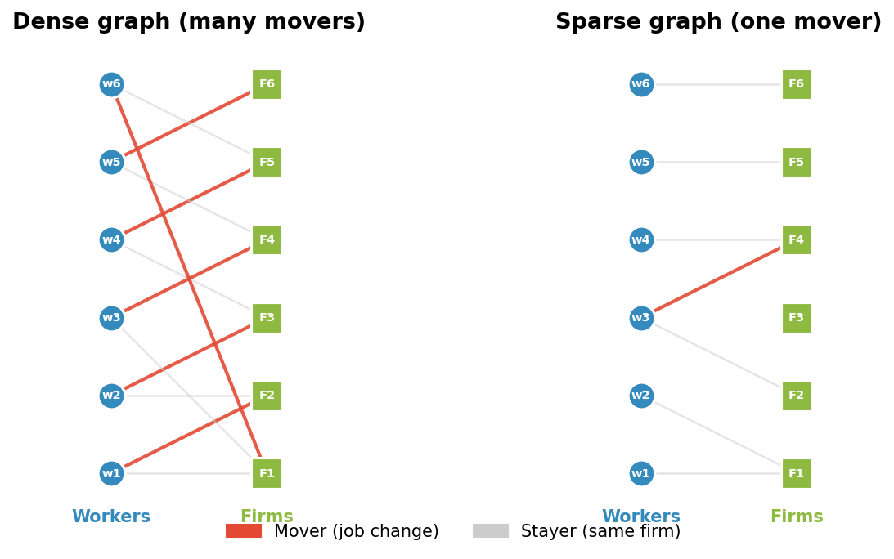
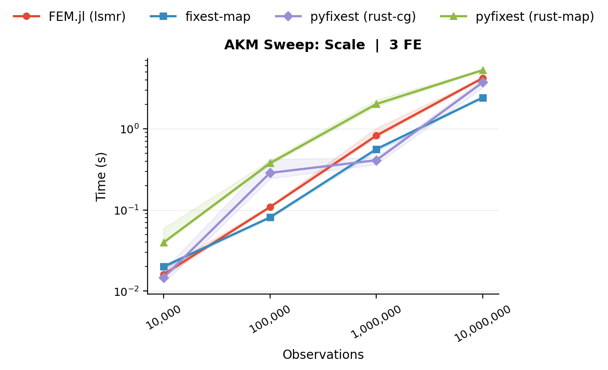
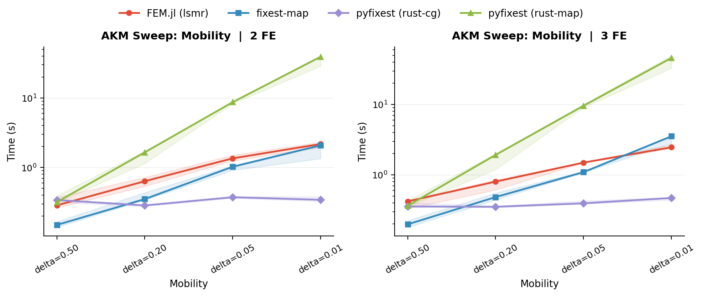
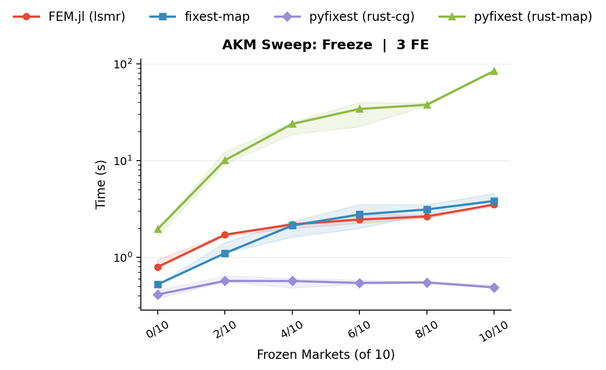
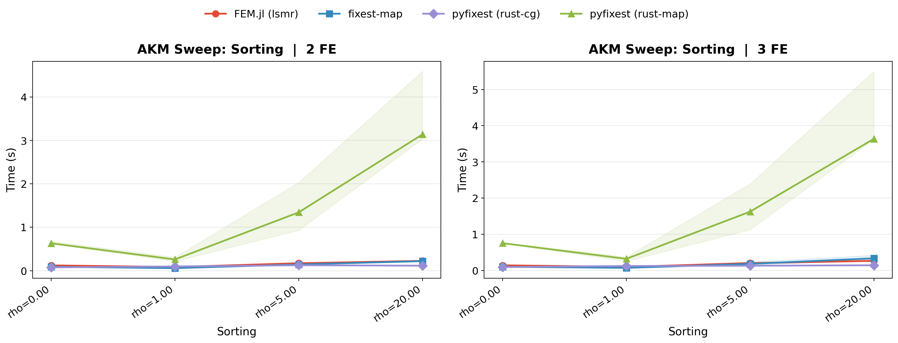
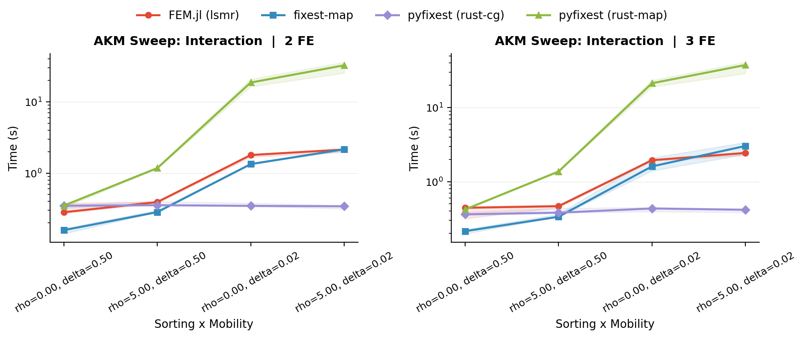
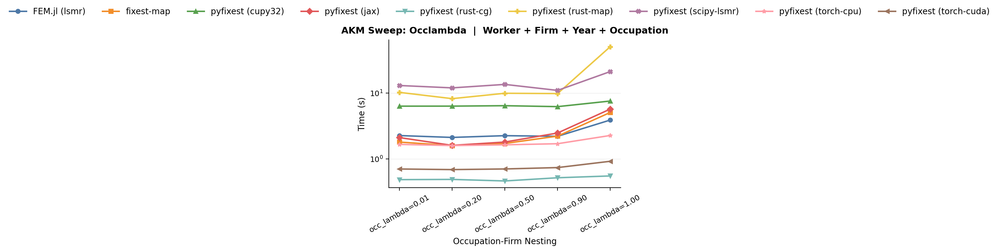
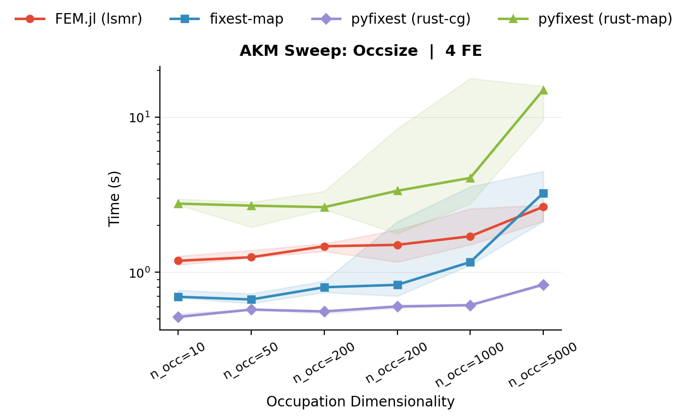
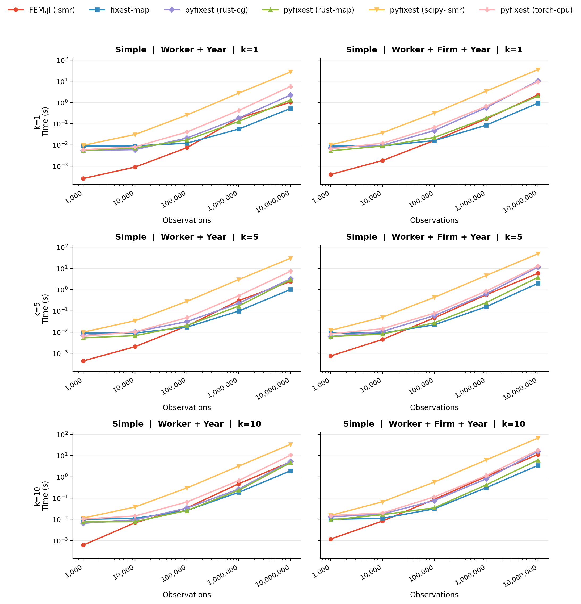
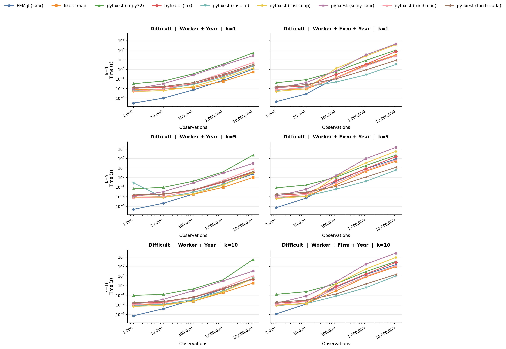

# "When Are Fixed Effects Estimations Difficult?"

If you have ever fitted a fixed effects regression, you might have noticed that models with the same number of observations and fixed effects levels can take orders of magnitude longer to run. This happens because the runtime of a fixed effects problem is not only determined by the sheer size of the data, but also by the structure of the fixed effects. Problems that are known to be particularly "hard" are ubiquitous in economics and arise, for example, in matched employer-employee data, patient-doctor panels, or trade networks.

In this guide, we explain *why* some fixed effects problems are harder to estimate than others, and benchmark different strategies to fit fixed effects regressions in a range of scenarios.

The key insight is that fixed-effects estimation is a **graph problem**: the structure of who-works-where (or who-sees-which-doctor which-brand-in-which-store) determines how hard the problem is. After reading this guide, you should (hopefully) have a good idea if your fixed effects structure at hand is "difficult" and if you can speed up your own fixed effects problem by choosing a different solver.

## Fixed Effects as a Network

As our workhorse example throughout this entire vignette, we will consider the Abowd-Kramarz-Margolis (AKM) wage model with worker fixed effects $\alpha_i$, firm fixed effects $\psi_{J(i,t)}$ and time fixed effects $\phi_t$.

$$y_{it} = \alpha_i + \psi_{J(i,t)} + \phi_t + x'_{it}\beta + \varepsilon_{it}$$

Workers and firms form a **bipartite graph**: workers are one set of nodes, firms
are the other, and each employment spell is an edge. Movers - workers who change
firms - are the workers whose edges connect different parts of the graph. Without movers,
worker and firm effects are not separately identified.

  

*A dense graph (left) has many movers connecting all firms, making worker and firm effects easy to separate. A sparse graph (right) has a single mover bridging two clusters - demeaning must propagate information through that thin bridge, which is slow.*

This bipartite structure is ubiquitous in applied economics. In AKM
wage decompositions, workers and firms are the two sides of the graph,
and job changers are the movers that connect them. The same pattern
arises in mover designs, where families / students move across schools or neighborhoods. In health economics, we have problems of similar structure with doctor-patient fixed effects. And in trade and industrial organisation,
products or brands might be sold across multiple markets and in different stores.

In all these settings, estimation requires solving the same underlying linear algebra problem, which we introduce in the following section.

## From FWL to Demeaning

Before we dive into algorithmic strategies for solving fixed effect problems, we first want to (re-) introduce the **Frisch-Waugh-Lovell (FWL) theorem**: in a
regression of $y$ on covariates $X$ and a set of dummy variables $D$
(the fixed effects), the coefficient $\hat{\beta}$ on $X$ is identical
when we either estimate the full model, or first regress $y$ and each column of $X$ on $D$, collect the resulting regression residuals, and fit a final regression of the residuals of $Y$ on the residuals of $X$.

Fitting the two initial regression and forming a residual is often referred to as a **demeaning** step.

In short, we need to fit / solve a linear system of equations

$$
   \hat{\alpha} = \arg\min_{\alpha} \| D\alpha - \mu \|_2^2
$$

where $\mu$ is either $Y$ or a column of $X$ and $\alpha$ are the fixed effect coefficients.

For a single fixed effect (e.g., only worker FEs), this demeaning step is trivial: $D$ is a single one-hot encoded matrix and the least-squares solution is simply the vector of group means. Subtracting these means from $\mu$ gives the residual - this is the classical "within transformation" from panel econometrics, and it can be computed in a single pass over the data. In other words, we have a "closed form solution" and no iteration is needed.

With two or more fixed effects, $D = [D_W \; D_F \; \ldots]$ is a concatenation of multiple dummy matrices and the within transformation for a single fixed effect no longer suffices. To see why, consider worker and firm fixed effects. Subtracting worker means removes variation *between* workers, but if a worker is employed at more than one firm, her worker mean is a mixture of outcomes at different firms. The residual after demeaning by worker therefore still carries information about firm effects - it is "contaminated" by firm variation. The same logic applies in reverse: demeaning by firm leaves traces of worker effects whenever a firm employs more than one worker.

Special data structures form an exception. Suppose we have a fully balanced panel, where every worker is observed at every firm exactly once. Then each worker mean is computed over the same set of firms, and each firm mean is computed over the same set of workers. As a result, demeaning by worker removes the worker-specific component while subtracting the same average firm effect for everyone. It therefore does not leave behind a worker-specific mixture of firm effects. A second demeaning step by firm then removes the remaining firm-specific component exactly. In this special case, a simple two-step procedure (double demeaning) is sufficient. This is also the idea behind the Mundlak (1978) transform used in [duckreg](https://github.com/py-econometrics/duckreg).

In practice, however, panels are almost never balanced. Workers are observed only at a subset of firms, so different worker means contain different mixtures of firm effects, and different firm means contain different mixtures of worker effects. Removing one set of means therefore does not cleanly isolate the other. This is why, in unbalanced settings, no simple closed-form demeaning formula is available and specialised iterative algorithms are needed.

## Algorithms for Demeaning

Several algorithms have been proposed for this multi-fixed effect demeaning
problem:

- **Method of Alternating Projections (MAP).** Introduced by Guimarães & Portugal (2010) as the "Zig-Zag" and Gaure (2013), this is the workhorse algorithm in most FE packages (`reghdfe`, `lfe`, `fixest`). It sequentially sweeps through each fixed effect and demeans the target variable by the current fixed effects's group means. Usually, this approach is implemented with accelerations. For example, R's `fixest` uses MAP with Irons-Tuck acceleration and other optimization strategies. In PyFixest, the `"rust"` backend implements MAP without acceleration and is therefore quite a lot slower than `fixest`'s algorithm in cases where the accelerations pay off.

- **LSMR.** The solver powering `FixedEffectsModels.jl`. It can be accessed in `pyfixest` via the `scipy` and `cupy` demeaner backends.

- **CG-Schwarz (Conjugate Gradients with Additive Schwarz Preconditioner).**
The [`within`](https://github.com/py-econometrics/within) crate, used by
PyFixest's `"rust-cg"` backend, takes a different approach: it
explicitly builds and exploits the block structure of the normal
equations to form a high-quality preconditioner for the linear problem. We explain this structure below.

## The Normal Equations and Their Block Structure

Removing the fixed effects in the first two steps of the FWL procedure reduces to solving a linear system. In particular, the fixed-effect coefficients satisfy the **normal equations**

$$G \, \hat{\alpha} = D^\top \mu$$

where $D$ is the $n \times m$ dummy matrix that encodes all FE levels
and $G = D^\top D$ is the **Gramian** - a symmetric positive
semi-definite matrix of dimension $m \times m$, where $m$ is the total
number of FE levels across all fixed effects.

For fixed effects problems, the Gramian $G$ has a natural **block structure**. To illustrate this, we will consider a small example (adapted from the
[`within` documentation](https://github.com/py-econometrics/within)) of
a worker-firm panel with $n = 6$ observations and $Q = 3$ fixed effects
(worker, firm, year). Worker W1 moves from Firm F1 to F2 - this
mobility is what connects the two firms in the estimation graph.
Workers W2 (at F1) and W3 (at F2) stay at their firms.

| Obs | Worker | Firm | Year | $y$ |
|-----|----------------|--------------|--------------|------|
| 1 | W1 | F1 | Y1 | 3.2 |
| 2 | W1 | F2 | Y2 | 4.1 |
| 3 | W2 | F1 | Y1 | 2.8 |
| 4 | W2 | F1 | Y2 | 3.9 |
| 5 | W3 | F2 | Y1 | 5.0 |
| 6 | W3 | F2 | Y2 | 4.5 |

Fixed Effect 1 (workers) has $m_1 = 3$ levels, fixed effect 2 (firms) has $m_2 = 2$
levels, fixed effect 3 (years) has $m_3 = 2$ levels, giving $m = 7$ total FE
levels. The Gramian has $Q = 3$ **diagonal blocks** and
$\binom{3}{2} = 3$ **cross-tabulation blocks**:

$$
G = \begin{pmatrix}
\mathbf{G_{WW}} & G_{WF} & G_{WY} \\
G_{WF}^\top & \mathbf{G_{FF}} & G_{FY} \\
G_{WY}^\top & G_{FY}^\top & \mathbf{G_{YY}}
\end{pmatrix}
= \begin{pmatrix}
\mathbf{2} & \mathbf{0} & \mathbf{0} & 1 & 1 & 1 & 1 \\
\mathbf{0} & \mathbf{2} & \mathbf{0} & 2 & 0 & 1 & 1 \\
\mathbf{0} & \mathbf{0} & \mathbf{2} & 0 & 2 & 1 & 1 \\
1 & 2 & 0 & \mathbf{3} & \mathbf{0} & 2 & 1 \\
1 & 0 & 2 & \mathbf{0} & \mathbf{3} & 1 & 2 \\
1 & 1 & 1 & 2 & 1 & \mathbf{3} & \mathbf{0} \\
1 & 1 & 1 & 1 & 2 & \mathbf{0} & \mathbf{3}
\end{pmatrix}
$$

The **diagonal blocks** $G_{WW}$,
$G_{FF}$, $G_{YY}$ are each
diagonal matrices whose entries are the group counts (how many
observations belong to each worker, firm, or year). We note that inverting these
blocks is computationally cheap because it amounts to dividing by group sizes, i.e.,
computing group means.

The **cross-tabulation blocks** $G_{WF}$,
$G_{WY}$, $G_{FY}$ encode the
bipartite graph structure. For example, $G_{WF} = D_W^\top D_F$ is the
worker-firm cross-tabulation: entry $(i, j)$ counts how many times
worker $i$ is observed at firm $j$. This is where the mover information
lives. Worker W1's row in $G_{WF}$ is $(1, 1)$ while W2's row is $(2, 0)$. In other words, W1 works in both firms, while W2 works in F1 in both periods. In a labour market with little mobility, the off-diagonal blocks will be sparse as most
workers stay within a single firm.

## The Method of Alternating Projections

Recall that we need to solve $G \hat{\alpha} = D^\top \mu$ for the FE
coefficients $\hat{\alpha}$, or equivalently, find the residual
$r = \mu - D \hat{\alpha}$ that has all fixed effects projected out. The method of alternating projections (MAP) approaches this iteratively: it sweeps through each fixed effect and subtracts
group means from the current residual. In terms of the Gramian, this is
**block Gauss-Seidel** - each sweep solves one diagonal block of $G$ at
a time. Writing $D_W, D_F, D_Y$ for the $n \times m_q$ dummy
sub-matrices (column blocks of $D$), the steps are:

1. Start with $r = y$
2. Subtract worker means from $r$: $r \leftarrow r - D_W G_{WW}^{-1} D_W^\top r$
3. Subtract firm means from $r$: $r \leftarrow r - D_F G_{FF}^{-1} D_F^\top r$
4. Subtract year means from $r$: $r \leftarrow r - D_Y G_{YY}^{-1} D_Y^\top r$
5. Repeat steps 2-4 until convergence

Each of these steps is individually cheap because $G_{WW}$, $G_{FF}$, $G_{YY}$ are diagonal matrices and therefore not difficult to invert.

We also note that the MAP algorithm **never directly touches the cross-tabulation blocks** $G_{WF}$, $G_{FY}$, $G_{WY}$. It can only extract information about the
relationship between workers and firms *indirectly*, through the
residuals that get passed from one sweep to the next.

Why does convergence depend on the graph? The alternating demeaning algorithm works by passing information back and forth between worker and firm effects. In the worker-mean step, each worker mean is computed over the firms at which that worker is observed. If many workers move across firms, each worker mean averages over several firm effects, so no single firm dominates that average. Subtracting worker means then removes mainly the worker-specific component while leaving a residual that still contains useful information about firms. The subsequent firm-mean step can exploit that information, and the algorithm makes substantial progress from one iteration to the next.

In the case of balanced panels, this transmission is perfect: every worker is observed at every firm, so each worker mean averages over the same set of firms, and each firm mean averages over the same set of workers. A single pass by worker and then by firm is therefore enough.

If a worker never changes firms, demeaning by worker uses only data from that one firm. The resulting residual therefore gives the next firm-demeaning step almost no information about how that firm differs from other firms. Symmetrically, demeaning by firm may give the next worker-demeaning step almost no information about workers connected to other firms. Hence each iteration changes the estimates only a little, which is why convergence is slow.

## How the `CGS` algorithm in `within` works

The [`within`](https://github.com/py-econometrics/within) crate takes a
different route. Rather than repeatedly demeaning by one fixed effect at
a time, it treats residualization as the sparse linear-algebra problem
introduced above. For each target vector $\mu$ - the dependent variable
$y$ or one of the covariates to be partialled out - it solves

$$
G \, \hat{\alpha} = D^\top \mu.
$$

This is especially appealing in the FWL setting because the matrix $G$
is the same for $y$ and for every column of $X$; only the right-hand
side changes. The key computational question is therefore not whether we
can write down the system, but how to solve it quickly.

This sparse linear system can be solved with different solvers, e.g. the **conjugate gradient (CG)** method.

The main idea behind `within` is to build a good **preconditioner**
$M$ for this large sparse system. The matrix $M$ is chosen so that it
is cheap to invert and so that the preconditioned system
$M^{-1} G x = M^{-1} b$ is much better conditioned than the original
one. A good preconditioner therefore reduces the number of iterations
needed by CG.

For a three-way fixed effects model with worker, firm, and year effects,
`within` decomposes the problem into the three pairwise interactions:
worker-firm, worker-year, and firm-year. This turns the original large
tripartite problem into three bipartite subproblems. As we have explained above,
each subproblem has a highly structured Gramian: the diagonal blocks are simple count
matrices (for example, worker counts and firm counts in the worker-firm
case), while the off-diagonal blocks record the cross-tabulation between
the two sets of fixed effects. In the worker-firm block, for instance,
entry $(i,j)$ counts how often worker $i$ is observed at firm $j$.

This special bipartite structure allows `within` to use fast approximate
solvers for the pairwise graph problems. These local solves are then
assembled into a **Schwarz preconditioner** for the full
system. Finally, `within` applies a standard Krylov method - by default,
CG - to the original normal equations, but now
with this preconditioner.

Compared with MAP, the important difference is that CG-Schwarz uses the
block structure of the full Gramian $G$ directly, rather than waiting
for information to trickle indirectly through many demeaning sweeps.
This is why it is much less sensitive to sparse mobility patterns, as we will show in the benchmarks below.

You can find a detailed exposition of the algorithm [here](https://github.com/py-econometrics/within/tree/main/docs).

## When do MAP and CGS look good / bad?

Here is some first-order intuition:

**MAP** looks good on **dense graphs**. When the graph is well-connected with
many movers and no fragmentation, the vanilla MAP algorithm converges in a handful of iterations.
Each sweep is extremely cheap because it only computes group means / only has to invert diagonal matrices, so
the total cost per MAP iteration is low. The CG algorithm instead has overhead from forming the preconditioner, which might not amortize for dense graphs.

**CG-Schwarz** looks good on sparse graphs. When the graph has few movers,
MAP's convergence stalls because it cannot propagate information across
thin bridges. CG uses the cross-tabulation blocks directly, so it does
not suffer from this bottleneck. The overhead of building $G$ is repaid by needing fewer iterations.

An important "failing" case for the CGS algorithm is when the problem has a pair of fixed effects that is "dense" and where both fixed effects have high cardinality - for example, worker and firm fixed effects where each worker works in each firm once or large $N$ and large $T$ panels. One example with benchmark for a dgp that is difficult for CGS is provided at the very end.

The intuition above is deliberately simplified. In practice, fixed-point accelerations
can significantly speed up MAP convergence, narrowing the gap on moderately sparse graphs.

The following benchmarks test two PyFixest backends:

- `pyfixest (rust-map)` implements MAP without acceleration,
- `pyfixest (rust-cg)` implements the CG-Schwarz strategy via `within`'s solver.

All benchmarks time the full PyFixest estimation call.

The benchmark scripts and DGP documentation live in
[`benchmarks/modular/`](https://github.com/py-econometrics/pyfixest/tree/master/benchmarks/modular). You should be able to reproduce all results by running `pixi r benchmark`, `pixi r benchmark-akm` and `pixi run benchmark-akm-occupation` - if not, please send us a message!

## Benchmark Parametrization

We now introduce our baseline benchmark parametrization. All subsequent benchmarks start from these defaults and vary one parameter at a time.

| Parameter | Symbol | Default | Meaning |
|:----------|:------:|--------:|:--------|
| Panel length | $T$ | 10 | Number of time periods each worker is observed |
| Number of firms | $m_F$ | 50,000 | Total firms in the economy |
| Separation rate | $\delta$ | 0.10 | Per-period probability that a worker switches firms |
| Sorting | $\rho$ | 1.0 | Correlation between worker ability and firm quality in the matching process ($\rho = 0$: random, high $\rho$: strong assortative matching) |
| Within-industry match prob. | $\lambda$ | 0.80 | Probability that a mover's next firm is in the same industry ($\lambda = 1$: no cross-industry moves) |
| Number of industries | $S$ | 5 | Number of industry clusters |
| Match bins | `n_match_bins` | 2,048 | Number of worker ability bins used in the benchmark matching routine |
| Firm size shape | $\gamma$ | 1.0 | Pareto shape parameter for the firm size distribution (high $\gamma$: equal sizes, low $\gamma$: extreme dispersion) |

## Well-Connected Graphs

Before looking at problems with sparse(r) connections, it is worth confirming the
baseline: when the bipartite graph is dense, the MAP algorithm converges really quickly.

In this initial scenario, we hold the graph structure fixed at the defaults and - to spice up the benchmarks a bit - increase the number of workers $N$ from 10K to 10M.

  

*Benchmark: scale sweep. Runtime as a function of dataset size on a well-connected graph with default parameters.*

On this easy problem, the standard worker + firm + year specification is solved routinely well by both algorithms because each sweep already removes most of the variation. The `rust-map` backend will not look this good in any other of the benchmarks to follow, which all reduce the level of connectivity between workers and firms.

## Complex Fixed Effects Structures

All benchmarks below hold the estimation dataset at ~1M observations and vary
one structural parameter at a time from the defaults, isolating the effect of
each graph property on solver performance.

### (a) Low worker mobility $\delta$

The separation rate $\delta$ controls how likely a worker is to change
firms in each period. With $\delta = 0.5$, a worker has a 50% chance of
switching firms every period, so after a 10-period panel nearly everyone
has moved at least once. With $\delta = 0.01$, workers separate only 1%
of the time, so the expected tenure at a firm is 100 periods, which is far
longer than the panel itself. In a 10-period panel with $\delta = 0.01$,
only about 9% of workers are ever observed at more than one firm.

This matters because movers are the only source of information that
lets the algorithm distinguish worker effects from firm effects. When
$\delta$ is high, the bipartite graph is dense with edges and every
firm is connected to many others through shared workers. When $\delta$
is low, most workers sit at a single firm, and the graph thins out to
a near-nested structure where worker and firm effects are almost
collinear.

  

*Benchmark: mobility sweep. The rust-map solver degrades sharply as mobility decreases, while CG-Schwarz (rust-cg) remains stable.*

### (b) Progressive freezing

The uniform mobility sweep above turns a single "global knob" for the entire labour market. But real labour markets are not uniformly sparse - some sectors are highly dynamic, while in others, workers more or less retire at their first employer. The progressive-freezing benchmark captures this by
keeping the baseline 5-industry market structure and progressively switching off
mobility one industry at a time. Active industries keep the baseline
separation rate ($\delta = 0.1$), while frozen industries drop to
$\delta = 0.005$.

  

*Benchmark: progressive freezing. As more industries switch from the
baseline mobility rate ($\delta = 0.1$) to the frozen regime
($\delta = 0.005$), MAP runtimes rise progressively, while CG-Schwarz
remains stable throughout.*

### (c) Strong assortative matching $\rho$

The sorting parameter $\rho$ controls how strongly worker ability
$\alpha_i$ and firm quality $\psi_j$ are correlated in the matching
process. When $\rho = 0$, workers are randomly assigned to firms
regardless of type. When $\rho$ is large, high-ability workers
systematically sort into high-quality firms and low-ability workers end
up at low-quality firms.

Strong sorting changes the structure of the bipartite graph even if the
total number of movers stays the same. With random matching, movers
create edges that cross the entire graph, connecting firms of all
quality levels. With strong sorting, movers tend to switch between firms
of similar quality, so the graph develops a near-block-diagonal
structure where each "quality band" becomes an almost self-contained
subgraph. The cross-tabulation blocks become sparse because there are
few edges between quality bands - great workers never work in poor firms and vice versa -  making worker and firm effect columns
nearly collinear.

  

*Benchmark: sorting sweep. Increasing sorting ($\rho$) increases MAP runtime while CGS runtime remains stable.*

### (d) 99 Problems

The benchmarks above vary one parameter at a time from the
baseline. In practice, real datasets often combine multiple "sources of
difficulty" simultaneously. The sorting $\times$ mobility factorial
benchmark tests this by crossing two levels of sorting ($\rho \in
\{0, 20\}$) with two levels of mobility ($\delta \in \{0.5, 0.02\}$).

  

*Benchmark: sorting x mobility interaction.*

The combination of $\rho = 20$ and $\delta = 0.02$ produces runtimes far
exceeding what either factor alone would predict. Sorting thins out the
bridges between quality bands by making movers switch only between
similar firms, while low mobility means there are few movers to begin
with. Together, they produce an extremely sparse graph where MAP has
almost no cross-fixed-effect information to work with.

## Adding a Third Nesting Structure: Occupation Fixed Effects

The benchmarks above all involve the standard worker + firm + year
specification - which essentially forms a bipartite graph between workers and firms
(as year is low-dimensional and trivially absorbed). But many empirical
applications add a third high-dimensional fixed effect. In AKM wage
regressions, occupation is a natural candidate: labour economists often want to separate how much of a worker's wage comes from *who they are* (worker FE), *where they work* (firm FE), and *what they do*
(occupation FE).

Adding occupation turns the bipartite graph into a **tripartite**
structure. The new fixed effect can be "easy" or "hard" depending on how it
relates to the existing fixed effects. If occupation cross-cuts firms and
workers - different occupations appear at each firm, and workers switch
occupations when they move - then the occupation dimension adds
independent variation and is cheap to absorb. But if occupation is
*nested* within one of the existing fixed effects, the new fixed effects
become nearly collinear with an existing set, and the problem gets
harder for the same reasons we saw above: the graph loses
edges and becomes more sparse.

There are two ways occupation can nest:

- **Firm nesting:** Each firm concentrates on a single occupation
  (think a law firm where everyone is a lawyer). Then knowing the firm
  almost perfectly predicts the occupation, and the occupation FE
  column is nearly a copy of the firm FE column.
- **Worker nesting:** Workers carry their occupation across job changes
  (a nurse remains a nurse regardless of which hospital they join).
  Then the occupation FE column is nearly a copy of the worker FE
  column.

In either case, the solver must separate two nearly identical columns -
exactly the type of problem that makes vanilla MAP slow.

In the benchmark family below, we focus primarily on **firm nesting** and
on the overall number of occupation levels. Worker-level occupation
persistence is part of the DGP, but it is held fixed rather than swept as
its own benchmark dimension.

### The occupation DGP

For the occupation benchmarks, we set up a new data generating process that keeps the standard worker + firm + year AKM
panel and adds `occ_id` as a fourth fixed effect. Each firm draws a
sparse menu of occupations from an industry-level pool, with one
primary occupation. Workers draw their initial occupation from that
menu. On a firm move, workers keep their old occupation with probability
`occ_delta` if the destination firm supports it; otherwise they redraw
from the destination firm's occupation menu.

Three parameters matter for the occupation DGP. The benchmark family
below varies the first two and holds the third fixed:

| Parameter | Symbol | Default | Meaning |
|:----------|:------:|--------:|:--------|
| Firm–occ concentration | `occ_lambda` | 0.50 | Probability that a fresh draw from a firm's occupation menu selects the primary occupation (higher values imply stronger firm–occupation concentration) |
| Number of occupations | `n_occupations` | 200 | Total occupation levels in the economy |
| Occupation persistence | `occ_delta` | 0.30 | Probability that a worker keeps the same occupation on a compatible firm move |

Each firm also has a menu size of 5 occupations. These defaults give a
moderately cross-cutting baseline on top of the standard three-way AKM
panel (~1M observations).

### (a) Firm–occupation nesting (`occ_lambda`)

The parameter `occ_lambda` controls how strongly realized occupations
at a firm concentrate on that firm's primary occupation. At `occ_lambda = 0.01`, fresh draws from a firm's menu rarely select the primary occupation, so workers are spread
across the non-primary occupations in the menu. At `occ_lambda = 1.0`,
every fresh draw from a firm's menu selects the primary occupation, so
occupation becomes much closer to a deterministic function of firm
identity. Compatible movers can still carry an old non-primary
occupation because `occ_delta` is held fixed above zero.

  

*Benchmark: firm–occupation concentration benchmarks. This family varies only `occ_lambda`, making occupations progressively more nested within firms.*

### (b) Occupation dimensionality (`n_occupations`)

Increasing the number of occupation levels makes the problem harder
as the occupation sub-graph thins out. With 10 occupations, each level is observed at many firms and held by
many workers, so the occupation cross-tabulation blocks are dense and
well-conditioned. With 5,000 occupations, each level appears in far
fewer observations, and the cross-tabulation blocks become sparse. This is the same graph-thinning mechanism that makes low mobility hard, just in the occupation dimension. The bencmark varies `n_occupations` from 10 to 5,000 while holding all other parameters at their defaults.

  

*Benchmark: occupation dimensionality benchmark. This family varies only the number of occupation levels from 10 to 5,000.*

## Conclusion

Graph connectivity is the fundamental driver of fixed-effects solver
performance.

The practical recommendation is straightforward: for well-connected
graphs (high mobility, low sorting, cross-cutting factors), (accelerated)
MAP is often hard to beat. For sparse
graphs - low mobility, strong sorting, nested structures, or any
combination thereof - vanilla MAP as in `rust-map` reveals poor convergence properties. Within PyFixest, the CG-Schwarz backend (`rust-cg` via the `within` crate) is the more robust choice on these sparse graphs.

We conclude by showing two benchmarks from the `fixest` package that are designed to be simple and very challenging for the MAP algorithm. On the "simple" problem, the graph is dense and both PyFixest backends perform well; here, CG-Schwarz tends to lose because its setup overhead does not amortize. On the "difficult" sparse problem, vanilla MAP degrades sharply, while CG-Schwarz performs much better. In the checked-in results, `rust-cg` is substantially faster than `rust-map` on the hard three-way specification.

  

*Benchmark: "simple" DGP. A well-connected graph where both PyFixest solvers perform well, except CG-Schwarz whose preconditioner setup cost does not amortize.*

  

*Benchmark: "difficult" DGP. A sparse graph where vanilla MAP degrades dramatically, while CG-Schwarz remains fast.*
