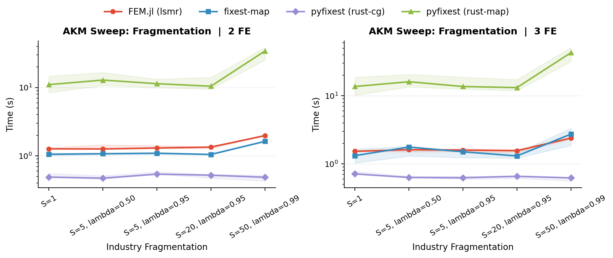
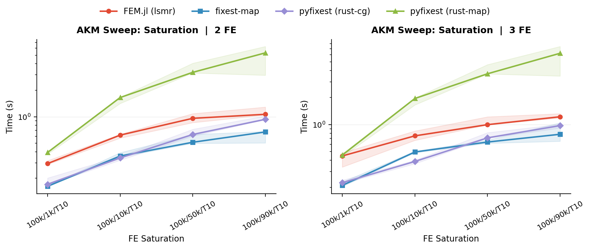
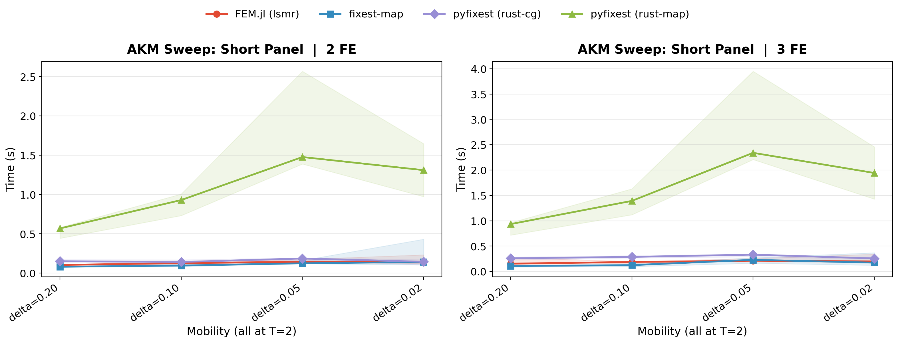
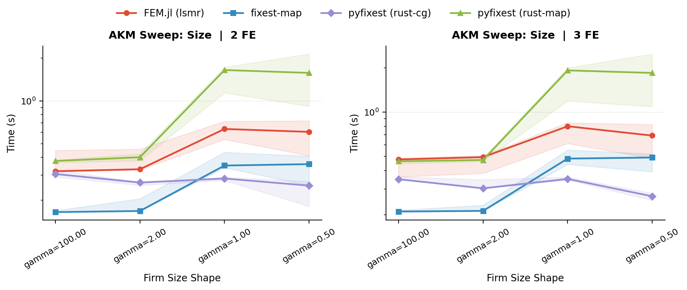

# "When Are Fixed Effects Estimations Hard?"

If you have ever fitted a fixed regression model, then you might have noticed that fixed effects regressions with the same number of observations and fixed effects levels can take orders of magnitudes to run. The runtime of a fixed effects problem is not only determined by the sheer size of the data, but of its properties. Problems that are known to be particularly "hard" are ubiqitous in economics, and arise for example in matched employer-employee data, patient-doctor panels, or trade networks.

In this guide, we explain *why* and *what to do about it*. The key insight is that
fixed-effects estimation is a **graph problem**: the structure of who-works-where
(or who-sees-which-doctor, which-brand-in-which-store) determines how hard the
problem is.

## Fixed Effects as a Network

Consider the Abowd-Kramarz-Margolis (AKM) wage model:

$$y_{it} = \alpha_i + \psi_{J(i,t)} + \phi_t + x'_{it}\beta + \varepsilon_{it}$$

Workers and firms form a **bipartite graph**: workers are one set of nodes, firms
are the other, and each employment spell is an edge. Movers - workers who change
firms - are the edges that connect different parts of the graph. Without movers,
worker and firm effects are not separately identified.


*A dense graph (left) has many movers connecting all firms, making worker and firm effects easy to separate. A sparse graph (right) has a single mover bridging two clusters - demeaning must propagate information through that thin bridge, which is slow.*

This bipartite structure appears throughout applied economics. In AKM
wage decompositions, workers and firms are the two sides of the graph,
and job changers are the movers that connect them. The same pattern
arises in Chetty-style mover designs, where families / students move across schools or neighborhoods. In health economics, we have problems of similar structure with doctor-patient fixed effects. In trade and industrial organisation,
products sold across multiple markets or brands stocked in different
stores play the role of movers.

In all these settings, estimation requires solving the same underlying
linear algebra problem.

## From FWL to Demeaning

Before we dive into algorithmic strategies, we first want to (re-) introduce the **Frisch-Waugh-Lovell (FWL) theorem**: in a
regression of $y$ on covariates $X$ and a set of dummy variables $D$
(the fixed effects), the coefficient $\hat{\beta}$ on $X$ is identical
whether we estimate the full model or first project both $y$ and $X$
onto the orthogonal complement of $D$'s column space and then regress.

In other words, we can "partial out" the fixed effects by **demeaning**:
replace each variable with its residual after removing all FE group
means. Once demeaned, standard OLS on the residuals recovers $\hat{\beta}$
exactly.

For a single factor (e.g., only worker FEs), demeaning is trivial -
subtract worker means from every variable and you are done. For two-way
FEs in balanced panels, closed-form solutions exist (e.g., the Mundlak
approach), but as soon as panels are unbalanced - which is the norm in
matched employer-employee data and most real-world applications -
these methods break down and we need iterative solvers. The problem
becomes interesting with **two or more crossed factors** (e.g., worker
*and* firm FEs) in unbalanced panels, because subtracting worker means
does not remove firm effects, and vice versa. This is where the graph
structure of the data determines how quickly iterative algorithms
converge.

## Algorithms for the FWL Demeaning Step

Several algorithms have been proposed for this multi-factor demeaning
problem:

- **MAP (Method of Alternating Projections).** Introduced by
  Guimarães & Portugal (2010) as the "Zig-Zag" and Gaure (2013), this is the workhorse algorithm in most FE packages (`reghdfe`, `lfe`, `fixest`). It sweeps through each factor in turn, demeaning the residual by the current factor's group means. Usually, this approach is implemented with accelerations. For example, R's `fixest` uses MAP with Irons-Tuck acceleration and other convergence tricks. In PyFixest, the `"rust"` backend implements MAP without acceleration. One key advantage of the MAP algorithm is that the fixed effects do not have to be encoded as a (sparse) one-hot encoded design matrix.

- **LSMR.** Julia's `FixedEffectModels.jl` uses LSMR, a Krylov-subspace
  method that works on the rectangular design matrix directly rather than
  the normal equations. It tends to be robust and fast, but requires
  forming the sparse FE design.

- **CG-Schwarz (Conjugate Gradients with Additive Schwarz Preconditioner).**
  The [`within`](https://github.com/py-econometrics/within) crate, used by
  PyFixest's `"rust-cg"` backend, takes a different approach: it
  explicitly builds and exploits the block structure of the normal
  equations. We explain this structure below.

## The Normal Equations and Their Block Structure

The FWL projection - removing fixed effects from the data - amounts to
solving a linear system. Specifically, we must solve the **normal
equations**:

$$G \, \hat{\mu} = D^\top y$$

where $D$ is the $n \times m$ dummy matrix that encodes all FE levels
and $G = D^\top D$ is the **Gramian** — a symmetric positive
semi-definite matrix of dimension $m \times m$, where $m$ is the total
number of FE levels across all factors. (For weighted least squares,
replace $D^\top D$ with $D^\top \Omega D$ where $\Omega$ is a diagonal
weight matrix; the block structure is identical.)

The Gramian has a natural **block structure**. Consider a small example
(adapted from the
[`within` documentation](https://github.com/py-econometrics/within)):
a worker-firm panel with $n = 6$ observations and $Q = 3$ factors
(worker, firm, year). Worker W1 moves from Firm F1 to F2 - this
mobility is what connects the two firms in the estimation graph.
Workers W2 (at F1) and W3 (at F2) stay at their firms.

| Obs | Worker | Firm | Year | $y$ |
|-----|----------------|--------------|--------------|------|
| 1 | W1 | F1 | Y1 | 3.2 |
| 2 | W1 | F2 | Y2 | 4.1 |
| 3 | W2 | F1 | Y1 | 2.8 |
| 4 | W2 | F1 | Y2 | 3.9 |
| 5 | W3 | F2 | Y1 | 5.0 |
| 6 | W3 | F2 | Y2 | 4.5 |

Factor 1 (workers) has $m_1 = 3$ levels, factor 2 (firms) has $m_2 = 2$
levels, factor 3 (years) has $m_3 = 2$ levels, giving $m = 7$ total FE
levels. The Gramian has $Q = 3$ **diagonal blocks** and
$\binom{3}{2} = 3$ **cross-tabulation blocks**:

$$
G = \begin{pmatrix}
{\color{royalblue}G_{WW}} & {\color{gray}G_{WF}} & {\color{gray}G_{WY}} \\
{\color{gray}G_{WF}^\top} & {\color{crimson}G_{FF}} & {\color{gray}G_{FY}} \\
{\color{gray}G_{WY}^\top} & {\color{gray}G_{FY}^\top} & {\color{forestgreen}G_{YY}}
\end{pmatrix}
= \left(\begin{array}{ccc|cc|cc}
{\color{royalblue}2} & {\color{royalblue}0} & {\color{royalblue}0} & {\color{gray}1} & {\color{gray}1} & {\color{gray}1} & {\color{gray}1} \\
{\color{royalblue}0} & {\color{royalblue}2} & {\color{royalblue}0} & {\color{gray}2} & {\color{gray}0} & {\color{gray}1} & {\color{gray}1} \\
{\color{royalblue}0} & {\color{royalblue}0} & {\color{royalblue}2} & {\color{gray}0} & {\color{gray}2} & {\color{gray}1} & {\color{gray}1} \\
\hline
{\color{gray}1} & {\color{gray}2} & {\color{gray}0} & {\color{crimson}3} & {\color{crimson}0} & {\color{gray}2} & {\color{gray}1} \\
{\color{gray}1} & {\color{gray}0} & {\color{gray}2} & {\color{crimson}0} & {\color{crimson}3} & {\color{gray}1} & {\color{gray}2} \\
\hline
{\color{gray}1} & {\color{gray}1} & {\color{gray}1} & {\color{gray}2} & {\color{gray}1} & {\color{forestgreen}3} & {\color{forestgreen}0} \\
{\color{gray}1} & {\color{gray}1} & {\color{gray}1} & {\color{gray}1} & {\color{gray}2} & {\color{forestgreen}0} & {\color{forestgreen}3}
\end{array}\right)
$$

The **diagonal blocks** ${\color{royalblue}G_{WW}}$,
${\color{crimson}G_{FF}}$, ${\color{forestgreen}G_{YY}}$ are each
diagonal matrices whose entries are the group counts (how many
observations belong to each worker, firm, or year). Inverting these
blocks is instant because it amounts to dividing by group sizes, i.e.,
computing group means.

The **cross-tabulation blocks** ${\color{gray}G_{WF}}$,
${\color{gray}G_{WY}}$, ${\color{gray}G_{FY}}$ encode the
bipartite graph structure. For example, $G_{WF} = D_W^\top D_F$ is the
worker-firm cross-tabulation: entry $(i, j)$ counts how many times
worker $i$ is observed at firm $j$. This is where the mover information
lives. Worker W1's row in $G_{WF}$ is $(1, 1)$ — one spell at each
firm — while W2's row is $(2, 0)$, a pure stayer. In a labour market
with little mobility, the off-diagonal blocks will be sparse as most
workers stay within a single firm.

## How MAP Works (and Why It Ignores the Graph)

Recall that we need to solve $G \hat{\mu} = D^\top y$ for the FE
coefficients $\hat{\mu}$, or equivalently, find the residual
$r = y - D \hat{\mu}$ that has all fixed effects projected out. MAP
approaches this iteratively: it sweeps through each factor and subtracts
group means from the current residual. In terms of the Gramian, this is
**block Gauss-Seidel** — each sweep solves one diagonal block of $G$ at
a time. Writing $D_W, D_F, D_Y$ for the $n \times m_q$ dummy
sub-matrices (column blocks of $D$), the steps are:

1. Start with $r = y$
2. Subtract worker means from $r$: $r \leftarrow r - D_W {\color{royalblue}G_{WW}^{-1}} D_W^\top r$ (cheap — $G_{WW}$ is diagonal, so its inverse just divides by group sizes)
3. Subtract firm means from $r$: $r \leftarrow r - D_F {\color{crimson}G_{FF}^{-1}} D_F^\top r$ (cheap)
4. Subtract year means from $r$: $r \leftarrow r - D_Y {\color{forestgreen}G_{YY}^{-1}} D_Y^\top r$ (cheap)
5. Repeat steps 2-4 until convergence

Each of these steps is individually cheap - we are just averaging within groups. But the
algorithm **never directly touches the cross-tabulation blocks**
$G_{WF}$, $G_{FY}$, $G_{WY}$. It can only extract information about the
relationship between workers and firms *indirectly*, through the
residuals that get passed from one sweep to the next.

When the graph is dense (many movers), each sweep makes good progress.
If workers move frequently between firms, high-ability workers are
observed at both good and bad firms, producing different outcomes in
each. The algorithm can easily tease apart the worker contribution from
the firm contribution, because the same worker provides a direct
comparison across firms. Subtracting worker means already removes most
of the worker effect, and what remains is a clean signal about firms.

When the graph is sparse (few movers), workers are essentially
**nested** within firms - nearly every worker is observed at a single
firm only. In this regime, a high outcome could be due to a good worker
*or* a good firm, and the data provides almost no variation to tell
them apart. Subtracting worker means barely helps, because each worker's
mean is contaminated by the firm effect they are stuck in. The algorithm
must iterate many times, slowly propagating the little cross-factor
information that exists through the few movers that bridge different
firms.

Formally, the convergence rate per sweep is governed by
$\cos^2(\theta)$, where $\theta$ is the **Friedrichs angle** between
the column spaces of the FE design matrices. Dense graphs produce
large $\theta$ (fast convergence); sparse graphs produce small
$\theta$ (slow convergence, or no convergence within budget).

Note that MAP implementations never actually form the dummy matrix $D$.
Each projection $D_q G_{qq}^{-1} D_q^\top r$ is just "compute the mean
of $r$ within each group, then subtract it" — an operation that only
requires the integer group labels, not a sparse one-hot matrix. This is
one of MAP's practical advantages: it needs no sparse matrix assembly
and has minimal memory overhead.

## How CG-Schwarz Works (and Why It Uses the Graph)

The [`within`](https://github.com/py-econometrics/within) crate takes
the opposite approach: it works with the **full Gramian** $G$, including
the cross-tabulation blocks, and solves the normal equations using
**preconditioned conjugate gradients (CG)**.

Because CG directly works with the cross-tabulation structure, it can
propagate information across the graph in a single matrix-vector
multiply. Its convergence rate depends on the **condition number** of
the preconditioned system, not the Friedrichs angle. This makes it much
more robust to sparse graphs.

## When Does Each Solver Win?

The first-order intuition is simple:

- **MAP wins on dense graphs.** When the graph is well-connected with
  many movers and no fragmentation, MAP converges in a handful of sweeps.
  Each sweep is extremely cheap because it only computes group means, so
  the total cost is low. CG has overhead from forming the Gramian and
  computing full matrix-vector products, which does not pay off in this
  regime.

- **CG-Schwarz wins on sparse graphs.** When the graph has few movers,
  MAP's convergence stalls because it cannot propagate information across
  thin bridges. CG uses the cross-tabulation blocks directly, so it does
  not suffer from this bottleneck. The overhead of building $G$ is repaid
  many times over by needing far fewer iterations.

The intuition above is deliberately simplified. In practice, fixed-point accelerations
such as Irons-Tuck (used in R's `fixest`) can significantly speed up
MAP convergence, narrowing the gap on moderately sparse graphs. This is
why the benchmarks below compare four backends: `pyfixest (rust-map)`
(MAP without acceleration), `fixest-map` (R's `fixest` with Irons-Tuck
acceleration), `pyfixest (rust-cg)` (CG-Schwarz via `within`), and
`FEM.jl` (Julia's `FixedEffectModels.jl` via LSMR). All benchmarks time
the full estimation function call (e.g., `fixest::feols()` or
`pf.feols()`); each panel shows 2-way and 3-way FE specifications. The
data come from a calibrated AKM data-generating process. The benchmark
scripts and DGP documentation live in
[`benchmarks/modular/`](https://github.com/py-econometrics/pyfixest/tree/master/benchmarks/modular).
To reproduce the results, run `python benchmarks/modular/benchmark_akm_sweep.py`.


## The Easy Case: Well-Connected Graphs

Before looking at difficult problems, it is worth confirming the baseline: when
the bipartite graph is dense, **all solvers are fast**. The "easy" scenario uses
100 firms, a separation rate of $\delta = 0.5$ (workers switch firms every
other period on average), no sorting ($\rho = 0$), and a 20-period panel — a
deliberately well-connected graph with ~1M observations.

| Backend | 2-way FE | 3-way FE |
|---------|----------|----------|
| `pyfixest (rust-map)` | 0.23 s | 0.29 s |
| `pyfixest (rust-cg)` | 0.26 s | 0.41 s |

On this easy problem, both solvers finish in well under a second at 1M
observations. MAP converges in very few sweeps because each sweep
already removes most of the variation, and CG-Schwarz's overhead from
building the Gramian does not pay off. This is the regime where the
choice of solver simply does not matter.

## Scaling with Dataset Size

The next question is how runtimes grow with the number of observations,
holding the graph structure fixed at the (benign) defaults ($\delta = 0.2$,
$\rho = 1.0$, $T = 10$). The scale sweep increases $N$ from 10K to 10M.


*Benchmark: scale sweep. Runtime as a function of dataset size on a well-connected graph with default parameters.*

On a well-connected graph, all solvers scale roughly linearly. At 1M
observations, `fixest` and `rust-cg` finish in under half a second,
while `rust-map` (MAP without acceleration) takes about 2 seconds.
The absolute differences remain moderate because the graph structure is
benign — MAP converges quickly even without acceleration. The gap
between solvers only blows up when the graph becomes sparse, as shown
in the sections below.


## Complex Fixed Effects Structures

The single-axis sweeps below hold the dataset at ~1M observations and vary
one structural parameter at a time from the defaults, isolating the effect of
each graph property on solver performance.


### (a) Low mobility: the dominant factor

The separation rate $\delta$ controls how likely a worker is to change
firms in each period. With $\delta = 0.5$, a worker has a 50% chance of
switching firms every period, so after a 10-period panel nearly everyone
has moved at least once. With $\delta = 0.01$, workers separate only 1%
of the time, so the expected tenure at a firm is 100 periods - far
longer than the panel itself. In a 10-period panel with $\delta = 0.01$,
only about 9% of workers are ever observed at more than one firm.

This matters because movers are the only source of information that
lets the algorithm distinguish worker effects from firm effects. When
$\delta$ is high, the bipartite graph is dense with edges and every
firm is connected to many others through shared workers. When $\delta$
is low, most workers sit at a single firm, and the graph thins out to
a near-nested structure where worker and firm effects are almost
collinear.


*Benchmark: mobility sweep. MAP-based solvers (rust-map, fixest) degrade sharply as mobility decreases, while CG-Schwarz (rust-cg) remains stable.*

**Rule of thumb:** If fewer than 10% of units are movers, expect MAP to
struggle. Consider switching to CG.


### (b) Strong assortative matching (sorting)

The sorting parameter $\rho$ controls how strongly worker ability
$\alpha_i$ and firm quality $\psi_j$ are correlated in the matching
process. When $\rho = 0$, workers are randomly assigned to firms
regardless of type. When $\rho$ is large, high-ability workers
systematically sort into high-quality firms and low-ability workers end
up at low-quality firms.

Strong sorting changes the structure of the bipartite graph even if the
total number of movers stays the same. With random matching, movers
create edges that criss-cross the entire graph, connecting firms of all
quality levels. With strong sorting, movers tend to switch between firms
of similar quality, so the graph develops a near-block-diagonal
structure where each "quality band" becomes an almost self-contained
subgraph. The cross-tabulation blocks become sparse because there are
few edges between quality bands, making worker and firm effect columns
nearly collinear.


*Benchmark: sorting sweep. Increasing sorting ($\rho$) inflates MAP runtime, with wide variance indicating unstable convergence.*

**Rule of thumb:** If worker and firm effects are highly correlated
(strong positive assortative matching), MAP convergence degrades. CG is
more robust because it directly uses the cross-tabulation structure.


### (c) Fragmented markets

Two parameters control market fragmentation: the number of industries
$S$ and the within-industry match probability $\lambda$. When $\lambda$
is close to 1, workers almost never leave their home industry, so each
industry forms a nearly self-contained subgraph. The parameter $S$
determines how many such subgraphs exist. With $S = 1$, there is no
industry structure at all. With $S = 50$ and $\lambda = 0.99$, the
economy consists of 50 almost disconnected silos, linked only by the
rare cross-industry mover.

Fragmentation matters because it determines the topology of the bridges
in the bipartite graph. Even if the overall mover share is reasonable,
those movers may all be moving *within* their industry. Cross-industry
movers are the thin bridges that connect different parts of the graph,
and when those bridges are few, MAP struggles to propagate information
from one industry cluster to another.



*Benchmark: fragmentation sweep. Fragmentation alone has a moderate effect, but extreme segmentation (S=50, lambda=0.99) can cause MAP to blow up.*

**Rule of thumb:** Fragmentation alone has a moderate effect on runtime.
But combined with low mobility, it becomes devastating because the
bridges between industry clusters become so thin that MAP cannot
propagate information across the graph.


### (d) High FE saturation

The ratio $(m_W + m_F) / n$ measures how many fixed-effect parameters
there are relative to the number of observations. When this ratio is
low (e.g., 0.10), there are many observations per FE level and the
normal equations are well-conditioned. As the number of firms $m_F$
increases while holding everything else fixed, the ratio grows and the
system becomes increasingly ill-conditioned. In the extreme, when
$(m_W + m_F) / n$ approaches 1, there are nearly as many parameters as
observations and the problem becomes poorly identified.

High saturation means that each firm has very few workers, so the
diagonal blocks of the Gramian have small entries and the group means
are noisy estimates. This slows convergence for all solvers, but MAP
is more sensitive because it relies exclusively on these noisy group
means.



*Benchmark: saturation sweep. Runtime increases steadily as the FE-to-observation ratio grows.*

**Rule of thumb:** Saturation has a moderate standalone effect on
runtime. It becomes severe when combined with short panels, where $T=2$
means each worker contributes at most 2 observations.


### (e) Short panels

The panel length $T$ determines how many periods each worker is
observed. With $T = 10$, a worker with separation rate $\delta = 0.2$
has about $1 - (1 - 0.2)^9 \approx 87\%$ probability of moving at
least once. With $T = 2$, the same worker has only a 20% chance of
moving. Short panels drastically reduce the effective mover share even
when the per-period separation rate is held constant. As a result, the off-diagonal matrices of the Gramian are more sparse for short panels.

Short panels also reduce the number of observations per FE level,
pushing the saturation ratio higher. With $T = 2$, every worker
contributes exactly 2 observations, so the system is much less
overdetermined than with $T = 10$.

The figure below shows the effect directly. All scenarios use $T = 2$,
with the separation rate $\delta$ varying along the x-axis. Even at the
default $\delta = 0.20$, the short panel already makes the problem
harder than the same $\delta$ in a 10-period panel. As $\delta$ drops
further, MAP runtimes increase sharply.



*Benchmark: short panel sweep. All scenarios have T=2. As mobility decreases, MAP-based solvers slow down substantially.*

Short panels interact strongly with all the other factors above. In
practice, many matched employer-employee datasets have short panels
($T = 2$ or $T = 3$), which is one reason these problems are
particularly challenging.


### (f) Firm size dispersion

The parameter $\gamma$ controls the shape of the firm size distribution.
With high $\gamma$ (e.g., 100), firms are roughly equal in size. With
low $\gamma$ (e.g., 0.5), the distribution follows an extreme Pareto-like
shape where a few large firms employ most of the workforce while many
small firms have only one or two employees.

One might expect extreme size dispersion to hurt solver performance
because small firms contribute very few observations, making their
diagonal block entries in the Gramian very sparse. However, the
benchmark results show that the effect is modest. The main reason is
that singletons - firms with only one worker-period observation - get
dropped before estimation, which removes the worst-conditioned FE
levels. Our DGP does not yet perfectly replicate the extreme singleton
patterns found in real-world administrative data, so the true effect
of firm size dispersion may be larger in practice.



*Benchmark: firm size sweep. Varying the Pareto shape parameter $\gamma$ has a modest effect on runtime.*

## The Interaction Effect

The single-axis sweeps above vary one parameter at a time from the
baseline. In practice, real datasets often combine multiple sources of
difficulty simultaneously. The sorting $\times$ mobility factorial
benchmark tests this by crossing two levels of sorting ($\rho \in
\{0, 5\}$) with two levels of mobility ($\delta \in \{0.5, 0.02\}$).


*Benchmark: sorting x mobility interaction. The combination of high sorting and low mobility produces super-additive slowdowns - far worse than either factor alone.*

The combination of $\rho = 5$ and $\delta = 0.02$ produces runtimes far
exceeding what either factor alone would predict. Sorting thins out the
bridges between quality bands by making movers switch only between
similar firms, while low mobility means there are few movers to begin
with. Together, they produce an extremely sparse graph where MAP has
almost no cross-factor information to work with.

The general principle is that **graph connectivity is necessary and
sufficient.** Every other axis matters only insofar as it reduces the
effective connectivity of the bipartite graph.


## Conclusion

Fixed-effects estimation is fast when the bipartite graph connecting
units to groups is well-connected. It becomes slow - or fails entirely -
when that graph is sparse. The single most important predictor is the
mover share, but sorting, market fragmentation, short panels, and high
FE saturation all contribute by thinning out the edges that carry
cross-factor information.

MAP, the standard demeaning algorithm, works only with the diagonal
blocks of the Gramian and must extract cross-factor information
indirectly. This makes it efficient on dense graphs but vulnerable to
sparse ones. CG-Schwarz, by contrast, works with the full Gramian
including the cross-tabulation blocks, which allows it to propagate
information across the graph directly. The trade-off is higher per-iteration
cost, which only pays off when the graph is sparse enough that MAP
would need many iterations.

In PyFixest, switching between the two is a one-argument change:

```python
import pyfixest as pf

# Default MAP backend:
pf.feols("y ~ x | worker_id + firm_id", data=df)

# CG-Schwarz backend:
pf.feols("y ~ x | worker_id + firm_id", data=df, demeaner_backend="rust-cg")
```

If your mover share is low, if your data has strong assortative
matching, or if MAP does not converge within the default iteration
budget, switch to `demeaner_backend="rust-cg"`. For well-connected
panels with high mobility, the default MAP backend will be faster.
