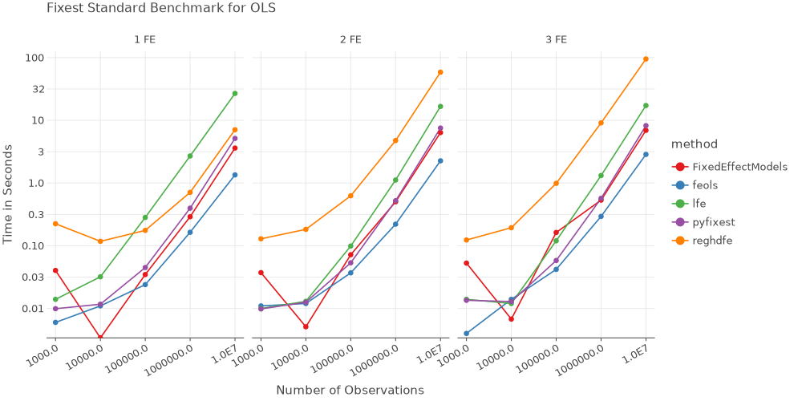

# PyFixest: Fast High-Dimensional Fixed Effects Regression in Python

[](https://opensource.org/license/mit)
[](https://pypi.org/project/pyfixest/)

[](https://pepy.tech/project/pyfixest)
[](https://pepy.tech/project/pyfixest)
[](https://codecov.io/gh/py-econometrics/pyfixest)
[](https://github.com/astral-sh/ruff)
[](#contributors-)

`PyFixest` is a Python implementation of the formidable [fixest](https://github.com/lrberge/fixest) package for fast high-dimensional fixed effects regression.

The package aims to mimic `fixest` syntax and functionality as closely as Python allows: if you know `fixest` well, the goal is that you won't have to read the docs to get started! In particular, this means that all of `fixest's` defaults are mirrored by `PyFixest` - currently with only [one small exception](https://github.com/py-econometrics/pyfixest/issues/260).

Nevertheless, for a quick introduction, you can take a look at the [documentation](https://py-econometrics.github.io/pyfixest/pyfixest.html) or the regression chapter of [Arthur Turrell's](https://github.com/aeturrell) book on [Coding for Economists](https://aeturrell.github.io/coding-for-economists/econmt-regression.html#imports).

## Features

-   **OLS**, **WLS** and **IV** Regression (including IV diagnostics)
-   **Poisson Regression** following the [pplmhdfe algorithm](https://journals.sagepub.com/doi/full/10.1177/1536867X20909691)
-   Multiple Estimation Syntax
-   Several **Robust** and **Cluster Robust Variance-Covariance** Estimators
-   Wald Tests of Multiple Simultaneous Hypotheses
-   **Wild Cluster Bootstrap** Inference (via
    [wildboottest](https://github.com/py-econometrics/wildboottest))
-   **Difference-in-Differences** Estimators:
    -   The canonical Two-Way Fixed Effects Estimator
    -   [Gardner's two-stage
        ("`Did2s`")](https://jrgcmu.github.io/2sdd_current.pdf)
        estimator
    -   Basic Versions of the Local Projections estimator following
        [Dube et al (2023)](https://www.nber.org/papers/w31184)
- **Multiple Hypothesis Corrections** following the Procedure by [Romano and Wolf](https://journals.sagepub.com/doi/pdf/10.1177/1536867X20976314) and **Simultaneous Confidence Intervals** using a **Multiplier Bootstrap**
- Fast **Randomization Inference** as in the [ritest Stata package](https://hesss.org/ritest.pdf)
- The **Causal Cluster Variance Estimator (CCV)** following [Abadie et al.](https://economics.mit.edu/sites/default/files/2022-09/When%20Should%20You%20Adjust%20Standard%20Errors%20for%20Clustering.pdf)


## Installation

You can install the release version from `PyPI` by running

```py
# inside an active virtual environment
python -m pip install pyfixest
```

or the development version from github by running

```py
python -m pip install git+https://github.com/py-econometrics/pyfixest
```

## Benchmarks

All benchmarks follow the [fixest
benchmarks](https://github.com/lrberge/fixest/tree/master/_BENCHMARK).
All non-pyfixest timings are taken from the `fixest` benchmarks.




## Quickstart


```python
import pyfixest as pf

data = pf.get_data()
pf.feols("Y ~ X1 | f1 + f2", data=data).summary()
```


<div id="W5xl50"></div>
<script type="text/javascript" data-lets-plot-script="library">
    if(!window.letsPlotCallQueue) {
        window.letsPlotCallQueue = [];
    };
    window.letsPlotCall = function(f) {
        window.letsPlotCallQueue.push(f);
    };
    (function() {
        var script = document.createElement("script");
        script.type = "text/javascript";
        script.src = "https://cdn.jsdelivr.net/gh/JetBrains/lets-plot@v4.3.3/js-package/distr/lets-plot.min.js";
        script.onload = function() {
            window.letsPlotCall = function(f) {f();};
            window.letsPlotCallQueue.forEach(function(f) {f();});
            window.letsPlotCallQueue = [];

        };
        script.onerror = function(event) {
            window.letsPlotCall = function(f) {};    // noop
            window.letsPlotCallQueue = [];
            var div = document.createElement("div");
            div.style.color = 'darkred';
            div.textContent = 'Error loading Lets-Plot JS';
            document.getElementById("W5xl50").appendChild(div);
        };
        var e = document.getElementById("W5xl50");
        e.appendChild(script);
    })()
</script>


<div id="9eFgOT"></div>
<script type="text/javascript" data-lets-plot-script="library">
    if(!window.letsPlotCallQueue) {
        window.letsPlotCallQueue = [];
    };
    window.letsPlotCall = function(f) {
        window.letsPlotCallQueue.push(f);
    };
    (function() {
        var script = document.createElement("script");
        script.type = "text/javascript";
        script.src = "https://cdn.jsdelivr.net/gh/JetBrains/lets-plot@v4.3.3/js-package/distr/lets-plot.min.js";
        script.onload = function() {
            window.letsPlotCall = function(f) {f();};
            window.letsPlotCallQueue.forEach(function(f) {f();});
            window.letsPlotCallQueue = [];

        };
        script.onerror = function(event) {
            window.letsPlotCall = function(f) {};    // noop
            window.letsPlotCallQueue = [];
            var div = document.createElement("div");
            div.style.color = 'darkred';
            div.textContent = 'Error loading Lets-Plot JS';
            document.getElementById("9eFgOT").appendChild(div);
        };
        var e = document.getElementById("9eFgOT");
        e.appendChild(script);
    })()
</script>


    ###

    Estimation:  OLS
    Dep. var.: Y, Fixed effects: f1+f2
    Inference:  CRV1
    Observations:  997

    | Coefficient   |   Estimate |   Std. Error |   t value |   Pr(>|t|) |   2.5% |   97.5% |
    |:--------------|-----------:|-------------:|----------:|-----------:|-------:|--------:|
    | X1            |     -0.919 |        0.065 |   -14.057 |      0.000 | -1.053 |  -0.786 |
    ---
    RMSE: 1.441 R2: 0.609 R2 Within: 0.2


### Multiple Estimation

You can estimate multiple models at once by using [multiple estimation
syntax](https://aeturrell.github.io/coding-for-economists/econmt-regression.html#multiple-regression-models):


```python
# OLS Estimation: estimate multiple models at once
fit = pf.feols("Y + Y2 ~X1 | csw0(f1, f2)", data = data, vcov = {'CRV1':'group_id'})
# Print the results
pf.etable(fit.to_list())
```


<style type="text/css">
#T_6bd5a tbody tr:nth-child(0) td {
  background-color: #f0f0f0;
}
#T_6bd5a tbody tr:nth-child(1) td {
  border-bottom: 2px solid black;
}
#T_6bd5a tbody tr:nth-child(3) td {
  border-bottom: 1px solid black;
}
#T_6bd5a tbody tr:nth-child(5) td {
  border-bottom: 1px solid black;
}
#T_6bd5a tbody tr:nth-child(8) td {
  border-bottom: 1px solid black;
}
#T_6bd5a tbody td {
  background-color: #ffffff;
}
#T_6bd5a tbody tr td:first-child {
  background-color: #f0f0f0;
  font-weight: bold;
  text-align: left;
}
#T_6bd5a_row0_col0, #T_6bd5a_row0_col1, #T_6bd5a_row0_col2, #T_6bd5a_row0_col3, #T_6bd5a_row0_col4, #T_6bd5a_row0_col5, #T_6bd5a_row0_col6, #T_6bd5a_row1_col0, #T_6bd5a_row1_col1, #T_6bd5a_row1_col2, #T_6bd5a_row1_col3, #T_6bd5a_row1_col4, #T_6bd5a_row1_col5, #T_6bd5a_row1_col6, #T_6bd5a_row2_col0, #T_6bd5a_row2_col1, #T_6bd5a_row2_col2, #T_6bd5a_row2_col3, #T_6bd5a_row2_col4, #T_6bd5a_row2_col5, #T_6bd5a_row2_col6, #T_6bd5a_row3_col0, #T_6bd5a_row3_col1, #T_6bd5a_row3_col2, #T_6bd5a_row3_col3, #T_6bd5a_row3_col4, #T_6bd5a_row3_col5, #T_6bd5a_row3_col6, #T_6bd5a_row4_col0, #T_6bd5a_row4_col1, #T_6bd5a_row4_col2, #T_6bd5a_row4_col3, #T_6bd5a_row4_col4, #T_6bd5a_row4_col5, #T_6bd5a_row4_col6, #T_6bd5a_row5_col0, #T_6bd5a_row5_col1, #T_6bd5a_row5_col2, #T_6bd5a_row5_col3, #T_6bd5a_row5_col4, #T_6bd5a_row5_col5, #T_6bd5a_row5_col6, #T_6bd5a_row6_col0, #T_6bd5a_row6_col1, #T_6bd5a_row6_col2, #T_6bd5a_row6_col3, #T_6bd5a_row6_col4, #T_6bd5a_row6_col5, #T_6bd5a_row6_col6, #T_6bd5a_row7_col0, #T_6bd5a_row7_col1, #T_6bd5a_row7_col2, #T_6bd5a_row7_col3, #T_6bd5a_row7_col4, #T_6bd5a_row7_col5, #T_6bd5a_row7_col6 {
  text-align: right;
}
</style>
<table id="T_6bd5a">
  <caption>Significance levels: * p < 0.05, ** p < 0.01, *** p < 0.001. Format of coefficient cell:
Coefficient (Std. Error)</caption>
  <thead>
    <tr>
      <th id="T_6bd5a_level0_col0" class="col_heading level0 col0" ></th>
      <th id="T_6bd5a_level0_col1" class="col_heading level0 col1" >est1</th>
      <th id="T_6bd5a_level0_col2" class="col_heading level0 col2" >est2</th>
      <th id="T_6bd5a_level0_col3" class="col_heading level0 col3" >est3</th>
      <th id="T_6bd5a_level0_col4" class="col_heading level0 col4" >est4</th>
      <th id="T_6bd5a_level0_col5" class="col_heading level0 col5" >est5</th>
      <th id="T_6bd5a_level0_col6" class="col_heading level0 col6" >est6</th>
    </tr>
  </thead>
  <tbody>
    <tr>
      <td id="T_6bd5a_row0_col0" class="data row0 col0" >depvar</td>
      <td id="T_6bd5a_row0_col1" class="data row0 col1" >Y</td>
      <td id="T_6bd5a_row0_col2" class="data row0 col2" >Y2</td>
      <td id="T_6bd5a_row0_col3" class="data row0 col3" >Y</td>
      <td id="T_6bd5a_row0_col4" class="data row0 col4" >Y2</td>
      <td id="T_6bd5a_row0_col5" class="data row0 col5" >Y</td>
      <td id="T_6bd5a_row0_col6" class="data row0 col6" >Y2</td>
    </tr>
    <tr>
      <td id="T_6bd5a_row1_col0" class="data row1 col0" >Intercept</td>
      <td id="T_6bd5a_row1_col1" class="data row1 col1" >0.919*** (0.121)</td>
      <td id="T_6bd5a_row1_col2" class="data row1 col2" >1.064*** (0.232)</td>
      <td id="T_6bd5a_row1_col3" class="data row1 col3" ></td>
      <td id="T_6bd5a_row1_col4" class="data row1 col4" ></td>
      <td id="T_6bd5a_row1_col5" class="data row1 col5" ></td>
      <td id="T_6bd5a_row1_col6" class="data row1 col6" ></td>
    </tr>
    <tr>
      <td id="T_6bd5a_row2_col0" class="data row2 col0" >X1</td>
      <td id="T_6bd5a_row2_col1" class="data row2 col1" >-1.000*** (0.117)</td>
      <td id="T_6bd5a_row2_col2" class="data row2 col2" >-1.322*** (0.211)</td>
      <td id="T_6bd5a_row2_col3" class="data row2 col3" >-0.949*** (0.087)</td>
      <td id="T_6bd5a_row2_col4" class="data row2 col4" >-1.266*** (0.212)</td>
      <td id="T_6bd5a_row2_col5" class="data row2 col5" >-0.919*** (0.069)</td>
      <td id="T_6bd5a_row2_col6" class="data row2 col6" >-1.228*** (0.194)</td>
    </tr>
    <tr>
      <td id="T_6bd5a_row3_col0" class="data row3 col0" >f2</td>
      <td id="T_6bd5a_row3_col1" class="data row3 col1" >-</td>
      <td id="T_6bd5a_row3_col2" class="data row3 col2" >-</td>
      <td id="T_6bd5a_row3_col3" class="data row3 col3" >-</td>
      <td id="T_6bd5a_row3_col4" class="data row3 col4" >-</td>
      <td id="T_6bd5a_row3_col5" class="data row3 col5" >x</td>
      <td id="T_6bd5a_row3_col6" class="data row3 col6" >x</td>
    </tr>
    <tr>
      <td id="T_6bd5a_row4_col0" class="data row4 col0" >f1</td>
      <td id="T_6bd5a_row4_col1" class="data row4 col1" >-</td>
      <td id="T_6bd5a_row4_col2" class="data row4 col2" >-</td>
      <td id="T_6bd5a_row4_col3" class="data row4 col3" >x</td>
      <td id="T_6bd5a_row4_col4" class="data row4 col4" >x</td>
      <td id="T_6bd5a_row4_col5" class="data row4 col5" >x</td>
      <td id="T_6bd5a_row4_col6" class="data row4 col6" >x</td>
    </tr>
    <tr>
      <td id="T_6bd5a_row5_col0" class="data row5 col0" >R2</td>
      <td id="T_6bd5a_row5_col1" class="data row5 col1" >0.123</td>
      <td id="T_6bd5a_row5_col2" class="data row5 col2" >0.037</td>
      <td id="T_6bd5a_row5_col3" class="data row5 col3" >0.437</td>
      <td id="T_6bd5a_row5_col4" class="data row5 col4" >0.115</td>
      <td id="T_6bd5a_row5_col5" class="data row5 col5" >0.609</td>
      <td id="T_6bd5a_row5_col6" class="data row5 col6" >0.168</td>
    </tr>
    <tr>
      <td id="T_6bd5a_row6_col0" class="data row6 col0" >S.E. type</td>
      <td id="T_6bd5a_row6_col1" class="data row6 col1" >by: group_id</td>
      <td id="T_6bd5a_row6_col2" class="data row6 col2" >by: group_id</td>
      <td id="T_6bd5a_row6_col3" class="data row6 col3" >by: group_id</td>
      <td id="T_6bd5a_row6_col4" class="data row6 col4" >by: group_id</td>
      <td id="T_6bd5a_row6_col5" class="data row6 col5" >by: group_id</td>
      <td id="T_6bd5a_row6_col6" class="data row6 col6" >by: group_id</td>
    </tr>
    <tr>
      <td id="T_6bd5a_row7_col0" class="data row7 col0" >Observations</td>
      <td id="T_6bd5a_row7_col1" class="data row7 col1" >998</td>
      <td id="T_6bd5a_row7_col2" class="data row7 col2" >999</td>
      <td id="T_6bd5a_row7_col3" class="data row7 col3" >997</td>
      <td id="T_6bd5a_row7_col4" class="data row7 col4" >998</td>
      <td id="T_6bd5a_row7_col5" class="data row7 col5" >997</td>
      <td id="T_6bd5a_row7_col6" class="data row7 col6" >998</td>
    </tr>
  </tbody>
</table>


### Adjust Standard Errors "on-the-fly"

Standard Errors can be adjusted after estimation, "on-the-fly":


```python
fit1 = fit.fetch_model(0)
fit1.vcov("hetero").summary()
```

    Model:  Y~X1
    ###

    Estimation:  OLS
    Dep. var.: Y, Fixed effects:
    Inference:  hetero
    Observations:  998

    | Coefficient   |   Estimate |   Std. Error |   t value |   Pr(>|t|) |   2.5% |   97.5% |
    |:--------------|-----------:|-------------:|----------:|-----------:|-------:|--------:|
    | Intercept     |      0.919 |        0.112 |     8.227 |      0.000 |  0.699 |   1.138 |
    | X1            |     -1.000 |        0.082 |   -12.140 |      0.000 | -1.162 |  -0.838 |
    ---
    RMSE: 2.158 R2: 0.123


### Poisson Regression via `fepois()`

You can estimate Poisson Regressions via the `fepois()` function:


```python
poisson_data = pf.get_data(model = "Fepois")
pf.fepois("Y ~ X1 + X2 | f1 + f2", data = poisson_data).summary()
```

    ###

    Estimation:  Poisson
    Dep. var.: Y, Fixed effects: f1+f2
    Inference:  CRV1
    Observations:  997

    | Coefficient   |   Estimate |   Std. Error |   t value |   Pr(>|t|) |   2.5% |   97.5% |
    |:--------------|-----------:|-------------:|----------:|-----------:|-------:|--------:|
    | X1            |     -0.007 |        0.035 |    -0.190 |      0.850 | -0.075 |   0.062 |
    | X2            |     -0.015 |        0.010 |    -1.449 |      0.147 | -0.035 |   0.005 |
    ---
    Deviance: 1068.169


### IV Estimation via three-part formulas

Last, `PyFixest` also supports IV estimation via three part formula
syntax:


```python
fit_iv = pf.feols("Y ~ 1 | f1 | X1 ~ Z1", data = data)
pf.etable([fit_iv._model_1st_stage, fit_iv])
```


<style type="text/css">
#T_52718 tbody tr:nth-child(0) td {
  background-color: #f0f0f0;
}
#T_52718 tbody tr:nth-child(1) td {
  border-bottom: 2px solid black;
}
#T_52718 tbody tr:nth-child(3) td {
  border-bottom: 1px solid black;
}
#T_52718 tbody tr:nth-child(4) td {
  border-bottom: 1px solid black;
}
#T_52718 tbody tr:nth-child(7) td {
  border-bottom: 1px solid black;
}
#T_52718 tbody td {
  background-color: #ffffff;
}
#T_52718 tbody tr td:first-child {
  background-color: #f0f0f0;
  font-weight: bold;
  text-align: left;
}
#T_52718_row0_col0, #T_52718_row0_col1, #T_52718_row0_col2, #T_52718_row1_col0, #T_52718_row1_col1, #T_52718_row1_col2, #T_52718_row2_col0, #T_52718_row2_col1, #T_52718_row2_col2, #T_52718_row3_col0, #T_52718_row3_col1, #T_52718_row3_col2, #T_52718_row4_col0, #T_52718_row4_col1, #T_52718_row4_col2, #T_52718_row5_col0, #T_52718_row5_col1, #T_52718_row5_col2, #T_52718_row6_col0, #T_52718_row6_col1, #T_52718_row6_col2 {
  text-align: right;
}
</style>
<table id="T_52718">
  <caption>Significance levels: * p < 0.05, ** p < 0.01, *** p < 0.001. Format of coefficient cell:
Coefficient (Std. Error)</caption>
  <thead>
    <tr>
      <th id="T_52718_level0_col0" class="col_heading level0 col0" ></th>
      <th id="T_52718_level0_col1" class="col_heading level0 col1" >est1</th>
      <th id="T_52718_level0_col2" class="col_heading level0 col2" >est2</th>
    </tr>
  </thead>
  <tbody>
    <tr>
      <td id="T_52718_row0_col0" class="data row0 col0" >depvar</td>
      <td id="T_52718_row0_col1" class="data row0 col1" >Y</td>
      <td id="T_52718_row0_col2" class="data row0 col2" >Y</td>
    </tr>
    <tr>
      <td id="T_52718_row1_col0" class="data row1 col0" >Z1</td>
      <td id="T_52718_row1_col1" class="data row1 col1" >0.396*** (0.014)</td>
      <td id="T_52718_row1_col2" class="data row1 col2" ></td>
    </tr>
    <tr>
      <td id="T_52718_row2_col0" class="data row2 col0" >X1</td>
      <td id="T_52718_row2_col1" class="data row2 col1" ></td>
      <td id="T_52718_row2_col2" class="data row2 col2" >-1.025*** (0.115)</td>
    </tr>
    <tr>
      <td id="T_52718_row3_col0" class="data row3 col0" >f1</td>
      <td id="T_52718_row3_col1" class="data row3 col1" >x</td>
      <td id="T_52718_row3_col2" class="data row3 col2" >x</td>
    </tr>
    <tr>
      <td id="T_52718_row4_col0" class="data row4 col0" >R2</td>
      <td id="T_52718_row4_col1" class="data row4 col1" >0.419</td>
      <td id="T_52718_row4_col2" class="data row4 col2" >-</td>
    </tr>
    <tr>
      <td id="T_52718_row5_col0" class="data row5 col0" >S.E. type</td>
      <td id="T_52718_row5_col1" class="data row5 col1" >by: f1</td>
      <td id="T_52718_row5_col2" class="data row5 col2" >by: f1</td>
    </tr>
    <tr>
      <td id="T_52718_row6_col0" class="data row6 col0" >Observations</td>
      <td id="T_52718_row6_col1" class="data row6 col1" >994</td>
      <td id="T_52718_row6_col2" class="data row6 col2" >997</td>
    </tr>
  </tbody>
</table>


## Call for Contributions

Thanks for showing interest in contributing to `pyfixest`! We appreciate all
contributions and constructive feedback, whether that be reporting bugs, requesting
new features, or suggesting improvements to documentation.

If you'd like to get involved, but are not yet sure how, please feel free to send us an [email](alexander-fischer1801@t-online.de). Some familiarity with
either Python or econometrics will help, but you really don't need to be a `numpy` core developer or have published in [Econometrica](https://onlinelibrary.wiley.com/journal/14680262) =) We'd be more than happy to invest time to help you get started!

## Contributors ✨

Thanks goes to these wonderful people:

<!-- ALL-CONTRIBUTORS-LIST:START - Do not remove or modify this section -->
<!-- prettier-ignore-start -->
<!-- markdownlint-disable -->
<table>
  <tbody>
    <tr>
      <td align="center" valign="top" width="12.5%"><a href="https://github.com/styfenschaer"><br /><sub><b>styfenschaer</b></sub></a><br /><a href="https://github.com/py-econometrics/pyfixest/commits?author=styfenschaer" title="Code">💻</a></td>
      <td align="center" valign="top" width="12.5%"><a href="https://www.nkeleher.com/"><br /><sub><b>Niall Keleher</b></sub></a><br /><a href="#infra-NKeleher" title="Infrastructure (Hosting, Build-Tools, etc)">🚇</a> <a href="https://github.com/py-econometrics/pyfixest/commits?author=NKeleher" title="Code">💻</a></td>
      <td align="center" valign="top" width="12.5%"><a href="http://wenzhi-ding.com"><br /><sub><b>Wenzhi Ding</b></sub></a><br /><a href="https://github.com/py-econometrics/pyfixest/commits?author=Wenzhi-Ding" title="Code">💻</a></td>
      <td align="center" valign="top" width="12.5%"><a href="https://apoorvalal.github.io/"><br /><sub><b>Apoorva Lal</b></sub></a><br /><a href="https://github.com/py-econometrics/pyfixest/commits?author=apoorvalal" title="Code">💻</a> <a href="https://github.com/py-econometrics/pyfixest/issues?q=author%3Aapoorvalal" title="Bug reports">🐛</a></td>
      <td align="center" valign="top" width="12.5%"><a href="https://juanitorduz.github.io"><br /><sub><b>Juan Orduz</b></sub></a><br /><a href="#infra-juanitorduz" title="Infrastructure (Hosting, Build-Tools, etc)">🚇</a> <a href="https://github.com/py-econometrics/pyfixest/commits?author=juanitorduz" title="Code">💻</a></td>
      <td align="center" valign="top" width="12.5%"><a href="https://s3alfisc.github.io/"><br /><sub><b>Alexander Fischer</b></sub></a><br /><a href="https://github.com/py-econometrics/pyfixest/commits?author=s3alfisc" title="Code">💻</a> <a href="#infra-s3alfisc" title="Infrastructure (Hosting, Build-Tools, etc)">🚇</a></td>
      <td align="center" valign="top" width="12.5%"><a href="http://www.aeturrell.com"><br /><sub><b>aeturrell</b></sub></a><br /><a href="#tutorial-aeturrell" title="Tutorials">✅</a> <a href="https://github.com/py-econometrics/pyfixest/commits?author=aeturrell" title="Documentation">📖</a> <a href="#promotion-aeturrell" title="Promotion">📣</a></td>
      <td align="center" valign="top" width="12.5%"><a href="https://github.com/leostimpfle"><br /><sub><b>leostimpfle</b></sub></a><br /><a href="https://github.com/py-econometrics/pyfixest/commits?author=leostimpfle" title="Code">💻</a> <a href="https://github.com/py-econometrics/pyfixest/issues?q=author%3Aleostimpfle" title="Bug reports">🐛</a></td>
    </tr>
    <tr>
      <td align="center" valign="top" width="12.5%"><a href="https://github.com/baggiponte"><br /><sub><b>baggiponte</b></sub></a><br /><a href="https://github.com/py-econometrics/pyfixest/commits?author=baggiponte" title="Documentation">📖</a></td>
      <td align="center" valign="top" width="12.5%"><a href="https://github.com/sanskriti2005"><br /><sub><b>Sanskriti</b></sub></a><br /><a href="#infra-sanskriti2005" title="Infrastructure (Hosting, Build-Tools, etc)">🚇</a></td>
      <td align="center" valign="top" width="12.5%"><a href="https://github.com/Jayhyung"><br /><sub><b>Jaehyung</b></sub></a><br /><a href="https://github.com/py-econometrics/pyfixest/commits?author=Jayhyung" title="Code">💻</a></td>
      <td align="center" valign="top" width="12.5%"><a href="http://alexstephenson.me"><br /><sub><b>Alex</b></sub></a><br /><a href="https://github.com/py-econometrics/pyfixest/commits?author=asteves" title="Documentation">📖</a></td>
      <td align="center" valign="top" width="12.5%"><a href="https://github.com/greenguy33"><br /><sub><b>Hayden Freedman</b></sub></a><br /><a href="https://github.com/py-econometrics/pyfixest/commits?author=greenguy33" title="Code">💻</a> <a href="https://github.com/py-econometrics/pyfixest/commits?author=greenguy33" title="Documentation">📖</a></td>
      <td align="center" valign="top" width="12.5%"><a href="https://github.com/saidamir"><br /><sub><b>Aziz Mamatov</b></sub></a><br /><a href="https://github.com/py-econometrics/pyfixest/commits?author=saidamir" title="Code">💻</a></td>
      <td align="center" valign="top" width="12.5%"><a href="https://github.com/rafimikail"><br /><sub><b>rafimikail</b></sub></a><br /><a href="https://github.com/py-econometrics/pyfixest/commits?author=rafimikail" title="Code">💻</a></td>
      <td align="center" valign="top" width="12.5%"><a href="https://www.linkedin.com/in/benjamin-knight/"><br /><sub><b>Benjamin Knight</b></sub></a><br /><a href="https://github.com/py-econometrics/pyfixest/commits?author=b-knight" title="Code">💻</a></td>
    </tr>
  </tbody>
</table>

<!-- markdownlint-restore -->
<!-- prettier-ignore-end -->

<!-- ALL-CONTRIBUTORS-LIST:END -->

This project follows the [all-contributors](https://github.com/all-contributors/all-contributors) specification. Contributions of any kind welcome!
