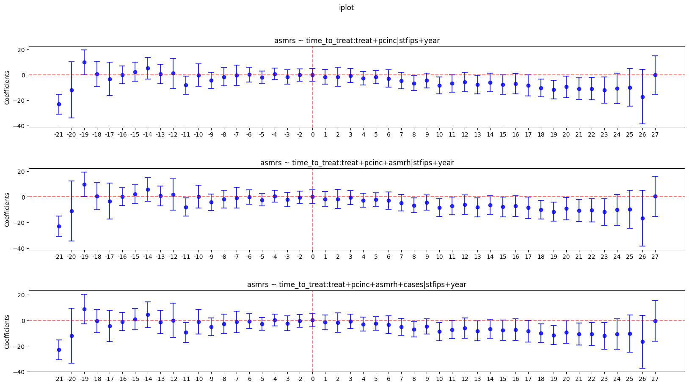

# Getting Started with PyFixest

In a first step, we load the module and some example data:
```py
from pyfixest import Fixest
from pyfixest.utils import get_data

data = get_data()
data.head()
# >>> data.head()
#            Y        X1  X2  X3   X4 group_id         Y2
# 0  37.167541  0.471435  14  20  829        2  36.343535
# 1 -20.290945 -0.720589  36  33   59        6 -21.650227
# 2  23.738056  0.015696   6  13  516       19  23.482428
# 3  19.980327  0.953324  11  91  759       13  19.372943
# 4  -1.482348  0.405453  11  84  325       19  -2.510737

```

We then initiate an object of type `Fixest`.

```py
fixest = Fixest(data = data)
#<pyfixest.fixest.Fixest object at 0x00000216D5873070>
```

For this object, we can now estimate a fixed effects regression via the `.feols()` method. `.feols()` has two arguments: a two-sided model formula, and the type of inference.

```py
fixest.feols("Y~X1 | X2", vcov = "HC1")
```
The first part of the formula contains the dependent variable and "regular" covariates, while the second part contains fixed effects.

Estimation results can be accessed via a `.summary()` or `.tidy()` method:

```py
fixest.summary()
# >>> fixest.summary()
#
# ### Fixed-effects: X2
# Dep. var.: Y
#
#     Estimate  Std. Error   t value  Pr(>|t|)
# X1 -0.103285    0.172956 -0.597172  0.550393
```

Supported covariance types are "iid", "HC1-3", CRV1 and CRV3 (one-way clustering). Inference can be adjusted "on-the-fly" via the
`.vcov()` method:

```py
fixest.vcov({'CRV1':'group_id'}).summary()
# >>> fixest.vcov({'CRV1':'group_id'}).summary()
#
# ### Fixed-effects: X2
# Dep. var.: Y
#
#     Estimate  Std. Error   t value  Pr(>|t|)
# X1 -0.103285    0.157756 -0.654713  0.512653
# ---
```

`PyFixest` supports a range of multiple estimation functionality: `sw`, `sw0`, `csw`, `csw0`, and multiple dependent variables. Note that every new call of `.feols()` attaches new regression results the `Fixest` object.

```py
fixest.feols("Y~X1 | csw0(X3, X4)", vcov = "HC1").summary()

# >>> fixest.feols("Y~X1 | csw0(X3, X4)", vcov = "HC1").summary()
#
# ### Fixed-effects: X2
# Dep. var.: Y
#
#     Estimate  Std. Error   t value  Pr(>|t|)
# X1 -0.103285    0.157756 -0.654713  0.512653
# ---
#
# ### Fixed-effects: 0
# Dep. var.: Y
#
#            Estimate  Std. Error   t value  Pr(>|t|)
# Intercept  7.386158    0.187825 39.324716  0.000000
#        X1 -0.163744    0.186494 -0.878008  0.379939
# ---
#
# ### Fixed-effects: X3
# Dep. var.: Y
#
#     Estimate  Std. Error   t value  Pr(>|t|)
# X1 -0.117885    0.178649 -0.659867  0.509339
# ---
#
# ### Fixed-effects: X3+X4
# Dep. var.: Y
#
#     Estimate  Std. Error   t value  Pr(>|t|)
# X1 -0.063646    0.074751 -0.851439  0.394525
# ---

```

# TWFE Event Study

Here, we follow an example from the LOST library of statistical techniques.

```py
import pandas as pd
import numpy as np
from pyfixest import Fixest

# Read in data
df = pd.read_csv("https://raw.githubusercontent.com/LOST-STATS/LOST-STATS.github.io/master/Model_Estimation/Data/Event_Study_DiD/bacon_example.csv")

df['time_to_treat'] = df['_nfd'].sub(df['year']).fillna(0).astype(int).astype('category')
df['treat'] = np.where(pd.isna(df['_nfd']), 0, 1)

fixest = Fixest(df)
fml = 'asmrs ~ i(time_to_treat, treat, ref = -1) + csw(pcinc, asmrh, cases) | stfips + year'
fixest.feols(fml, vcov = {'CRV1':'stfips'})
fixest.iplot()
```

