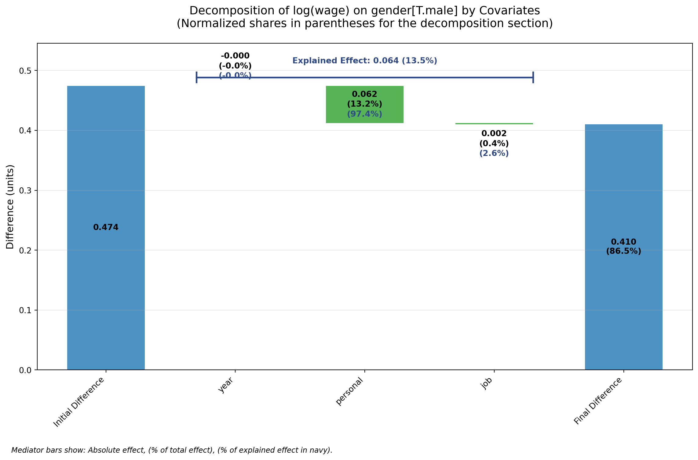

# How much do Covariates Matter?

## Motivation

In regression analyses, we often wonder about “how much covariates matter?” for explaining the relationship between a target variable \\D\\ and an outcome variable \\Y\\.

For example, we might start analysing the gender wage gap with a simple regression model as `log(wage) on gender`. But arguably, men and women differ in many socio-economic characteristics: they might have different (average) levels of education or career experience, and they might work in different industries and select into different higher- or lower-paying industries. So which fraction of the gender wage gap can be explained by these observable characteristics?

In this notebook, we will compute and decompose the gender wage gab based on a subset of the PSID data set using a method commonly known as the “Gelbach Decomposition” ([Gelbach, JoLE 2016](https://papers.ssrn.com/sol3/papers.cfm?abstract_id=1425737)).

We start with loading a subset of the PSID data provided by the AER R package.

``` python
import re

import pandas as pd

import pyfixest as pf

psid = pd.read_csv(
    "https://raw.githubusercontent.com/vincentarelbundock/Rdatasets/refs/heads/master/csv/AER/PSID7682.csv"
)
psid["experience"] = pd.Categorical(psid["experience"])
psid["year"] = pd.Categorical(psid["year"])
psid.head()
```

|  | rownames | experience | weeks | occupation | industry | south | smsa | married | gender | union | education | ethnicity | wage | year | id |
|----|----|----|----|----|----|----|----|----|----|----|----|----|----|----|----|
| 0 | 1 | 3 | 32 | white | no | yes | no | yes | male | no | 9 | other | 260 | 1976 | 1 |
| 1 | 2 | 4 | 43 | white | no | yes | no | yes | male | no | 9 | other | 305 | 1977 | 1 |
| 2 | 3 | 5 | 40 | white | no | yes | no | yes | male | no | 9 | other | 402 | 1978 | 1 |
| 3 | 4 | 6 | 39 | white | no | yes | no | yes | male | no | 9 | other | 402 | 1979 | 1 |
| 4 | 5 | 7 | 42 | white | yes | yes | no | yes | male | no | 9 | other | 429 | 1980 | 1 |

Computing a first correlation between gender and wage, we find that males earn on average 0.474 log points more than women.

``` python
fit_base = pf.feols("log(wage) ~ gender", data=psid, vcov="hetero")
fit_base.summary()
```

    ###

    Estimation:  OLS
    Dep. var.: log(wage)
    sample: None = all
    Inference:  hetero
    Observations:  4165

    | Coefficient    |   Estimate |   Std. Error |   t value |   Pr(>|t|) |   2.5% |   97.5% |
    |:---------------|-----------:|-------------:|----------:|-----------:|-------:|--------:|
    | Intercept      |      6.255 |        0.020 |   320.714 |      0.000 |  6.217 |   6.294 |
    | gender[T.male] |      0.474 |        0.021 |    22.818 |      0.000 |  0.434 |   0.515 |
    ---
    RMSE: 0.436 R2: 0.106 

To examine the impact of observable on the relationship between wage and gender, a common strategy in applied research is to incrementally add a set of covariates to the baseline regression model of `log(wage) on gender`. Here, we will incrementally add the following covariates:

- education,
- experience
- occupation,
- industry
- year
- ethnicity

We can do so by using **multiple estimation syntax**:

``` python
fit_stepwise1 = pf.feols(
    "log(wage) ~ gender + csw0(education, experience, occupation, industry, year, ethnicity)",
    data=psid,
)
pf.etable(fit_stepwise1)
```

[TABLE]

Because the table is so long that it’s hard to see anything, we restrict it to display only a few variables:

``` python
pf.etable(fit_stepwise1, keep=["gender", "ethnicity", "education"])
```

[TABLE]

We see that the coefficient on gender is roughly the same in all models. Tentatively, we might already conclude that the observable characteristics in the data do not explain a large part of the gender wage gap.

But how much do differences in education matter? We have computed 6 additional models that contain education as a covariate. The obtained point estimates vary between \\0.059\\ and \\0.075\\. Which of these numbers should we report?

Additionally, note that while we have only computed 6 additional models with covariates, the number of possible models is much larger. If I did the math correctly, simply by additively and incrementally adding covariates, we could have computed \\57\\ different models (not all of which would have included `education` as a control).

As it turns out, different models **will lead to different point estimates**. The order of incrementally adding covariates **might** impact our conclusion. To illustrate this, we keep the same ordering as before, but start with `ethnicity` as our first variable:

``` python
fit_stepwise2 = pf.feols(
    "log(wage) ~ gender + csw0(ethnicity, education, experience, occupation, industry, year)",
    data=psid,
)
pf.etable(fit_stepwise2, keep=["gender", "ethnicity", "education"])
```

[TABLE]

We obtain 5 new coefficients on `education` that vary between 0.074 and 0.059.

So, which share of the “raw” gender wage gap can be attributed to differences in education between men and women? Should we report a statisics based on the 0.075 estimate? Or on the 0.059 estimate? Which value should we pick?

To help us with this problem, Gelbach (2016, JoLE) develops a decomposition procedure building on the omitted variable bias formula that produces a single value for the contribution of a given covariate, say education, to the gender wage gap.

## Notation and Gelbach’s Algorithm

Before we dive into a code example, let us first introduce the notation and Gelbach’s algorithm. We are interested in “decomposing” the effect of a variable \\X\_{1} \in \mathbb{R}\\ on an outcome \\Y \in \mathbb{R}\\ into a part explained by covariates \\X\_{2} \in \mathbb{R}^{k\_{2}}\\ and an unexplained part.

Thus we can specify two regression models:

- The **short** model \\ Y = X\_{1} \beta\_{1} + u\_{1} \\

- the **long** (or full) model

  \\ Y = X\_{1} \beta\_{1} + X\_{2} \beta\_{2} + e \\

By fitting the **short** regression, we obtain an estimate \\\hat{\beta}\_{1}\\, which we will denote as the **direct effect**, and by estimating the **long** regression, we obtain an estimate of the regression coefficients \\\hat{\beta}\_{2} \in \mathbb{R}^{k_2}\\. We will denote the estimate on \\X_1\\ in the long regression as the **full** effect.

We can then compute the contribution of an individual covariate \\\hat{\delta}\_{k}\\ via the following algorithm:

- Step 1: we compute coefficients from \\k\_{2}\\ auxiliary regression models \\\hat{\Gamma}\\ as \\ \hat{\Gamma} = (X\_{1}'X\_{1})^{-1} X\_{1}'X\_{2} \\

  In words, we regress the target variable \\X\_{1}\\ on each covariate in \\X\_{2}\\. In practice, we can easily do this in one line of code via `scipy.linalg.lstsq()`.

- Step 2: We can compute the total effect **explained** by the covariates, which we denote by \\\delta\\, as

  \\ \hat{\delta} = \sum\_{k=1}^{k_2} \hat{\Gamma}\_{k} \hat{\beta}\_{2,k} \\

  where \\\hat{\Gamma}\_{k}\\ are the coefficients from an auxiliary regression \\X_1\\ on covariate \\X\_{2,k}\\ and \\\hat{\beta}\_{2,k}\\ is the associated estimate on \\X\_{2,k}\\ from the **full** model.

  The individual **contribution of covariate \\k\\** is then defined as

  \\ \hat{\delta}\_{k} = \hat{\Gamma}\_{k} \hat{\beta}\_{2,k}. \\

After having obtained \\\delta\_{k}\\ for each auxiliary variable \\k\\, we can easily aggregate multiple variables into a single groups of interest. For example, if \\X\_{2}\\ contains a set of dummies from industry fixed effects, we could compute the explained part of “industry” by summing over all the dummies:

\\ \hat{\delta}\_{\textit{industry}} = \sum\_{k \in \textit{industry dummies}} \hat{\Gamma}\_{k} \hat{\beta}\_{2,k} \\

## `PyFixest` Example

To employ Gelbach’s decomposition in `pyfixest`, we start with the **full** regression model that contains **all variables of interest**:

``` python
fit_full = pf.feols(
    "log(wage) ~ gender + ethnicity + education + experience + occupation + industry +year",
    data=psid,
)
```

After fitting the **full model**, we can run the decomposition procedure by calling the `decompose()` method. The only required argument is to specify the focal variable `decomp_var`, which in this case is “gender”. Inference is conducted via a non-parametric bootstrap and can optionally be turned off.

``` python
gb = fit_full.decompose(decomp_var="gender[T.male]", digits=5)
```

As before, this produces a pretty big output table that reports - the **direct effect** of the regression of `log(wage) ~ gender` - the **full effect** of gender on log wage using the **full regression** with all control variables - the **explained effect** as the difference between the full and direct effect - a **single scalar value** for the individual contributions of a covariate to overall **explained effect**

For our example at hand, the additional covariates only explain a tiny fraction of the differences in log wages between men and women - 0.064 points. Of these, around one third can be attributed to ethnicity, 0.00064 to years of eduaction, etc.

Note that for now, we ask `etable()` to only report effects in levels. By switching to `panels = "all"`, we would also report normalized coefficient; but we decided not to do so here as otherwise the table would have turned out even longer than it already has.

``` python
gb.etable(
    panels="levels",
)
```

|  | Initial Difference | Adjusted Difference | Explained Difference |
|----|----|----|----|
| Levels (units) |  |  |  |
| gender\[T.male\] | 0.474 | 0.410 | 0.064 |
|  | \[0.438, 0.485\] | \[0.384, 0.420\] | \[0.046, 0.076\] |
| ethnicity\[T.other\] | \- | \- | 0.023 |
|  | \- | \- | \[0.018, 0.025\] |
| education | \- | \- | 0.001 |
|  | \- | \- | \[-0.013, 0.008\] |
| experience\[T.2\] | \- | \- | -0.000 |
|  | \- | \- | \[-0.003, 0.001\] |
| experience\[T.3\] | \- | \- | -0.002 |
|  | \- | \- | \[-0.005, 0.000\] |
| experience\[T.4\] | \- | \- | -0.004 |
|  | \- | \- | \[-0.008, -0.002\] |
| experience\[T.5\] | \- | \- | -0.003 |
|  | \- | \- | \[-0.013, 0.003\] |
| experience\[T.6\] | \- | \- | -0.001 |
|  | \- | \- | \[-0.002, 0.003\] |
| experience\[T.7\] | \- | \- | 0.000 |
|  | \- | \- | \[-0.008, 0.005\] |
| experience\[T.8\] | \- | \- | 0.002 |
|  | \- | \- | \[-0.006, 0.011\] |
| experience\[T.9\] | \- | \- | -0.003 |
|  | \- | \- | \[-0.005, 0.007\] |
| experience\[T.10\] | \- | \- | -0.004 |
|  | \- | \- | \[-0.011, 0.001\] |
| experience\[T.11\] | \- | \- | -0.002 |
|  | \- | \- | \[-0.016, 0.003\] |
| experience\[T.12\] | \- | \- | -0.001 |
|  | \- | \- | \[-0.015, -0.000\] |
| experience\[T.13\] | \- | \- | -0.006 |
|  | \- | \- | \[-0.008, 0.002\] |
| experience\[T.14\] | \- | \- | -0.010 |
|  | \- | \- | \[-0.017, -0.004\] |
| experience\[T.15\] | \- | \- | -0.009 |
|  | \- | \- | \[-0.015, 0.003\] |
| experience\[T.16\] | \- | \- | -0.006 |
|  | \- | \- | \[-0.015, 0.006\] |
| experience\[T.17\] | \- | \- | -0.000 |
|  | \- | \- | \[-0.004, 0.006\] |
| experience\[T.18\] | \- | \- | -0.002 |
|  | \- | \- | \[-0.013, 0.001\] |
| experience\[T.19\] | \- | \- | -0.006 |
|  | \- | \- | \[-0.012, 0.002\] |
| experience\[T.20\] | \- | \- | -0.008 |
|  | \- | \- | \[-0.015, -0.005\] |
| experience\[T.21\] | \- | \- | -0.004 |
|  | \- | \- | \[-0.012, 0.002\] |
| experience\[T.22\] | \- | \- | -0.006 |
|  | \- | \- | \[-0.017, -0.000\] |
| experience\[T.23\] | \- | \- | -0.002 |
|  | \- | \- | \[-0.010, 0.003\] |
| experience\[T.24\] | \- | \- | -0.003 |
|  | \- | \- | \[-0.007, 0.001\] |
| experience\[T.25\] | \- | \- | -0.001 |
|  | \- | \- | \[-0.004, 0.004\] |
| experience\[T.26\] | \- | \- | 0.002 |
|  | \- | \- | \[-0.011, 0.007\] |
| experience\[T.27\] | \- | \- | 0.010 |
|  | \- | \- | \[0.006, 0.014\] |
| experience\[T.28\] | \- | \- | 0.009 |
|  | \- | \- | \[0.005, 0.012\] |
| experience\[T.29\] | \- | \- | 0.013 |
|  | \- | \- | \[0.010, 0.023\] |
| experience\[T.30\] | \- | \- | 0.012 |
|  | \- | \- | \[0.007, 0.019\] |
| experience\[T.31\] | \- | \- | 0.014 |
|  | \- | \- | \[0.009, 0.018\] |
| experience\[T.32\] | \- | \- | 0.012 |
|  | \- | \- | \[0.005, 0.021\] |
| experience\[T.33\] | \- | \- | 0.012 |
|  | \- | \- | \[0.009, 0.018\] |
| experience\[T.34\] | \- | \- | 0.011 |
|  | \- | \- | \[0.008, 0.014\] |
| experience\[T.35\] | \- | \- | 0.009 |
|  | \- | \- | \[0.005, 0.016\] |
| experience\[T.36\] | \- | \- | 0.007 |
|  | \- | \- | \[-0.002, 0.011\] |
| experience\[T.37\] | \- | \- | 0.006 |
|  | \- | \- | \[0.001, 0.007\] |
| experience\[T.38\] | \- | \- | 0.006 |
|  | \- | \- | \[0.004, 0.009\] |
| experience\[T.39\] | \- | \- | 0.003 |
|  | \- | \- | \[0.001, 0.005\] |
| experience\[T.40\] | \- | \- | 0.002 |
|  | \- | \- | \[-0.002, 0.004\] |
| experience\[T.41\] | \- | \- | -0.000 |
|  | \- | \- | \[-0.003, 0.002\] |
| experience\[T.42\] | \- | \- | -0.000 |
|  | \- | \- | \[-0.002, 0.003\] |
| experience\[T.43\] | \- | \- | 0.000 |
|  | \- | \- | \[-0.003, 0.001\] |
| experience\[T.44\] | \- | \- | -0.002 |
|  | \- | \- | \[-0.005, 0.001\] |
| experience\[T.45\] | \- | \- | -0.002 |
|  | \- | \- | \[-0.003, 0.001\] |
| experience\[T.46\] | \- | \- | -0.001 |
|  | \- | \- | \[-0.002, 0.001\] |
| experience\[T.47\] | \- | \- | -0.000 |
|  | \- | \- | \[-0.001, 0.000\] |
| experience\[T.48\] | \- | \- | -0.001 |
|  | \- | \- | \[-0.001, 0.002\] |
| experience\[T.49\] | \- | \- | -0.001 |
|  | \- | \- | \[-0.001, 0.000\] |
| experience\[T.50\] | \- | \- | -0.001 |
|  | \- | \- | \[-0.001, 0.001\] |
| experience\[T.51\] | \- | \- | -0.000 |
|  | \- | \- | \[-0.000, 0.000\] |
| occupation\[T.white\] | \- | \- | -0.016 |
|  | \- | \- | \[-0.023, -0.009\] |
| industry\[T.yes\] | \- | \- | 0.018 |
|  | \- | \- | \[0.015, 0.021\] |
| year\[T.1977\] | \- | \- | 0.000 |
|  | \- | \- | \[-0.003, 0.002\] |
| year\[T.1978\] | \- | \- | 0.000 |
|  | \- | \- | \[-0.007, 0.006\] |
| year\[T.1979\] | \- | \- | 0.000 |
|  | \- | \- | \[-0.007, 0.005\] |
| year\[T.1980\] | \- | \- | 0.000 |
|  | \- | \- | \[-0.015, 0.009\] |
| year\[T.1981\] | \- | \- | 0.000 |
|  | \- | \- | \[-0.019, 0.027\] |
| year\[T.1982\] | \- | \- | 0.000 |
|  | \- | \- | \[-0.018, 0.015\] |
| Decomposition variable: gender\[T.male\]. CIs are computed using B = 1000 bootstrap replications using iid sampling.Col 1: Raw Difference - Coefficient on gender\[T.male\] in short regression . Col 2: Adjusted Difference - Coefficient on gender\[T.male\] in long regression. Col 3: Explained Difference - Difference in coefficients of gender\[T.male\] in short and long regression. Panel 1: Levels (units). |  |  |  |

Note: we can also return the decomposition results as a pd.DataFrame via the `tidy` method.

``` python
gb.tidy().head()
```

|                      | coefficients | ci_lower | ci_upper | panels         |
|----------------------|--------------|----------|----------|----------------|
| direct_effect        | 0.474466     | 0.438460 | 0.484853 | Levels (units) |
| full_effect          | 0.410338     | 0.383537 | 0.420450 | Levels (units) |
| explained_effect     | 0.064129     | 0.045972 | 0.076154 | Levels (units) |
| unexplained_effect   | 0.410338     | 0.383537 | 0.420450 | Levels (units) |
| ethnicity\[T.other\] | 0.022749     | 0.017736 | 0.025083 | Levels (units) |

Because experience is a categorical variable, the table gets pretty unhandy: we produce one estimate for “each” level. Luckily, Gelbach’s decomposition allows us to group individual contributions into a single number. In the `decompose()` method, we can combine variables via the `combine_covariates` argument:

``` python
gb2 = fit_full.decompose(
    decomp_var="gender[T.male]",
    combine_covariates={
        "experience": re.compile("experience"),
        "occupation": re.compile("occupation"),
        "industry": re.compile("industry"),
        "year": re.compile("year"),
        "ethnicity": re.compile("ethnicity"),
    },
    only_coef=True,  # suppress bootstrap for inference
)
```

We now report a single value for “experience”, which explains a good chunk - around half - of the explained part of the gender wage gap.

``` python
gb2.etable(
    panels="levels",
)
```

|  | Initial Difference | Adjusted Difference | Explained Difference |
|----|----|----|----|
| Levels (units) |  |  |  |
| gender\[T.male\] | 0.474 | 0.410 | 0.063 |
| experience | \- | \- | 0.039 |
| occupation | \- | \- | -0.016 |
| industry | \- | \- | 0.018 |
| year | \- | \- | -0.000 |
| ethnicity | \- | \- | 0.023 |
| Decomposition variable: gender\[T.male\]. Col 1: Raw Difference - Coefficient on gender\[T.male\] in short regression . Col 2: Adjusted Difference - Coefficient on gender\[T.male\] in long regression. Col 3: Explained Difference - Difference in coefficients of gender\[T.male\] in short and long regression. Panel 1: Levels (units). |  |  |  |

We can aggregate even more to “individual level” and “job” level variables:

``` python
gb3 = fit_full.decompose(
    decomp_var="gender[T.male]",
    combine_covariates={
        "job": re.compile(r".*(occupation|industry).*"),
        "personal": re.compile(r".*(education|experience|ethnicity).*"),
        "year": re.compile("year"),
    },
    only_coef=True,  # suppress inference
)
```

``` python
gb3.etable(panels="levels")
```

|  | Initial Difference | Adjusted Difference | Explained Difference |
|----|----|----|----|
| Levels (units) |  |  |  |
| gender\[T.male\] | 0.474 | 0.410 | 0.064 |
| job | \- | \- | 0.002 |
| personal | \- | \- | 0.062 |
| year | \- | \- | -0.000 |
| Decomposition variable: gender\[T.male\]. Col 1: Raw Difference - Coefficient on gender\[T.male\] in short regression . Col 2: Adjusted Difference - Coefficient on gender\[T.male\] in long regression. Col 3: Explained Difference - Difference in coefficients of gender\[T.male\] in short and long regression. Panel 1: Levels (units). |  |  |  |

We can easily change multiple aspects of the GT table that `etable` returns. If we set `panels = "all"`, `etable()` will also report normalized coefficients.

``` python
gb3.etable(
    column_heads=["Column A", "Column B", "Column C"],
    panel_heads=["Panel A", "Panel B", "Panel C"],
    panels="all",
    add_notes="We add more notes.",
    caption="Gelbach Decomposition",
)
```

| Gelbach Decomposition |  |  |  |
|----|----|----|----|
|  | Column A | Column B | Column C |
| Panel A |  |  |  |
| gender\[T.male\] | 0.474 | 0.410 | 0.064 |
| job | \- | \- | 0.002 |
| personal | \- | \- | 0.062 |
| year | \- | \- | -0.000 |
| Panel B |  |  |  |
| gender\[T.male\] | 1.000 | 0.865 | 0.135 |
| job | \- | \- | 0.004 |
| personal | \- | \- | 0.132 |
| year | \- | \- | -0.000 |
| Panel C |  |  |  |
| gender\[T.male\] | \- | \- | 1.000 |
| job | \- | \- | 0.026 |
| personal | \- | \- | 0.974 |
| year | \- | \- | -0.000 |
| Decomposition variable: gender\[T.male\]. Col 1: Raw Difference - Coefficient on gender\[T.male\] in short regression . Col 2: Adjusted Difference - Coefficient on gender\[T.male\] in long regression. Col 3: Explained Difference - Difference in coefficients of gender\[T.male\] in short and long regression. Panel 1: Levels (units). Panel 2: Share of Full Effect: Levels normalized by coefficient of the short regression. Panel 3: Share of Explained Effect: Levels normalized by coefficient of the long regression. We add more notes. |  |  |  |

We can visualise the Gelbach decomposition using the `coefplot` method.

``` python
gb3.coefplot()
```



## Literature

- [“When do Covariates Matter? And Which Ones, and How Much?” by Gelbach, Jonah B. (2016), Journal of Labor Economics](https://papers.ssrn.com/sol3/papers.cfm?abstract_id=1425737)
