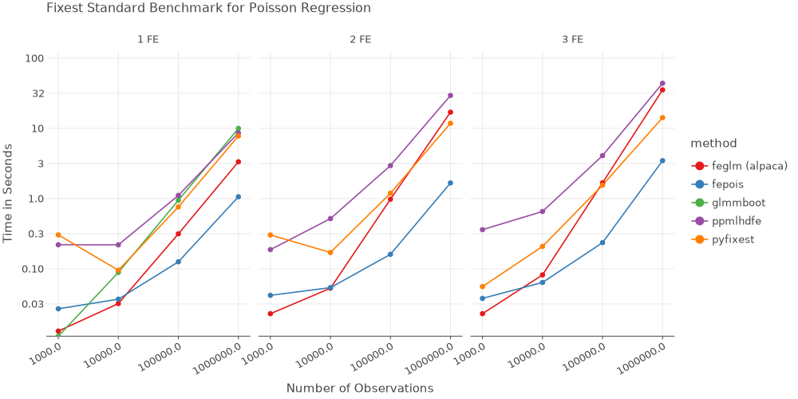

# PyFixest: Fast High-Dimensional Fixed Effects Regression in Python

[](https://opensource.org/license/mit)

[](https://pypi.org/project/pyfixest/)
[![Project Chat][chat-badge]][chat-url]
[](https://codecov.io/gh/py-econometrics/pyfixest)
[](https://github.com/py-econometrics/pyfixest/issues?q=is%3Aissue+is%3Aopen+label%3Abug)
[](https://github.com/py-econometrics/pyfixest/issues)
[](https://github.com/astral-sh/ruff)
[![Pixi Badge][pixi-badge]][pixi-url]
[](https://github.com/py-econometrics/pyfixest?tab=readme-ov-file#support-pyfixest)
[](https://pypi.org/project/pyfixest)
[](https://github.com/py-econometrics/pyfixest?tab=readme-ov-file#how-to-cite)
[](https://pyfixest.org/pyfixest.html)
[](https://pyfixest.org/reference/)
[](https://deepwiki.com/py-econometrics/pyfixest)


[pixi-badge]:https://img.shields.io/endpoint?url=https://raw.githubusercontent.com/prefix-dev/pixi/main/assets/badge/v0.json&style=flat-square
[pixi-url]: https://pixi.sh

[chat-badge]: https://img.shields.io/discord/1259933360726216754.svg?label=&logo=discord&logoColor=ffffff&color=7389D8&labelColor=6A7EC2&style=flat-square
[chat-url]: https://discord.gg/gBAydeDMVK

`PyFixest` is a Python package for fast high-dimensional fixed effects regression.

The package aims to mimic the syntax and functionality of [Laurent Bergé's](https://sites.google.com/site/laurentrberge/) formidable [fixest](https://github.com/lrberge/fixest) package as closely as Python allows: if you know `fixest` well, the goal is that you won't have to read the docs to get started! In particular, this means that all of `fixest's` defaults are mirrored by `PyFixest`.

For a quick introduction, you can take a look at the [quickstart](https://pyfixest.org/quickstart.html) or the regression chapter of [Coding for Economists](https://aeturrell.github.io/coding-for-economists/econmt-regression.html#imports). You can find documentation of all user facing functions in the [Function Reference](https://pyfixest.org/reference/) section of the [documentation](https://pyfixest.org/pyfixest.html).

For questions on `PyFixest`, head on over to our [github discussions](https://github.com/py-econometrics/pyfixest/discussions), or (more informally) join our [Discord server](https://discord.gg/gBAydeDMVK).

## Support PyFixest

If you enjoy using `PyFixest`, please consider donating to [GiveDirectly](https://donate.givedirectly.org/dedicate) and dedicating your donation to `pyfixest.dev@gmail.com`.
You can also leave a message through the donation form - your support and encouragement mean a lot to the developers!

## Features

-   **OLS**, **WLS** and **IV** Regression with Fixed-Effects Demeaning via [Frisch-Waugh-Lovell](https://bookdown.org/ts_robinson1994/10EconometricTheorems/frisch.html)
-   **Poisson Regression** following the [pplmhdfe algorithm](https://journals.sagepub.com/doi/full/10.1177/1536867X20909691)
-   Probit, Logit and Gaussian Family **GLMs** (currently without fixed effects demeaning, this is WIP)
-   **Quantile Regression** using an Interior Point Solver
-   Multiple Estimation Syntax
-   Several **Robust**, **Cluster Robust** and **HAC Variance-Covariance** Estimators
-   **Wild Cluster Bootstrap** Inference (via
    [wildboottest](https://github.com/py-econometrics/wildboottest))
-   **Difference-in-Differences** Estimators:
    -   The canonical Two-Way Fixed Effects Estimator
    -   [Gardner's two-stage
        ("`Did2s`")](https://jrgcmu.github.io/2sdd_current.pdf)
        estimator
    -   Basic Versions of the Local Projections estimator following
        [Dube et al (2023)](https://www.nber.org/papers/w31184)
    - The fully saturated Event-Study estimator following [Sun & Abraham (2021)](https://www.sciencedirect.com/science/article/abs/pii/S030440762030378X)
- **Multiple Hypothesis Corrections** following the Procedure by [Romano and Wolf](https://journals.sagepub.com/doi/pdf/10.1177/1536867X20976314) and **Simultaneous Confidence Intervals** using a **Multiplier Bootstrap**
- The **Causal Cluster Variance Estimator (CCV)** following [Abadie et al.](https://economics.mit.edu/sites/default/files/2022-09/When%20Should%20You%20Adjust%20Standard%20Errors%20for%20Clustering.pdf)
- Regression **Decomposition** following [Gelbach (2016)](https://papers.ssrn.com/sol3/papers.cfm?abstract_id=1425737)
- **Publication-ready tables** with [Great Tables](https://posit-dev.github.io/great-tables/articles/intro.html) or LaTex booktabs

## Installation

You can install the release version from `PyPi` by running

``` py
pip install -U pyfixest
```

or the development version from github by running

``` py
pip install git+https://github.com/py-econometrics/pyfixest.git
```


### GPU Acceleration (Optional)

PyFixest supports GPU-accelerated fixed effects demeaning via CuPy. To enable GPU acceleration, install CuPy matching your CUDA version:

```bash
# For CUDA 11.x, 12.x, 13.x
pip install cupy-cuda11x
pip install cupy-cuda12x
pip install cupy-cuda13x
```

Once installed, you can use GPU-accelerated demeaning by setting the `demean_backend` parameter:

```python
# Use GPU with float32 and float64 precision
pf.feols("Y ~ X1 | f1 + f2", data=data, demean_backend="cupy32")
pf.feols("Y ~ X1 | f1 + f2", data=data, demean_backend="cupy64")
```

## Benchmarks

All benchmarks follow the [fixest
benchmarks](https://github.com/lrberge/fixest/tree/master/_BENCHMARK).
All non-pyfixest timings are taken from the `fixest` benchmarks.





## Quickstart


```python
import pyfixest as pf

data = pf.get_data()
pf.feols("Y ~ X1 | f1 + f2", data=data).summary()
```

    ###

    Estimation:  OLS
    Dep. var.: Y, Fixed effects: f1+f2
    Inference:  CRV1
    Observations:  997

    | Coefficient   |   Estimate |   Std. Error |   t value |   Pr(>|t|) |   2.5% |   97.5% |
    |:--------------|-----------:|-------------:|----------:|-----------:|-------:|--------:|
    | X1            |     -0.919 |        0.065 |   -14.057 |      0.000 | -1.053 |  -0.786 |
    ---
    RMSE: 1.441   R2: 0.609   R2 Within: 0.2


### Multiple Estimation

You can estimate multiple models at once by using [multiple estimation
syntax](https://aeturrell.github.io/coding-for-economists/econmt-regression.html#multiple-regression-models):


```python
# OLS Estimation: estimate multiple models at once
fit = pf.feols("Y + Y2 ~X1 | csw0(f1, f2)", data = data, vcov = {'CRV1':'group_id'})
# Print the results
fit.etable()
```

                               est1               est2               est3               est4               est5               est6
    ------------  -----------------  -----------------  -----------------  -----------------  -----------------  -----------------
    depvar                        Y                 Y2                  Y                 Y2                  Y                 Y2
    ------------------------------------------------------------------------------------------------------------------------------
    Intercept      0.919*** (0.121)   1.064*** (0.232)
    X1            -1.000*** (0.117)  -1.322*** (0.211)  -0.949*** (0.087)  -1.266*** (0.212)  -0.919*** (0.069)  -1.228*** (0.194)
    ------------------------------------------------------------------------------------------------------------------------------
    f2                            -                  -                  -                  -                  x                  x
    f1                            -                  -                  x                  x                  x                  x
    ------------------------------------------------------------------------------------------------------------------------------
    R2                        0.123              0.037              0.437              0.115              0.609              0.168
    S.E. type          by: group_id       by: group_id       by: group_id       by: group_id       by: group_id       by: group_id
    Observations                998                999                997                998                997                998
    ------------------------------------------------------------------------------------------------------------------------------
    Significance levels: * p < 0.05, ** p < 0.01, *** p < 0.001
    Format of coefficient cell:
    Coefficient (Std. Error)


### Adjust Standard Errors "on-the-fly"

Standard Errors can be adjusted after estimation, "on-the-fly":


```python
fit1 = fit.fetch_model(0)
fit1.vcov("hetero").summary()
```

    Model:  Y~X1
    ###

    Estimation:  OLS
    Dep. var.: Y
    Inference:  hetero
    Observations:  998

    | Coefficient   |   Estimate |   Std. Error |   t value |   Pr(>|t|) |   2.5% |   97.5% |
    |:--------------|-----------:|-------------:|----------:|-----------:|-------:|--------:|
    | Intercept     |      0.919 |        0.112 |     8.223 |      0.000 |  0.699 |   1.138 |
    | X1            |     -1.000 |        0.082 |   -12.134 |      0.000 | -1.162 |  -0.838 |
    ---
    RMSE: 2.158   R2: 0.123


### Poisson Regression via `fepois()`

You can estimate Poisson Regressions via the `fepois()` function:


```python
poisson_data = pf.get_data(model = "Fepois")
pf.fepois("Y ~ X1 + X2 | f1 + f2", data = poisson_data).summary()
```

    ###

    Estimation:  Poisson
    Dep. var.: Y, Fixed effects: f1+f2
    Inference:  CRV1
    Observations:  997

    | Coefficient   |   Estimate |   Std. Error |   t value |   Pr(>|t|) |   2.5% |   97.5% |
    |:--------------|-----------:|-------------:|----------:|-----------:|-------:|--------:|
    | X1            |     -0.007 |        0.035 |    -0.190 |      0.850 | -0.075 |   0.062 |
    | X2            |     -0.015 |        0.010 |    -1.449 |      0.147 | -0.035 |   0.005 |
    ---
    Deviance: 1068.169


### IV Estimation via three-part formulas

Last, `PyFixest` also supports IV estimation via three part formula
syntax:


```python
fit_iv = pf.feols("Y ~ 1 | f1 | X1 ~ Z1", data = data)
fit_iv.summary()
```

    ###

    Estimation:  IV
    Dep. var.: Y, Fixed effects: f1
    Inference:  CRV1
    Observations:  997

    | Coefficient   |   Estimate |   Std. Error |   t value |   Pr(>|t|) |   2.5% |   97.5% |
    |:--------------|-----------:|-------------:|----------:|-----------:|-------:|--------:|
    | X1            |     -1.025 |        0.115 |    -8.930 |      0.000 | -1.259 |  -0.790 |
    ---

## Quantile Regression via `pf.quantreg`

```python
fit_qr = pf.quantreg("Y ~ X1 + X2", data = data, quantile = 0.5)
```


## Call for Contributions

Thanks for showing interest in contributing to `pyfixest`! We appreciate all
contributions and constructive feedback, whether that be reporting bugs, requesting
new features, or suggesting improvements to documentation.

**Upcoming:** We're hosting a [PyFixest Sprint in Heilbronn](pyfixest-sprint.md) with [AppliedAI](https://www.appliedai.de/) in late February/early March 2026. Interested in joining? [Learn more and get in touch](pyfixest-sprint.md).

If you'd like to get involved, but are not yet sure how, please feel free to send us an [email](alexander-fischer1801@t-online.de). Some familiarity with
either Python or econometrics will help, but you really don't need to be a `numpy` core developer or have published in [Econometrica](https://onlinelibrary.wiley.com/journal/14680262) =) We'd be more than happy to invest time to help you get started!

## Contributors ✨

Thanks goes to these wonderful people:

<!-- ALL-CONTRIBUTORS-LIST:START - Do not remove or modify this section -->
<!-- prettier-ignore-start -->
<!-- markdownlint-disable -->
<table>
  <tbody>
    <tr>
      <td align="center" valign="top" width="14.28%"><a href="https://github.com/styfenschaer"><br /><sub><b>styfenschaer</b></sub></a><br /><a href="https://github.com/py-econometrics/pyfixest/commits?author=styfenschaer" title="Code">💻</a></td>
      <td align="center" valign="top" width="14.28%"><a href="https://www.nkeleher.com/"><br /><sub><b>Niall Keleher</b></sub></a><br /><a href="#infra-NKeleher" title="Infrastructure (Hosting, Build-Tools, etc)">🚇</a> <a href="https://github.com/py-econometrics/pyfixest/commits?author=NKeleher" title="Code">💻</a></td>
      <td align="center" valign="top" width="14.28%"><a href="http://wenzhi-ding.com"><br /><sub><b>Wenzhi Ding</b></sub></a><br /><a href="https://github.com/py-econometrics/pyfixest/commits?author=Wenzhi-Ding" title="Code">💻</a></td>
      <td align="center" valign="top" width="14.28%"><a href="https://apoorvalal.github.io/"><br /><sub><b>Apoorva Lal</b></sub></a><br /><a href="https://github.com/py-econometrics/pyfixest/commits?author=apoorvalal" title="Code">💻</a> <a href="https://github.com/py-econometrics/pyfixest/issues?q=author%3Aapoorvalal" title="Bug reports">🐛</a></td>
      <td align="center" valign="top" width="14.28%"><a href="https://juanitorduz.github.io"><br /><sub><b>Juan Orduz</b></sub></a><br /><a href="#infra-juanitorduz" title="Infrastructure (Hosting, Build-Tools, etc)">🚇</a> <a href="https://github.com/py-econometrics/pyfixest/commits?author=juanitorduz" title="Code">💻</a></td>
      <td align="center" valign="top" width="14.28%"><a href="https://pyfixest.org/blog/"><br /><sub><b>Alexander Fischer</b></sub></a><br /><a href="https://github.com/py-econometrics/pyfixest/commits?author=py-econometrics" title="Code">💻</a> <a href="#infra-py-econometrics" title="Infrastructure (Hosting, Build-Tools, etc)">🚇</a></td>
      <td align="center" valign="top" width="14.28%"><a href="http://www.aeturrell.com"><br /><sub><b>aeturrell</b></sub></a><br /><a href="#tutorial-aeturrell" title="Tutorials">✅</a> <a href="https://github.com/py-econometrics/pyfixest/commits?author=aeturrell" title="Documentation">📖</a> <a href="#promotion-aeturrell" title="Promotion">📣</a></td>
    </tr>
  </tbody>
</table>

<!-- markdownlint-restore -->
<!-- prettier-ignore-end -->

<!-- ALL-CONTRIBUTORS-LIST:END -->

This project follows the [all-contributors](https://github.com/all-contributors/all-contributors) specification. Contributions of any kind welcome!

## Acknowledgements

First and foremost, we want to acknowledge [Laurent Bergé's](https://sites.google.com/site/laurentrberge/) formidable [fixest](https://github.com/lrberge/fixest), which [is so good we decided to stick to its API and conventions](https://youtu.be/kSQxGGA7Rr4?si=8-wTbzLPnIZQ7lYI&t=576) as closely as Python allows.

For a full list of software packages and papers that have influenced PyFixest, please take a look at the [Acknowledgements page](https://pyfixest.org/acknowledgements.html).

We also want to thank all institutions that have funded or supported work on PyFixest!


## How to Cite

If you want to cite PyFixest, you can use the following BibTeX entry:

```bibtex
@software{pyfixest,
  author  = {{The PyFixest Authors}},
  title   = {{pyfixest: Fast high-dimensional fixed effect estimation in Python}},
  year    = {2025},
  url     = {https://github.com/py-econometrics/pyfixest}
}
```
