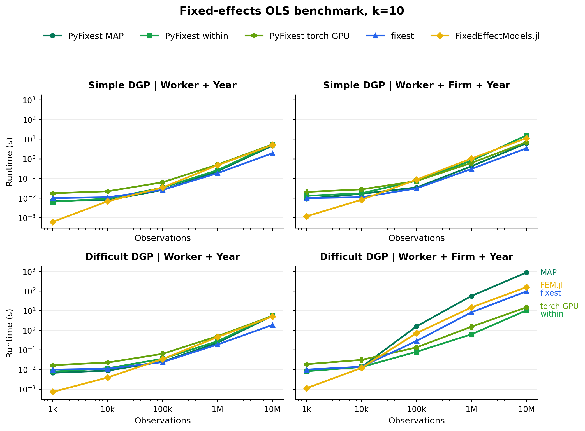

# PyFixest: Fast High-Dimensional Fixed Effects Regression in Python

[](https://opensource.org/license/mit)  [](https://pypi.org/project/pyfixest/) [](https://codecov.io/gh/py-econometrics/pyfixest) [](https://pepy.tech/project/pyfixest) [](https://pepy.tech/project/pyfixest)

[](https://discord.gg/gBAydeDMVK)

Project Chat

[Docs](https://pyfixest.org/pyfixest.html) · [Quickstart](https://pyfixest.org/quickstart.html) · [Function & API Reference](https://pyfixest.org/reference/) · [DeepWiki](https://deepwiki.com/py-econometrics/pyfixest) · [Benchmarks](https://github.com/py-econometrics/pyfixest/tree/master/benchmarks) · [Contributing](https://pyfixest.org/contributing.html) · [Changelog](https://pyfixest.org/changelog.html)

`PyFixest` is a Python package for fast high-dimensional fixed effects regression.

The package aims to mimic the syntax and functionality of [Laurent Bergé’s](https://sites.google.com/site/laurentrberge/) formidable [fixest](https://github.com/lrberge/fixest) package as closely as Python allows. If you know `fixest` well, the goal is that you won’t have to read the docs to get started! In particular, this means that all of `fixest's` defaults are mirrored by `PyFixest`.

For questions on `PyFixest`, head over to our [GitHub discussions](https://github.com/py-econometrics/pyfixest/discussions), or join our [Discord server](https://discord.gg/gBAydeDMVK).

## Features

- **Estimation**
  - **OLS**, **WLS**, **IV**, and **GLMs** (Poisson, logit, probit, gaussian) with high-dimensional fixed effects
  - Different **demeaning backends** (MAP, [within](https://github.com/py-econometrics/within) LSMR, torch LSMR) on CPU and GPU
  - Fast **quantile regression** via an interior-point solver
  - **Difference-in-differences** estimators, including TWFE, `Did2s`, local projections, and Sun-Abraham event studies
  - Regression **decomposition** following [Gelbach (2016)](https://papers.ssrn.com/sol3/papers.cfm?abstract_id=1425737)
  - Multiple estimation syntax
- **Inference**
  - Several **robust**, **cluster-robust**, and **HAC variance-covariance** estimators
  - **Wild cluster bootstrap** inference via [wildboottest](https://github.com/py-econometrics/wildboottest)
  - **Multiple hypothesis corrections** and simultaneous confidence intervals
  - Fast **randomization inference**
  - The **causal cluster variance estimator (CCV)**
- **Post-Estimation & Reporting**
  - **Publication-ready tables** with [Great Tables](https://posit-dev.github.io/great-tables/articles/intro.html) or LaTeX booktabs via the [maketables library](https://github.com/py-econometrics/maketables)

## Installation

You can install the release version from `PyPI` by running

``` bash
# inside an active virtual environment
python -m pip install pyfixest
```

or the development version from github by running

``` bash
python -m pip install git+https://github.com/py-econometrics/pyfixest
```

Optional dependencies

For visualization features using the `lets-plot` backend, install:

``` bash
python -m pip install pyfixest[plots]
```

`matplotlib` is included by default, so plotting works without this extra.

To run the LSMR demeaner via `PyTorch` (CPU and GPU), you need to install `PyTorch`, which you can do via

``` bash
python -m pip install pyfixest[torch]
```

For GPU acceleration on CUDA, you additionally need to install a CUDA-enabled torch build. See the [PyTorch installation guide](https://pytorch.org/get-started/locally/) for details.

Then use the typed `demeaner` API:

``` python
# CPU
pf.feols(
    "Y ~ X1 | f1 + f2",
    data=data,
    demeaner=pf.LsmrDemeaner(backend="torch", device="cpu"),
)

# CUDA GPU
pf.feols(
    "Y ~ X1 | f1 + f2",
    data=data,
    demeaner=pf.LsmrDemeaner(backend="torch", device="cuda"),
)
```

## Quickstart

``` python
import pyfixest as pf

data = pf.get_data()
pf.feols("Y ~ X1 | f1 + f2", data=data).summary()
```

    ###

    Estimation:  OLS
    Dep. var.: Y, Fixed effects: f1+f2
    Inference:  CRV1
    Observations:  997

    | Coefficient   |   Estimate |   Std. Error |   t value |   Pr(>|t|) |   2.5% |   97.5% |
    |:--------------|-----------:|-------------:|----------:|-----------:|-------:|--------:|
    | X1            |     -0.919 |        0.065 |   -14.057 |      0.000 | -1.053 |  -0.786 |
    ---
    RMSE: 1.441   R2: 0.609   R2 Within: 0.2

`PyFixest` also supports multiple estimation syntax:

``` python
fit = pf.feols("Y + Y2 ~ X1 | csw0(f1, f2)", data=data, vcov={"CRV1": "group_id"})
fit.etable()
```

For more examples, see the [quickstart](https://pyfixest.org/quickstart.html), the [formula syntax tutorial](https://pyfixest.org/formula-syntax.html), and the [Poisson & GLMs tutorial](https://pyfixest.org/poisson-glm.html).

## Benchmarks

The DGPs follow the “simple” and “difficult” designs from the [fixest benchmarks](https://github.com/kylebutts/fixest_benchmarks). The figure timings for regressions with `k=10` covariates and plots the median runtime across three runs for PyFixest MAP, PyFixest within, PyFixest torch on CUDA GPU, fixest, and FixedEffectModels.jl.



To reproduce the benchmarks, run the modular benchmark script:

``` bash
python benchmarks/modular/benchmark_main.py
```

For the full benchmark suite, see the [`benchmarks/`](https://github.com/py-econometrics/pyfixest/tree/master/benchmarks) directory and the note on [difficult fixed effects problems](https://github.com/py-econometrics/pyfixest/blob/master/docs/explanation/difficult-fixed-effects.md).

## Learn More

- [Quickstart](https://pyfixest.org/quickstart.html)
- [Function & API Reference](https://pyfixest.org/reference/)
- [Difference-in-Differences](https://pyfixest.org/difference-in-differences.html)
- [Quantile Regression](https://pyfixest.org/quantile-regression.html)
- [Changelog](https://pyfixest.org/changelog.html)
- [Contributing](https://pyfixest.org/contributing.html)

## Acknowledgements

First and foremost, we want to acknowledge [Laurent Bergé’s](https://sites.google.com/site/laurentrberge/) formidable [fixest](https://github.com/lrberge/fixest), which [is so good we decided to stick to its API and conventions](https://youtu.be/kSQxGGA7Rr4?si=8-wTbzLPnIZQ7lYI&t=576) as closely as Python allows. Without `fixest`, `PyFixest` likely wouldn’t exist - or at the very least, it would look very different.

For a full list of software packages and papers that have influenced PyFixest, please take a look at the [Acknowledgements page](https://pyfixest.org/acknowledgements.html).

We thank all institutions that have funded or supported work on PyFixest!


## How to Cite

If you want to cite PyFixest, you can use the following BibTeX entry:

``` bibtex
@software{pyfixest,
  author  = {{The PyFixest Authors}},
  title   = {{pyfixest: Fast high-dimensional fixed effect estimation in Python}},
  year    = {2025},
  url     = {https://github.com/py-econometrics/pyfixest}
}
```

## Support PyFixest

If you enjoy using `PyFixest`, please consider donating to [GiveDirectly](https://donate.givedirectly.org/dedicate) and dedicating your donation to `pyfixest.dev@gmail.com`. You can also leave a message through the donation form; your support and encouragement mean a lot to the developers.

## Call for Contributions

Thanks for showing interest in contributing to `pyfixest`! We appreciate all contributions and constructive feedback, whether that be reporting bugs, requesting new features, or suggesting improvements to documentation.

If you’d like to get involved, but are not yet sure how, please feel free to send us an [email](alexander-fischer1801@t-online.de). Some familiarity with either Python or econometrics will help, but you really don’t need to be a `numpy` core developer or have published in [Econometrica](https://onlinelibrary.wiley.com/journal/14680262) =) We’d be more than happy to invest time to help you get started!

## Contributors ✨

Thanks goes to these wonderful people:

[TABLE]

This project follows the [all-contributors](https://github.com/all-contributors/all-contributors) specification. Contributions of any kind welcome!
