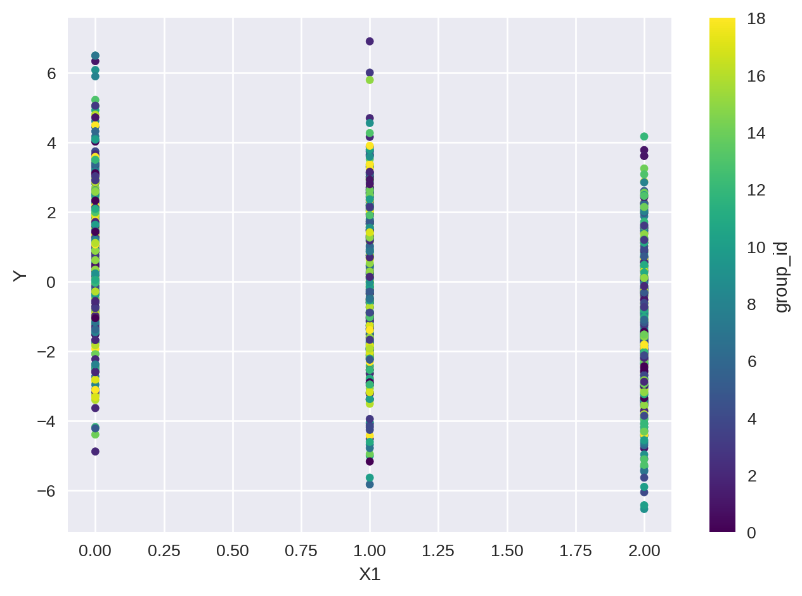
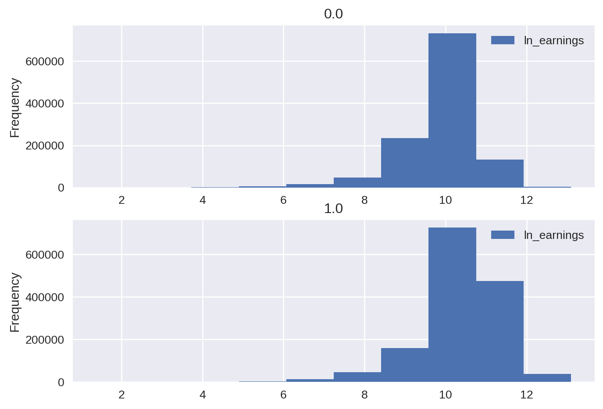
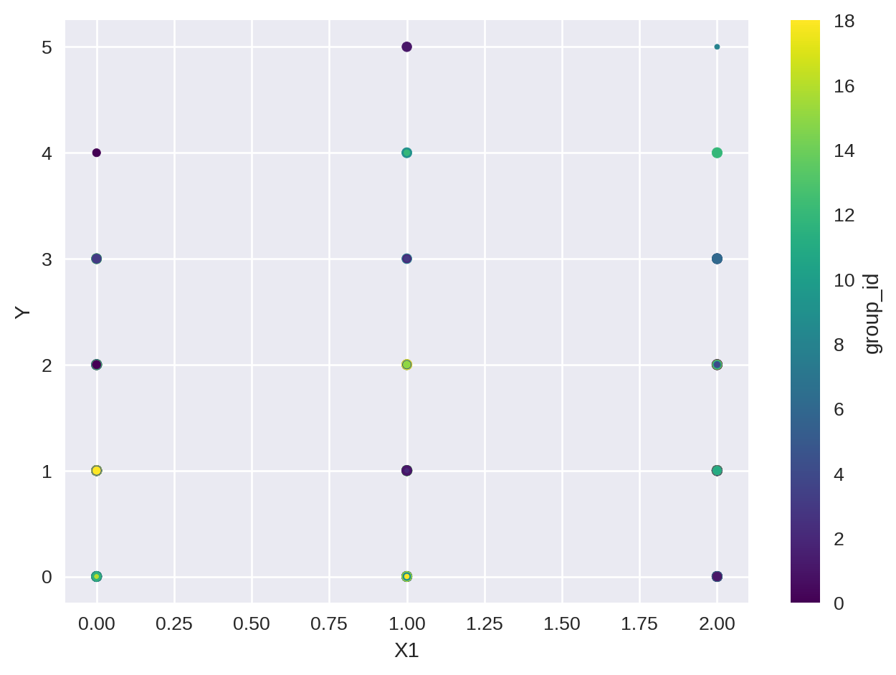
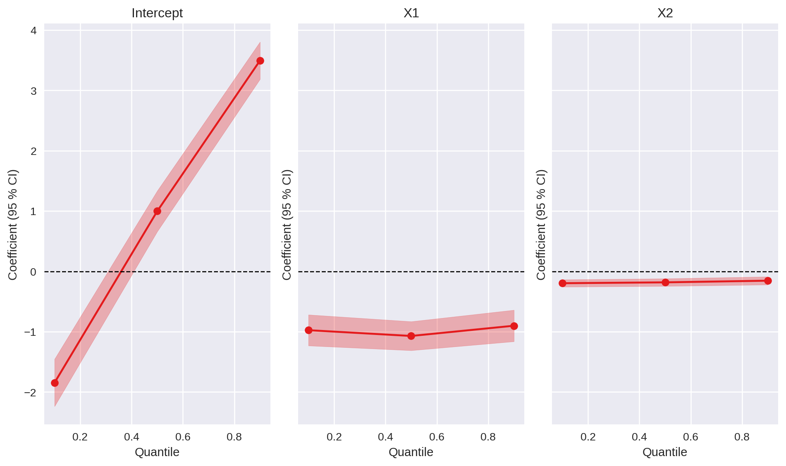

# Getting Started with PyFixest

# OLS with Fixed Effects

## What is a fixed effect model?

A fixed effect model is a statistical model that includes fixed effects, which are parameters that are estimated to be constant across different groups.

**Example \[Panel Data\]:** In the context of panel data, fixed effects are parameters that are constant across different individuals or time. The typical model example is given by the following equation:

\\ Y\_{it} = \beta X\_{it} + \alpha_i + \psi_t + \varepsilon\_{it} \\

where \\Y\_{it}\\ is the dependent variable for individual \\i\\ at time \\t\\, \\X\_{it}\\ is the independent variable, \\\beta\\ is the coefficient of the independent variable, \\\alpha_i\\ is the individual fixed effect, \\\psi_t\\ is the time fixed effect, and \\\varepsilon\_{it}\\ is the error term. The individual fixed effect \\\alpha_i\\ is a parameter that is constant across time for each individual, while the time fixed effect \\\psi_t\\ is a parameter that is constant across individuals for each time period.

Note however that, despite the fact that fixed effects are commonly used in panel setting, one does not need a panel data set to work with fixed effects. For example, cluster randomized trials with cluster fixed effects, or wage regressions with worker and firm fixed effects.

In this “quick start” guide, we will show you how to estimate a fixed effect model using the `PyFixest` package. We do not go into the details of the theory behind fixed effect models, but we focus on how to estimate them using `PyFixest`.

## Read Sample Data

In a first step, we load the module and some synthetic example data:

``` python
import matplotlib.pyplot as plt
import numpy as np
import pandas as pd
try:
    from lets_plot import LetsPlot
    _HAS_LETS_PLOT = True
except ImportError:
    _HAS_LETS_PLOT = False

from marginaleffects import slopes, avg_slopes

import pyfixest as pf

if _HAS_LETS_PLOT:
    LetsPlot.setup_html()

plt.style.use("seaborn-v0_8")

%load_ext watermark
%config InlineBackend.figure_format = "retina"
%watermark --iversions

data = pf.get_data()

data.head()
```

    pandas    : 3.0.1
    numpy     : 2.4.2
    pyfixest  : 0.60.0
    matplotlib: 3.10.8

|  | Y | Y2 | X1 | X2 | f1 | f2 | f3 | group_id | Z1 | Z2 | weights |
|----|----|----|----|----|----|----|----|----|----|----|----|
| 0 | NaN | 2.357103 | 0.0 | 0.457858 | 15.0 | 0.0 | 7.0 | 9.0 | -0.330607 | 1.054826 | 0.661478 |
| 1 | -1.458643 | 5.163147 | NaN | -4.998406 | 6.0 | 21.0 | 4.0 | 8.0 | NaN | -4.113690 | 0.772732 |
| 2 | 0.169132 | 0.751140 | 2.0 | 1.558480 | NaN | 1.0 | 7.0 | 16.0 | 1.207778 | 0.465282 | 0.990929 |
| 3 | 3.319513 | -2.656368 | 1.0 | 1.560402 | 1.0 | 10.0 | 11.0 | 3.0 | 2.869997 | 0.467570 | 0.021123 |
| 4 | 0.134420 | -1.866416 | 2.0 | -3.472232 | 19.0 | 20.0 | 6.0 | 14.0 | 0.835819 | -3.115669 | 0.790815 |

``` python
data.info()
```

    <class 'pandas.DataFrame'>
    RangeIndex: 1000 entries, 0 to 999
    Data columns (total 11 columns):
     #   Column    Non-Null Count  Dtype  
    ---  ------    --------------  -----  
     0   Y         999 non-null    float64
     1   Y2        1000 non-null   float64
     2   X1        999 non-null    float64
     3   X2        1000 non-null   float64
     4   f1        999 non-null    float64
     5   f2        1000 non-null   float64
     6   f3        1000 non-null   float64
     7   group_id  1000 non-null   float64
     8   Z1        999 non-null    float64
     9   Z2        1000 non-null   float64
     10  weights   1000 non-null   float64
    dtypes: float64(11)
    memory usage: 86.1 KB

We see that some of our columns have missing data.

## OLS Estimation

We are interested in the relation between the dependent variable `Y` and the independent variables `X1` using a fixed effect model for `group_id`. Let’s see how the data looks like:

``` python
ax = data.plot(kind="scatter", x="X1", y="Y", c="group_id", colormap="viridis")
```



We can estimate a fixed effects regression via the `feols()` function. `feols()` has three arguments: a two-sided model formula, the data, and optionally, the type of inference.

``` python
fit = pf.feols(fml="Y ~ X1 | group_id", data=data, vcov="HC1")
type(fit)
```

    pyfixest.estimation.models.feols_.Feols

The first part of the formula contains the dependent variable and “regular” covariates, while the second part contains fixed effects.

`feols()` returns an instance of the `Fixest` class.

## Inspecting Model Results

To inspect the results, we can use a summary function or method:

``` python
fit.summary()
```

    ###

    Estimation:  OLS
    Dep. var.: Y, Fixed effects: group_id
    sample: None = all
    Inference:  HC1
    Observations:  998

    | Coefficient   |   Estimate |   Std. Error |   t value |   Pr(>|t|) |   2.5% |   97.5% |
    |:--------------|-----------:|-------------:|----------:|-----------:|-------:|--------:|
    | X1            |     -1.019 |        0.083 |   -12.234 |      0.000 | -1.182 |  -0.856 |
    ---
    RMSE: 2.141 R2: 0.137 R2 Within: 0.126 

Or display a formatted regression table:

``` python
pf.etable(fit)
```

[TABLE]

Alternatively, the `.summarize` module contains a `summary` function, which can be applied on instances of regression model objects or lists of regression model objects. For details on how to customize `etable()`, please take a look at the [dedicated vignette](tutorials/regression-tables.llms.md).

``` python
pf.summary(fit)
```

    ###

    Estimation:  OLS
    Dep. var.: Y, Fixed effects: group_id
    sample: None = all
    Inference:  HC1
    Observations:  998

    | Coefficient   |   Estimate |   Std. Error |   t value |   Pr(>|t|) |   2.5% |   97.5% |
    |:--------------|-----------:|-------------:|----------:|-----------:|-------:|--------:|
    | X1            |     -1.019 |        0.083 |   -12.234 |      0.000 | -1.182 |  -0.856 |
    ---
    RMSE: 2.141 R2: 0.137 R2 Within: 0.126 

You can access individual elements of the summary via dedicated methods: `.tidy()` returns a “tidy” `pd.DataFrame`, `.coef()` returns estimated parameters, and `se()` estimated standard errors. Other methods include `pvalue()`, `confint()` and `tstat()`.

``` python
fit.tidy()
```

|             | Estimate  | Std. Error | t value    | Pr(\>\|t\|) | 2.5%      | 97.5%    |
|-------------|-----------|------------|------------|-------------|-----------|----------|
| Coefficient |           |            |            |             |           |          |
| X1          | -1.019009 | 0.083296   | -12.233634 | 0.0         | -1.182467 | -0.85555 |

``` python
fit.coef()
```

    Coefficient
    X1   -1.019009
    Name: Estimate, dtype: float64

``` python
fit.se()
```

    Coefficient
    X1    0.083296
    Name: Std. Error, dtype: float64

``` python
fit.tstat()
```

    Coefficient
    X1   -12.233634
    Name: t value, dtype: float64

``` python
fit.confint()
```

|     | 2.5%      | 97.5%    |
|-----|-----------|----------|
| X1  | -1.182467 | -0.85555 |

Last, model results can be visualized via dedicated methods for plotting:

``` python
fit.coefplot()
# or pf.coefplot([fit])
```

## How to interpret the results?

Let’s have a quick d-tour on the intuition behind fixed effects models using the example above. To do so, let us begin by comparing it with a simple OLS model.

``` python
fit_simple = pf.feols("Y ~ X1", data=data, vcov="HC1")

fit_simple.summary()
```

    ###

    Estimation:  OLS
    Dep. var.: Y
    sample: None = all
    Inference:  HC1
    Observations:  998

    | Coefficient   |   Estimate |   Std. Error |   t value |   Pr(>|t|) |   2.5% |   97.5% |
    |:--------------|-----------:|-------------:|----------:|-----------:|-------:|--------:|
    | Intercept     |      0.919 |        0.112 |     8.223 |      0.000 |  0.699 |   1.138 |
    | X1            |     -1.000 |        0.082 |   -12.134 |      0.000 | -1.162 |  -0.838 |
    ---
    RMSE: 2.158 R2: 0.123 

We can compare both models side by side in a regression table:

``` python
pf.etable([fit, fit_simple])
```

[TABLE]

We see that the `X1` coefficient is `-1.019`, which is less than the value from the OLS model in column (2). Where is the difference coming from? Well, in the fixed effect model we are interested in controlling for the feature `group_id`. One possibility to do this is by adding a simple dummy variable for each level of `group_id`.

``` python
fit_dummy = pf.feols("Y ~ X1 + C(group_id) ", data=data, vcov="HC1")

fit_dummy.summary()
```

    ###

    Estimation:  OLS
    Dep. var.: Y
    sample: None = all
    Inference:  HC1
    Observations:  998

    | Coefficient         |   Estimate |   Std. Error |   t value |   Pr(>|t|) |   2.5% |   97.5% |
    |:--------------------|-----------:|-------------:|----------:|-----------:|-------:|--------:|
    | Intercept           |      0.760 |        0.288 |     2.640 |      0.008 |  0.195 |   1.326 |
    | X1                  |     -1.019 |        0.083 |   -12.234 |      0.000 | -1.182 |  -0.856 |
    | C(group_id)[T.1.0]  |      0.380 |        0.451 |     0.844 |      0.399 | -0.504 |   1.264 |
    | C(group_id)[T.2.0]  |      0.084 |        0.389 |     0.216 |      0.829 | -0.680 |   0.848 |
    | C(group_id)[T.3.0]  |      0.790 |        0.415 |     1.904 |      0.057 | -0.024 |   1.604 |
    | C(group_id)[T.4.0]  |     -0.189 |        0.388 |    -0.487 |      0.626 | -0.950 |   0.572 |
    | C(group_id)[T.5.0]  |      0.537 |        0.388 |     1.385 |      0.166 | -0.224 |   1.297 |
    | C(group_id)[T.6.0]  |      0.307 |        0.398 |     0.771 |      0.441 | -0.474 |   1.087 |
    | C(group_id)[T.7.0]  |      0.015 |        0.422 |     0.035 |      0.972 | -0.814 |   0.844 |
    | C(group_id)[T.8.0]  |      0.382 |        0.406 |     0.941 |      0.347 | -0.415 |   1.179 |
    | C(group_id)[T.9.0]  |      0.219 |        0.417 |     0.526 |      0.599 | -0.599 |   1.037 |
    | C(group_id)[T.10.0] |     -0.363 |        0.422 |    -0.861 |      0.390 | -1.191 |   0.465 |
    | C(group_id)[T.11.0] |      0.201 |        0.387 |     0.520 |      0.603 | -0.559 |   0.961 |
    | C(group_id)[T.12.0] |     -0.110 |        0.410 |    -0.268 |      0.788 | -0.915 |   0.694 |
    | C(group_id)[T.13.0] |      0.126 |        0.440 |     0.287 |      0.774 | -0.736 |   0.989 |
    | C(group_id)[T.14.0] |      0.353 |        0.416 |     0.848 |      0.397 | -0.464 |   1.170 |
    | C(group_id)[T.15.0] |      0.469 |        0.398 |     1.179 |      0.239 | -0.312 |   1.249 |
    | C(group_id)[T.16.0] |     -0.135 |        0.396 |    -0.340 |      0.734 | -0.913 |   0.643 |
    | C(group_id)[T.17.0] |     -0.005 |        0.401 |    -0.013 |      0.989 | -0.792 |   0.781 |
    | C(group_id)[T.18.0] |      0.283 |        0.403 |     0.702 |      0.483 | -0.508 |   1.074 |
    ---
    RMSE: 2.141 R2: 0.137 

This is does not scale well! Imagine you have 1000 different levels of `group_id`. You would need to add 1000 dummy variables to your model. This is where fixed effect models come in handy. They allow you to control for these fixed effects without adding all these dummy variables. The way to do it is by a *demeaning procedure*. The idea is to subtract the average value of each level of `group_id` from the respective observations. This way, we control for the fixed effects without adding all these dummy variables. Let’s try to do this manually:

``` python
def _demean_column(df: pd.DataFrame, column: str, by: str) -> pd.Series:
    return df[column] - df.groupby(by)[column].transform("mean")


fit_demeaned = pf.feols(
    fml="Y_demeaned ~ X1_demeaned",
    data=data.assign(
        Y_demeaned=lambda df: _demean_column(df, "Y", "group_id"),
        X1_demeaned=lambda df: _demean_column(df, "X1", "group_id"),
    ),
    vcov="HC1",
)

fit_demeaned.summary()
```

    ###

    Estimation:  OLS
    Dep. var.: Y_demeaned
    sample: None = all
    Inference:  HC1
    Observations:  998

    | Coefficient   |   Estimate |   Std. Error |   t value |   Pr(>|t|) |   2.5% |   97.5% |
    |:--------------|-----------:|-------------:|----------:|-----------:|-------:|--------:|
    | Intercept     |      0.003 |        0.068 |     0.041 |      0.968 | -0.130 |   0.136 |
    | X1_demeaned   |     -1.019 |        0.083 |   -12.345 |      0.000 | -1.181 |  -0.857 |
    ---
    RMSE: 2.141 R2: 0.126 

We get the same results as the fixed effect model `Y1 ~ X | group_id` above. The `PyFixest` package uses a more efficient algorithm to estimate the fixed effect model, but the intuition is the same.

## Updating Regression Coefficients

You can update the coefficients of a model object via the `update()` method, which may be useful in an online learning setting where data arrives sequentially.

To see this in action, let us first fit a model on a subset of the data:

``` python
data_subsample = data.sample(frac=0.5)
m = pf.feols("Y ~ X1 + X2", data=data_subsample)
# current coefficient vector
m._beta_hat
```

    array([ 0.90409402, -1.1158195 , -0.18548245])

Then sample 5 new observations and update the model with the new data. The update rule is

\\ \hat{\beta}\_{n+1} = \hat{\beta}\_n + (X\_{n+1}' X\_{n+1})^{-1} x\_{n+1} + (y\_{n+1} - x\_{n+1} \hat{\beta}\_n) \\

for a new observation \\(x\_{n+1}, y\_{n+1})\\.

``` python
new_points_id = np.random.choice(list(set(data.index) - set(data_subsample.index)), 5)
X_new, y_new = (
    np.c_[np.ones(len(new_points_id)), data.loc[new_points_id][["X1", "X2"]].values],
    data.loc[new_points_id]["Y"].values,
)
m.update(X_new, y_new)
```

    array([ 0.87798556, -1.09257767, -0.18531654])

We verify that we get the same results if we had estimated the model on the appended data.

``` python
pf.feols(
    "Y ~ X1 + X2", data=data.loc[data_subsample.index.append(pd.Index(new_points_id))]
).coef().values
```

    array([ 0.87798556, -1.09257767, -0.18531654])

# Standard Errors and Inference

Supported covariance types are “iid”, “HC1-3”, CRV1 and CRV3 (up to two-way clustering).

**Why do we have so many different types of standard errors?**

The standard errors of the coefficients are crucial for inference. They tell us how certain we can be about the estimated coefficients. In the presence of heteroskedasticity (a situation which typically arises with cross-sectional data), the standard OLS standard errors are biased. The `pyfixest` package provides several types of standard errors that are robust to heteroskedasticity.

- `iid`: assumes that the error variance is spherical, i.e. errors are homoskedastic and not correlated (independent and identically distributed errors have a spherical error variance).
- `HC1-3`: heteroskedasticity-robust standard errors according to White (1980) and MacKinnon and White (1985). See [Econometric Computing with HC and HAC Covariance Matrix Estimators](https://cran.r-project.org/web/packages/sandwich/vignettes/sandwich.pdf) from the [`sandwich`](https://cran.r-project.org/web/packages/sandwich/) package for more details.
- `CRV1` and `CRV3`: cluster robust standard errors according to Cameron, Gelbach, and Miller (2011). See [A Practitioner’s Guide to Cluster-Robust Inference](https://cameron.econ.ucdavis.edu/research/Cameron_Miller_JHR_2015_February.pdf). For `CRV1` and `CRV3` one should pass a dictionaty of the form `{"CRV1": "clustervar"}`.

Inference can be adjusted “on-the-fly” via the `.vcov()` method:

``` python
fit.vcov({"CRV1": "group_id + f2"}).summary()

fit.vcov({"CRV3": "group_id"}).summary()
```

    ###

    Estimation:  OLS
    Dep. var.: Y, Fixed effects: group_id
    sample: None = all
    Inference:  CRV1
    Observations:  998

    | Coefficient   |   Estimate |   Std. Error |   t value |   Pr(>|t|) |   2.5% |   97.5% |
    |:--------------|-----------:|-------------:|----------:|-----------:|-------:|--------:|
    | X1            |     -1.019 |        0.121 |    -8.445 |      0.000 | -1.272 |  -0.766 |
    ---
    RMSE: 2.141 R2: 0.137 R2 Within: 0.126 
    ###

    Estimation:  OLS
    Dep. var.: Y, Fixed effects: group_id
    sample: None = all
    Inference:  CRV3
    Observations:  998

    | Coefficient   |   Estimate |   Std. Error |   t value |   Pr(>|t|) |   2.5% |   97.5% |
    |:--------------|-----------:|-------------:|----------:|-----------:|-------:|--------:|
    | X1            |     -1.019 |        0.125 |    -8.174 |      0.000 | -1.281 |  -0.757 |
    ---
    RMSE: 2.141 R2: 0.137 R2 Within: 0.126 

The estimated covariance matrix is available as an attribute of the `Feols` object called `._vcov`.

## Inference via the Wild Bootstrap

It is also possible to run a wild (cluster) bootstrap after estimation (via the [wildboottest module](https://github.com/py-econometrics/wildboottest), see [MacKinnon, J. G., Nielsen, M. Ø., & Webb, M. D. (2023). Fast and reliable jackknife and bootstrap methods for cluster-robust inference. Journal of Applied Econometrics, 38(5), 671–694.](http://qed.econ.queensu.ca/pub/faculty/mackinnon/working-papers/qed_wp_1485.pdf)):

``` python
fit2 = pf.feols(fml="Y ~ X1", data=data, vcov={"CRV1": "group_id"})
fit2.wildboottest(param="X1", reps=999)
```

    param                             X1
    t value           -8.567586579080427
    Pr(>|t|)                         0.0
    bootstrap_type                    11
    inference              CRV(group_id)
    impose_null                     True
    ssc                         1.056615
    dtype: object

## The Causal Cluster Variance Estimator

Additionally, `PyFixest` supports the causal cluster variance estimator following [Abadie et al. (2023)](https://academic.oup.com/qje/article/138/1/1/6750017). Let’s look into it with another data set:

``` python
df = pd.read_stata("http://www.damianclarke.net/stata/census2000_5pc.dta")

df.head()
```

|     | ln_earnings | educ | hours | state | college |
|-----|-------------|------|-------|-------|---------|
| 0   | 11.91839    | 18.0 | 50.0  | 44.0  | 1.0     |
| 1   | 11.48247    | 11.0 | 42.0  | 44.0  | 0.0     |
| 2   | 10.46310    | 12.0 | 42.0  | 44.0  | 0.0     |
| 3   | 10.22194    | 13.0 | 40.0  | 44.0  | 1.0     |
| 4   | 9.21034     | 13.0 | 8.0   | 44.0  | 1.0     |

``` python
axes = df.plot.hist(column=["ln_earnings"], by=["college"])
```



Now we can estimate the model `ln_earnings ~ college` where we cluster the standard errors at the state level:

``` python
fit3 = pf.feols("ln_earnings ~ college", vcov={"CRV1": "state"}, data=df)
fit3.ccv(treatment="college", pk=0.05, n_splits=2, seed=929)
```

|      | Estimate           | Std. Error | t value    | Pr(\>\|t\|) | 2.5%     | 97.5%    |
|------|--------------------|------------|------------|-------------|----------|----------|
| CCV  | 0.4656425903658183 | 0.00348    | 133.820079 | 0.0         | 0.458657 | 0.472628 |
| CRV1 | 0.465643           | 0.027142   | 17.155606  | 0.0         | 0.411152 | 0.520133 |

## Randomization Inference

You can also conduct inference via randomization inference [(see Heß, Stata Journal 2017)](https://hesss.org/ritest.pdf). `PyFixest` supports random and cluster random sampling.

``` python
fit2.ritest(resampvar="X1=0", reps=1000, cluster="group_id")
```

    H0                                      X1=0
    ri-type                      randomization-c
    Estimate                 -1.0000858400741555
    Pr(>|t|)                                 0.0
    Std. Error (Pr(>|t|))                    0.0
    2.5% (Pr(>|t|))                          0.0
    97.5% (Pr(>|t|))                         0.0
    Cluster                             group_id
    dtype: object

## Multiple Testing Corrections: Bonferroni and Romano-Wolf

To correct for multiple testing, p-values can be adjusted via either the [Bonferroni](https://en.wikipedia.org/wiki/Bonferroni_correction), the method by Romano and Wolf (2005), see for example [The Romano-Wolf Multiple Hypothesis Correction in Stata](https://docs.iza.org/dp12845.pdf), and the method by Westfall & Young (see [here](https://www.jstor.org/stable/2532216)).

``` python
pf.bonferroni([fit, fit2], param="X1").round(3)
```

|                        | est0   | est1   |
|------------------------|--------|--------|
| Estimate               | -1.019 | -1.000 |
| Std. Error             | 0.125  | 0.117  |
| t value                | -8.174 | -8.568 |
| Pr(\>\|t\|)            | 0.000  | 0.000  |
| 2.5%                   | -1.281 | -1.245 |
| 97.5%                  | -0.757 | -0.755 |
| Bonferroni Pr(\>\|t\|) | 0.000  | 0.000  |

``` python
pf.rwolf([fit, fit2], param="X1", reps=9999, seed=1234).round(3)
```

|                | est0   | est1   |
|----------------|--------|--------|
| Estimate       | -1.019 | -1.000 |
| Std. Error     | 0.125  | 0.117  |
| t value        | -8.174 | -8.568 |
| Pr(\>\|t\|)    | 0.000  | 0.000  |
| 2.5%           | -1.281 | -1.245 |
| 97.5%          | -0.757 | -0.755 |
| RW Pr(\>\|t\|) | 0.000  | 0.000  |

``` python
pf.wyoung([fit, fit2], param="X1", reps=9999, seed=1234).round(3)
```

|                | est0   | est1   |
|----------------|--------|--------|
| Estimate       | -1.019 | -1.000 |
| Std. Error     | 0.125  | 0.117  |
| t value        | -8.174 | -8.568 |
| Pr(\>\|t\|)    | 0.000  | 0.000  |
| 2.5%           | -1.281 | -1.245 |
| 97.5%          | -0.757 | -0.755 |
| WY Pr(\>\|t\|) | 0.000  | 0.000  |

## Joint Confidence Intervals

Simultaneous confidence bands for a vector of parameters can be computed via the `joint_confint()` method. See [Simultaneous confidence bands: Theory, implementation, and an application to SVARs](https://onlinelibrary.wiley.com/doi/abs/10.1002/jae.2656) for background.

``` python
fit_ci = pf.feols("Y ~ X1+ C(f1)", data=data)
fit_ci.confint(inference_type="simult").head()
```

|                | 2.5%      | 97.5%     |
|----------------|-----------|-----------|
| Intercept      | -0.418970 | 1.396881  |
| X1             | -1.159121 | -0.739761 |
| C(f1)\[T.1.0\] | 1.393359  | 3.771940  |
| C(f1)\[T.2.0\] | -2.829295 | -0.334573 |
| C(f1)\[T.3.0\] | -1.598464 | 0.973797  |

# Panel Data Example: Causal Inference for the Brave and True

In this example we replicate the results of the great (freely available reference!) [Causal Inference for the Brave and True - Chapter 14](https://matheusfacure.github.io/python-causality-handbook/14-Panel-Data-and-Fixed-Effects.html). Please refer to the original text for a detailed explanation of the data.

``` python
data_path = "https://raw.githubusercontent.com/bashtage/linearmodels/main/linearmodels/datasets/wage_panel/wage_panel.csv.bz2"
data_df = pd.read_csv(data_path)

data_df.head()
```

|     | nr  | year | black | exper | hisp | hours | married | educ | union | lwage    | expersq | occupation |
|-----|-----|------|-------|-------|------|-------|---------|------|-------|----------|---------|------------|
| 0   | 13  | 1980 | 0     | 1     | 0    | 2672  | 0       | 14   | 0     | 1.197540 | 1       | 9          |
| 1   | 13  | 1981 | 0     | 2     | 0    | 2320  | 0       | 14   | 1     | 1.853060 | 4       | 9          |
| 2   | 13  | 1982 | 0     | 3     | 0    | 2940  | 0       | 14   | 0     | 1.344462 | 9       | 9          |
| 3   | 13  | 1983 | 0     | 4     | 0    | 2960  | 0       | 14   | 0     | 1.433213 | 16      | 9          |
| 4   | 13  | 1984 | 0     | 5     | 0    | 3071  | 0       | 14   | 0     | 1.568125 | 25      | 5          |

The objective is to estimate the effect of the variable `married` on the variable `lwage` using a fixed effect model on the entity variable `nr` and the time variable `year`.

``` python
panel_fit = pf.feols(
    fml="lwage ~ expersq + union + married + hours | nr + year",
    data=data_df,
    vcov={"CRV1": "nr + year"},
)

pf.etable(panel_fit)
```

[TABLE]

We obtain the same results as in the book!

# Instrumental Variables (IV) Estimation

It is also possible to estimate [instrumental variable models](https://en.wikipedia.org/wiki/Instrumental_variables_estimation) with *one* endogenous variable and (potentially multiple) instruments.

In general, the syntax for IV is `depvar ~ exog.vars | fixef effects | endog.vars ~ instruments`.

``` python
iv_fit = pf.feols(fml="Y2 ~ 1 | f1 + f2 | X1 ~ Z1 + Z2", data=data)
iv_fit.summary()
```

    ###

    Estimation:  IV
    Dep. var.: Y2, Fixed effects: f1 + f2
    sample: None = all
    Inference:  iid
    Observations:  998

    | Coefficient   |   Estimate |   Std. Error |   t value |   Pr(>|t|) |   2.5% |   97.5% |
    |:--------------|-----------:|-------------:|----------:|-----------:|-------:|--------:|
    | X1            |     -1.600 |        0.336 |    -4.768 |      0.000 | -2.259 |  -0.942 |
    ---

If the model does not contain any fixed effects, just drop the second part of the formula above:

``` python
pf.feols(fml="Y ~ 1 | X1 ~ Z1 + Z2", data=data).summary()
```

    ###

    Estimation:  IV
    Dep. var.: Y
    sample: None = all
    Inference:  iid
    Observations:  998

    | Coefficient   |   Estimate |   Std. Error |   t value |   Pr(>|t|) |   2.5% |   97.5% |
    |:--------------|-----------:|-------------:|----------:|-----------:|-------:|--------:|
    | Intercept     |      0.911 |        0.156 |     5.843 |      0.000 |  0.605 |   1.217 |
    | X1            |     -0.993 |        0.134 |    -7.398 |      0.000 | -1.256 |  -0.730 |
    ---

You can access the first stage regression object via the `._model_1st_stage` attribute:

``` python
pf.etable([iv_fit._model_1st_stage, iv_fit])
```

[TABLE]

You can access the F-Statistic of the first stage via the `_f_stat_1st_stage` attribute:

``` python
iv_fit._f_stat_1st_stage
```

    311.5363735022021

Via the `IV_Diag` method, you can compute additional IV Diagnostics, as the **effective F-statistic** following Olea & Pflueger (2013):

``` python
iv_fit.IV_Diag()
iv_fit._eff_F
```

    np.float64(374.5051145710094)

IV estimation with multiple endogenous variables and multiple estimation syntax is currently not supported.

# Poisson Regression

It is possible to estimate Poisson Regressions (for example, to model count data). We can showcase this feature with another synthetic data set.

``` python
pois_data = pf.get_data(model="Fepois")

ax = pois_data.plot(
    kind="scatter",
    x="X1",
    y="Y",
    c="group_id",
    colormap="viridis",
    s="f2",
)
```



``` python
pois_fit = pf.fepois(fml="Y ~ X1 | group_id", data=pois_data, vcov={"CRV1": "group_id"})
pois_fit.summary()
```

    ###

    Estimation:  Poisson
    Dep. var.: Y, Fixed effects: group_id
    sample: None = all
    Inference:  CRV1
    Observations:  998

    | Coefficient   |   Estimate |   Std. Error |   t value |   Pr(>|t|) |   2.5% |   97.5% |
    |:--------------|-----------:|-------------:|----------:|-----------:|-------:|--------:|
    | X1            |      0.004 |        0.032 |     0.119 |      0.905 | -0.060 |   0.067 |
    ---
    Deviance: 1126.202 

# Quantile Regression

You can fit a quantile regression via the `quantreg` function:

``` python
fit_qr = pf.quantreg("Y ~ X1 + X2", data = data, quantile = [0.1, 0.5, 0.9])
pf.qplot(fit_qr)
```

    (<Figure size 960x576 with 3 Axes>,
     array([<Axes: title={'center': 'Intercept'}, xlabel='Quantile', ylabel='Coefficient (95 % CI)'>,
            <Axes: title={'center': 'X1'}, xlabel='Quantile', ylabel='Coefficient (95 % CI)'>,
            <Axes: title={'center': 'X2'}, xlabel='Quantile', ylabel='Coefficient (95 % CI)'>],
           dtype=object))



For details, take a look at the dedicated [quantreg vignette](tutorials/quantile-regression.llms.md).

# Tests of Multiple Hypothesis / Wald Tests

You can test multiple hypotheses simultaneously via the `wald_test` method.

``` python
fit = pf.feols("Y ~ X1 + X2 | f1", data=data)
```

For example, to test the joint null hypothesis of \\X\_{1} = 0\\ and \\X\_{2} = 0\\ vs the alternative that \\X\_{1} \neq 0\\ or \\X\_{2} \neq 0\\, we would run

``` python
fit.wald_test(R=np.eye(2))
```

    statistic    151.332526
    pvalue         0.000000
    dtype: float64

Alternatively, suppose we wanted to test a more complicated joint null hypothesis: \\X\_{1} + 2X\_{2} = 2.0\\ and \\X\_{2} = 1.0\\. To do so, we would define \\R\\ and \\q\\ as

``` python
R1 = np.array([[1, 2], [0, 1]])
q1 = np.array([2.0, 1.0])
fit.wald_test(R=R1, q=q1)
```

    statistic    4657.801246
    pvalue          0.000000
    dtype: float64

# Generalized Linear Models (GLMs) with Fixed Effects

`PyFixest` supports GLMs (logit, probit, gaussian) with high-dimensional fixed effects via `pf.feglm()`. Fixed effects are specified after the `|` symbol, just like in `feols()`.

``` python
data_glm = pf.get_data()
data_glm["Y"] = np.where(data_glm["Y"] > 0, 1, 0)

# Logit with fixed effects
fit_fe = pf.feglm("Y ~ X1 + X2 | f1", data=data_glm, family="logit")
fit_fe.summary()
```

    ###

    Estimation:  Logit
    Dep. var.: Y, Fixed effects: f1
    sample: None = all
    Inference:  iid
    Observations:  998

    | Coefficient   |   Estimate |   Std. Error |   t value |   Pr(>|t|) |   2.5% |   97.5% |
    |:--------------|-----------:|-------------:|----------:|-----------:|-------:|--------:|
    | X1            |     -1.016 |        0.109 |    -9.297 |      0.000 | -1.231 |  -0.802 |
    | X2            |     -0.166 |        0.028 |    -5.831 |      0.000 | -0.222 |  -0.110 |
    ---
    Deviance: 961.445 

Fixed effects estimation via demeaning produces identical point estimates as one-hot encoding the fixed effects via `C()`:

``` python
# Compare FE demeaning vs one-hot encoding
fit_onehot = pf.feglm("Y ~ X1 + X2 + C(f1)", data=data_glm, family="logit")

# Coefficients are identical
print("FE demeaning:", fit_fe.coef().values)
print("One-hot:     ", fit_onehot.coef()[["X1", "X2"]].values)
```

    FE demeaning: [-1.01634391 -0.16589933]
    One-hot:      [-1.01634391 -0.16589933]

Note that standard errors differ between the two approaches due to different degrees of freedom adjustments.

You can compare different GLM families using `etable()`:

``` python
fit_gaussian = pf.feglm("Y ~ X1 + X2 | f1", data=data_glm, family="gaussian")
fit_logit = pf.feglm("Y ~ X1 + X2 | f1", data=data_glm, family="logit")
fit_probit = pf.feglm("Y ~ X1 + X2 | f1", data=data_glm, family="probit")

pf.etable([fit_gaussian, fit_logit, fit_probit])
```

[TABLE]

You can make predictions on the `response` and `link` scale via the `predict()` method:

``` python
fit_logit.predict(type="response")[0:5]
fit_logit.predict(type="link")[0:5]
```

    array([ 1.49769788,  2.00927124, -0.37216326, -0.08440478, -1.81802515])

You can compute the **average marginal effect** via the [marginaleffects package](https://github.com/vincentarelbundock/pymarginaleffects):

``` python
avg_slopes(fit_logit, variables="X1")
```

shape: (1, 3)

| term | contrast | estimate  |
|------|----------|-----------|
| str  | str      | f64       |
| "X1" | "dY/dX"  | -1.016344 |

Please take a look at the [marginaleffects book](https://marginaleffects.com/) to learn about other transformations that the `marginaleffects` package supports.

# Multiple Estimation

`PyFixest` supports a range of multiple estimation functionality: `sw`, `sw0`, `csw`, `csw0`, and multiple dependent variables. The meaning of these options is explained in the [Multiple Estimations](https://lrberge.github.io/fixest/articles/multiple_estimations.html) vignette of the `fixest` package:

> - `sw`: this function is replaced sequentially by each of its arguments. For example, `y ~ x1 + sw(x2, x3)` leads to two estimations: `y ~ x1 + x2` and `y ~ x1 + x3`.
> - `sw0`: identical to sw but first adds the empty element. E.g. `y ~ x1 + sw0(x2, x3)` leads to three estimations: `y ~ x1`, `y ~ x1 + x2` and `y ~ x1 + x3`.
> - `csw`: it stands for cumulative stepwise. It adds to the formula each of its arguments sequentially. E.g. `y ~ x1 + csw(x2, x3)` will become `y ~ x1 + x2` and `y ~ x1 + x2 + x3`.
> - `csw0`: identical to csw but first adds the empty element. E.g. `y ~ x1 + csw0(x2, x3)` leads to three estimations: `y ~ x1`, `y ~ x1 + x`2 and `y ~ x1 + x2 + x3`.

Additionally, we support `split` and `fsplit` function arguments. \> - `split` allows to split a sample by a given variable. If specified, `pf.feols()` and `pf.fepois()` will loop through all resulting sample splits. \> - `fsplit` works just as `split`, but fits the model on the full sample as well.

If multiple regression syntax is used, `feols()` and `fepois` returns an instance of a `FixestMulti` object, which essentially consists of a dicionary of `Fepois` or [Feols](reference/estimation.models.feols_.Feols.llms.md) instances.

``` python
multi_fit = pf.feols(fml="Y ~ X1 | csw0(f1, f2)", data=data, vcov="HC1")
multi_fit
```

    <pyfixest.estimation.FixestMulti_.FixestMulti at 0x36840df40>

``` python
multi_fit.etable()
```

[TABLE]

You can access an individual model by its name - i.e. a formula - via the `all_fitted_models` attribute.

``` python
multi_fit.all_fitted_models["Y ~ X1"].tidy()
```

|             | Estimate  | Std. Error | t value    | Pr(\>\|t\|)  | 2.5%      | 97.5%     |
|-------------|-----------|------------|------------|--------------|-----------|-----------|
| Coefficient |           |            |            |              |           |           |
| Intercept   | 0.918518  | 0.111707   | 8.222580   | 6.661338e-16 | 0.699310  | 1.137725  |
| X1          | -1.000086 | 0.082420   | -12.134086 | 0.000000e+00 | -1.161822 | -0.838350 |

or equivalently via the `fetch_model` method:

``` python
multi_fit.fetch_model(0).tidy()
```

    Model:  Y ~ X1

|             | Estimate  | Std. Error | t value    | Pr(\>\|t\|)  | 2.5%      | 97.5%     |
|-------------|-----------|------------|------------|--------------|-----------|-----------|
| Coefficient |           |            |            |              |           |           |
| Intercept   | 0.918518  | 0.111707   | 8.222580   | 6.661338e-16 | 0.699310  | 1.137725  |
| X1          | -1.000086 | 0.082420   | -12.134086 | 0.000000e+00 | -1.161822 | -0.838350 |

Here, `0` simply fetches the first model stored in the `all_fitted_models` dictionary, `1` the second etc.

Objects of type `Fixest` come with a range of additional methods: `tidy()`, `coef()`, `vcov()` etc, which essentially loop over the equivalent methods of all fitted models. E.g. `Fixest.vcov()` updates inference for all models stored in `Fixest`.

``` python
multi_fit.vcov("iid").summary()
```

    ###

    Estimation:  OLS
    Dep. var.: Y
    sample: None = all
    Inference:  iid
    Observations:  998

    | Coefficient   |   Estimate |   Std. Error |   t value |   Pr(>|t|) |   2.5% |   97.5% |
    |:--------------|-----------:|-------------:|----------:|-----------:|-------:|--------:|
    | Intercept     |      0.919 |        0.112 |     8.214 |      0.000 |  0.699 |   1.138 |
    | X1            |     -1.000 |        0.085 |   -11.802 |      0.000 | -1.166 |  -0.834 |
    ---
    RMSE: 2.158 R2: 0.123 
    ###

    Estimation:  OLS
    Dep. var.: Y, Fixed effects: f1
    sample: None = all
    Inference:  iid
    Observations:  997

    | Coefficient   |   Estimate |   Std. Error |   t value |   Pr(>|t|) |   2.5% |   97.5% |
    |:--------------|-----------:|-------------:|----------:|-----------:|-------:|--------:|
    | X1            |     -0.949 |        0.070 |   -13.636 |      0.000 | -1.086 |  -0.813 |
    ---
    RMSE: 1.73 R2: 0.437 R2 Within: 0.161 
    ###

    Estimation:  OLS
    Dep. var.: Y, Fixed effects: f1 + f2
    sample: None = all
    Inference:  iid
    Observations:  997

    | Coefficient   |   Estimate |   Std. Error |   t value |   Pr(>|t|) |   2.5% |   97.5% |
    |:--------------|-----------:|-------------:|----------:|-----------:|-------:|--------:|
    | X1            |     -0.919 |        0.060 |   -15.322 |      0.000 | -1.037 |  -0.802 |
    ---
    RMSE: 1.441 R2: 0.609 R2 Within: 0.2 

You can summarize multiple models at once via `etable()`. `etable()` has many options to customize the output to obtain publication-ready tables.

``` python
pf.etable(
    [fit, fit2],
    labels={"Y": "Wage", "X1": "Age", "X2": "Years of Schooling"},
    felabels={"f1": "Industry Fixed Effects"},
    caption="Regression Results",
)
```

[TABLE]

You can also visualize multiple estimation results via `iplot()` and `coefplot()`:

``` python
multi_fit.coefplot().show()
```

# Difference-in-Differences / Event Study Designs

`PyFixest` supports eventy study designs via two-way fixed effects, Gardner’s 2-stage estimator, and the linear projections estimator.

``` python
url = "https://raw.githubusercontent.com/py-econometrics/pyfixest/master/pyfixest/did/data/df_het.csv"
df_het = pd.read_csv(url)

df_het.head()
```

|  | unit | state | group | unit_fe | g | year | year_fe | treat | rel_year | rel_year_binned | error | te | te_dynamic | dep_var |
|----|----|----|----|----|----|----|----|----|----|----|----|----|----|----|
| 0 | 1 | 33 | Group 2 | 7.043016 | 2010 | 1990 | 0.066159 | False | -20.0 | -6 | -0.086466 | 0 | 0.0 | 7.022709 |
| 1 | 1 | 33 | Group 2 | 7.043016 | 2010 | 1991 | -0.030980 | False | -19.0 | -6 | 0.766593 | 0 | 0.0 | 7.778628 |
| 2 | 1 | 33 | Group 2 | 7.043016 | 2010 | 1992 | -0.119607 | False | -18.0 | -6 | 1.512968 | 0 | 0.0 | 8.436377 |
| 3 | 1 | 33 | Group 2 | 7.043016 | 2010 | 1993 | 0.126321 | False | -17.0 | -6 | 0.021870 | 0 | 0.0 | 7.191207 |
| 4 | 1 | 33 | Group 2 | 7.043016 | 2010 | 1994 | -0.106921 | False | -16.0 | -6 | -0.017603 | 0 | 0.0 | 6.918492 |

``` python
fit_did2s = pf.did2s(
    df_het,
    yname="dep_var",
    first_stage="~ 0 | state + year",
    second_stage="~i(rel_year,ref= -1.0)",
    treatment="treat",
    cluster="state",
)


fit_twfe = pf.feols(
    "dep_var ~ i(rel_year,ref = -1.0) | state + year",
    df_het,
    vcov={"CRV1": "state"},
)

from pyfixest.report.utils import rename_categoricals
pf.iplot(
    [fit_did2s, fit_twfe], coord_flip=False, figsize=(900, 400), title="TWFE vs DID2S", rotate_xticks=90,
    labels= rename_categoricals(fit_did2s._coefnames, template="{value_int}")
)
```

The `event_study()` function provides a common API for several event study estimators.

``` python
fit_twfe = pf.event_study(
    data=df_het,
    yname="dep_var",
    idname="state",
    tname="year",
    gname="g",
    estimator="twfe",
)

fit_did2s = pf.event_study(
    data=df_het,
    yname="dep_var",
    idname="state",
    tname="year",
    gname="g",
    estimator="did2s",
)

pf.etable([fit_twfe, fit_did2s])
```

[TABLE]

For more details see the vignette on [Difference-in-Differences Estimation](tutorials/difference-in-differences.llms.md).
