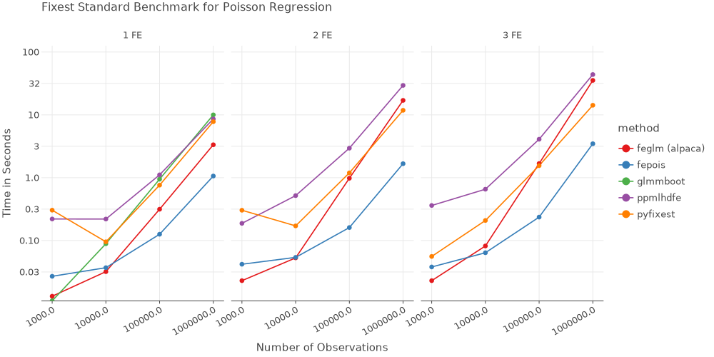

# PyFixest: Fast High-Dimensional Fixed Effects Regression in Python

[](https://pypi.org/project/pyfixest/)
 
[](https://codecov.io/gh/s3alfisc/pyfixest)

`PyFixest` is a Python implementation of the formidable [fixest](https://github.com/lrberge/fixest) package for fast high-dimensional fixed effects regression. 

The package aims to mimic `fixest` syntax and functionality as closely as Python allows: if you know `fixest` well, the goal is that you won't have to read the docs to get started! In particular, this means that all of `fixest's` defaults are mirrored by `PyFixest` - currently with only [one small exception](https://github.com/s3alfisc/pyfixest/issues/260).

Nevertheless, for a quick introduction, you can take a look at the [documentation](https://s3alfisc.github.io/pyfixest/pyfixest.html) or the regression chapter of [Arthur Turrell's](https://github.com/aeturrell) book on [Coding for Economists](https://aeturrell.github.io/coding-for-economists/econmt-regression.html#imports).

## Features

-   **OLS**, **WLS** and **IV** Regression
-   **Poisson Regression** following the [pplmhdfe algorithm](https://journals.sagepub.com/doi/full/10.1177/1536867X20909691)
-   Multiple Estimation Syntax
-   Several **Robust** and **Cluster Robust Variance-Covariance** Estimators
-   **Wild Cluster Bootstrap** Inference (via
    [wildboottest](https://github.com/s3alfisc/wildboottest))
-   **Difference-in-Differences** Estimators:
    -   The canonical Two-Way Fixed Effects Estimator
    -   [Gardner's two-stage
        ("`Did2s`")](https://jrgcmu.github.io/2sdd_current.pdf)
        estimator
    -   Basic Versions of the Local Projections estimator following
        [Dube et al (2023)](https://www.nber.org/papers/w31184)
- **Multiple Hypothesis Corrections** following the Procedure by [Romano and Wolf](https://journals.sagepub.com/doi/pdf/10.1177/1536867X20976314) and **Simultaneous Confidence Intervals** using a **Multiplier Bootstrap**
- The **Causal Cluster Variance Estimator** following [Abadie et al.](https://economics.mit.edu/sites/default/files/2022-09/When%20Should%20You%20Adjust%20Standard%20Errors%20for%20Clustering.pdf)


## Installation

You can install the release version from `PyPi` by running

``` py
pip install -U pyfixest
```

or the development version from github by running

``` py
pip install git+https://github.com/s3alfisc/pyfixest.git
```

## Benchmarks

All benchmarks follow the [fixest
benchmarks](https://github.com/lrberge/fixest/tree/master/_BENCHMARK).
All non-pyfixest timings are taken from the `fixest` benchmarks.




## Quickstart


```python
import pyfixest as pf

data = pf.get_data()
pf.feols("Y ~ X1 | f1 + f2", data=data).summary()
```


<div id="vaLhnd"></div>
<script type="text/javascript" data-lets-plot-script="library">
    if(!window.letsPlotCallQueue) {
        window.letsPlotCallQueue = [];
    }; 
    window.letsPlotCall = function(f) {
        window.letsPlotCallQueue.push(f);
    };
    (function() {
        var script = document.createElement("script");
        script.type = "text/javascript";
        script.src = "https://cdn.jsdelivr.net/gh/JetBrains/lets-plot@v4.3.0/js-package/distr/lets-plot.min.js";
        script.onload = function() {
            window.letsPlotCall = function(f) {f();};
            window.letsPlotCallQueue.forEach(function(f) {f();});
            window.letsPlotCallQueue = [];

        };
        script.onerror = function(event) {
            window.letsPlotCall = function(f) {};    // noop
            window.letsPlotCallQueue = [];
            var div = document.createElement("div");
            div.style.color = 'darkred';
            div.textContent = 'Error loading Lets-Plot JS';
            document.getElementById("vaLhnd").appendChild(div);
        };
        var e = document.getElementById("vaLhnd");
        e.appendChild(script);
    })()
</script>


    ###
    
    Estimation:  OLS
    Dep. var.: Y, Fixed effects: f1+f2
    Inference:  CRV1
    Observations:  997
    
    | Coefficient   |   Estimate |   Std. Error |   t value |   Pr(>|t|) |   2.5% |   97.5% |
    |:--------------|-----------:|-------------:|----------:|-----------:|-------:|--------:|
    | X1            |     -0.919 |        0.065 |   -14.057 |      0.000 | -1.053 |  -0.786 |
    ---
    RMSE: 1.441   R2: 0.609   R2 Within: 0.2
    

### Multiple Estimation

You can estimate multiple models at once by using [multiple estimation
syntax](https://aeturrell.github.io/coding-for-economists/econmt-regression.html#multiple-regression-models):


```python
# OLS Estimation: estimate multiple models at once
fit = pf.feols("Y + Y2 ~X1 | csw0(f1, f2)", data = data, vcov = {'CRV1':'group_id'})
# Print the results
fit.etable()
```

                               est1               est2               est3               est4               est5               est6
    ------------  -----------------  -----------------  -----------------  -----------------  -----------------  -----------------
    depvar                        Y                 Y2                  Y                 Y2                  Y                 Y2
    ------------------------------------------------------------------------------------------------------------------------------
    Intercept      0.919*** (0.121)   1.064*** (0.232)
    X1            -1.000*** (0.117)  -1.322*** (0.211)  -0.949*** (0.087)  -1.266*** (0.212)  -0.919*** (0.069)  -1.228*** (0.194)
    ------------------------------------------------------------------------------------------------------------------------------
    f2                            -                  -                  -                  -                  x                  x
    f1                            -                  -                  x                  x                  x                  x
    ------------------------------------------------------------------------------------------------------------------------------
    R2                        0.123              0.037              0.437              0.115              0.609              0.168
    S.E. type          by: group_id       by: group_id       by: group_id       by: group_id       by: group_id       by: group_id
    Observations                998                999                997                998                997                998
    ------------------------------------------------------------------------------------------------------------------------------
    Significance levels: * p < 0.05, ** p < 0.01, *** p < 0.001
    Format of coefficient cell:
    Coefficient (Std. Error)
    


### Adjust Standard Errors "on-the-fly"

Standard Errors can be adjusted after estimation, "on-the-fly":


```python
fit1 = fit.fetch_model(0)
fit1.vcov("hetero").summary()
```

    Model:  Y~X1
    ###
    
    Estimation:  OLS
    Dep. var.: Y
    Inference:  hetero
    Observations:  998
    
    | Coefficient   |   Estimate |   Std. Error |   t value |   Pr(>|t|) |   2.5% |   97.5% |
    |:--------------|-----------:|-------------:|----------:|-----------:|-------:|--------:|
    | Intercept     |      0.919 |        0.112 |     8.223 |      0.000 |  0.699 |   1.138 |
    | X1            |     -1.000 |        0.082 |   -12.134 |      0.000 | -1.162 |  -0.838 |
    ---
    RMSE: 2.158   R2: 0.123
    

### Poisson Regression via `fepois()`

You can estimate Poisson Regressions via the `fepois()` function:


```python
poisson_data = pf.get_data(model = "Fepois")
pf.fepois("Y ~ X1 + X2 | f1 + f2", data = poisson_data).summary()
```

    ###
    
    Estimation:  Poisson
    Dep. var.: Y, Fixed effects: f1+f2
    Inference:  CRV1
    Observations:  997
    
    | Coefficient   |   Estimate |   Std. Error |   t value |   Pr(>|t|) |   2.5% |   97.5% |
    |:--------------|-----------:|-------------:|----------:|-----------:|-------:|--------:|
    | X1            |     -0.007 |        0.035 |    -0.190 |      0.850 | -0.075 |   0.062 |
    | X2            |     -0.015 |        0.010 |    -1.449 |      0.147 | -0.035 |   0.005 |
    ---
    Deviance: 1068.169
    

### IV Estimation via three-part formulas

Last, `PyFixest` also supports IV estimation via three part formula
syntax:


```python
fit_iv = pf.feols("Y ~ 1 | f1 | X1 ~ Z1", data = data)
fit_iv.summary()
```

    ###
    
    Estimation:  IV
    Dep. var.: Y, Fixed effects: f1
    Inference:  CRV1
    Observations:  997
    
    | Coefficient   |   Estimate |   Std. Error |   t value |   Pr(>|t|) |   2.5% |   97.5% |
    |:--------------|-----------:|-------------:|----------:|-----------:|-------:|--------:|
    | X1            |     -1.025 |        0.115 |    -8.930 |      0.000 | -1.259 |  -0.790 |
    ---
    
