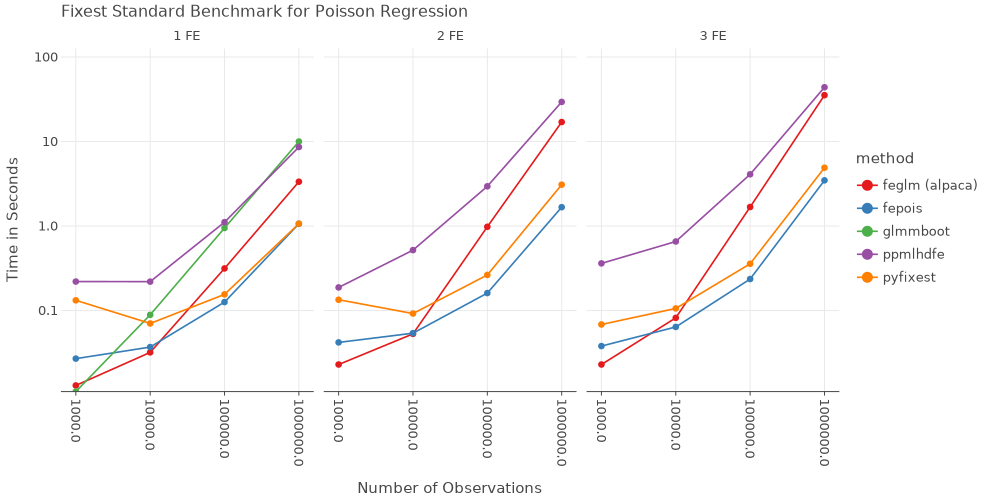

Readme
================

## PyFixest

[](https://pypi.org/project/pyfixest/)
 
[](https://codecov.io/gh/s3alfisc/pyfixest)

`PyFixest` is a Python implementation of the formidable
[fixest](https://github.com/lrberge/fixest) package. The package aims to
mimic `fixest` syntax and functionality as closely as Python allows. For
a quick introduction, see the
[tutorial](https://s3alfisc.github.io/pyfixest/tutorial/) or take a look
at the regression chapter of [Arthur
Turrell’s](https://github.com/aeturrell) book on [Coding for
Economists](https://aeturrell.github.io/coding-for-economists/econmt-regression.html#imports).

`PyFixest` supports

-   OLS and IV Regression
-   Poisson Regression
-   Multiple Estimation Syntax
-   Several Robust and Cluster Robust Variance-Covariance Types
-   Wild Cluster Bootstrap Inference (via
    [wildboottest](https://github.com/s3alfisc/wildboottest))
-   Difference-in-Difference Estimators:
    -   The canonical Two-Way Fixed Effects Estimator
    -   [Gardner’s two-stage
        (“`Did2s`”)](https://jrgcmu.github.io/2sdd_current.pdf)
        estimator
    -   Basic Versions of the Local Projections estimator following
        [Dube et al (2023)](https://www.nber.org/papers/w31184)

## Installation

You can install the release version from `PyPi` by running

``` py
pip install pyfixest
```

or the development version from github by running

``` py
pip install git+https://github.com/s3alfisc/pyfixest.git
```

## News

`PyFixest` `0.13` adds support for the local projections “DID2s”
estimator:

``` python
import pandas as pd
import numpy as np
from pyfixest.did.lpdid import lpdid

df_het = pd.read_stata("pyfixest/did/data/lpdidtestdata1.dta")
df_het = df_het.astype(np.float64)

fit_lpdid = lpdid(
    df_het,
    yname="Y",
    idname="unit",
    tname="time",
    gname="event_date",
    att=True,
    pre_window=5,
    post_window=10,
)

fit_lpdid.tidy()
```


          You have loaded the 'pyfixest.did' module. While every function is tested in `tests/test_did.py`,
          the module is not yet as thoroughly tested as I would like. So please use it with caution and
          provide feedback in case you stumble over any bugs!


            <div id="hjyggM"></div>
            <script type="text/javascript" data-lets-plot-script="library">
                if(!window.letsPlotCallQueue) {
                    window.letsPlotCallQueue = [];
                };
                window.letsPlotCall = function(f) {
                    window.letsPlotCallQueue.push(f);
                };
                (function() {
                    var script = document.createElement("script");
                    script.type = "text/javascript";
                    script.src = "https://cdn.jsdelivr.net/gh/JetBrains/lets-plot@v4.2.0/js-package/distr/lets-plot.min.js";
                    script.onload = function() {
                        window.letsPlotCall = function(f) {f();};
                        window.letsPlotCallQueue.forEach(function(f) {f();});
                        window.letsPlotCallQueue = [];

                    };
                    script.onerror = function(event) {
                        window.letsPlotCall = function(f) {};    // noop
                        window.letsPlotCallQueue = [];
                        var div = document.createElement("div");
                        div.style.color = 'darkred';
                        div.textContent = 'Error loading Lets-Plot JS';
                        document.getElementById("hjyggM").appendChild(div);
                    };
                    var e = document.getElementById("hjyggM");
                    e.appendChild(script);
                })()
            </script>

<div>
<style scoped>
    .dataframe tbody tr th:only-of-type {
        vertical-align: middle;
    }

    .dataframe tbody tr th {
        vertical-align: top;
    }

    .dataframe thead th {
        text-align: right;
    }
</style>
<table border="1" class="dataframe">
  <thead>
    <tr style="text-align: right;">
      <th></th>
      <th>Estimate</th>
      <th>Std. Error</th>
      <th>t value</th>
      <th>Pr(&gt;|t|)</th>
      <th>2.5 %</th>
      <th>97.5 %</th>
      <th>N</th>
    </tr>
  </thead>
  <tbody>
    <tr>
      <th>treat_diff</th>
      <td>31.794381</td>
      <td>0.755459</td>
      <td>42.086191</td>
      <td>0.0</td>
      <td>30.312812</td>
      <td>33.27595</td>
      <td>28709.0</td>
    </tr>
  </tbody>
</table>
</div>

## Benchmarks

All benchmarks follow the [fixest
benchmarks](https://github.com/lrberge/fixest/tree/master/_BENCHMARK).
All non-pyfixest timings are taken from the `fixest` benchmarks.




## Quickstart

You can estimate a linear regression models just as you would in
`fixest` - via `feols()`:

``` python
from pyfixest.estimation import feols, fepois
from pyfixest.utils import get_data
from pyfixest.summarize import etable

data = get_data()
feols("Y ~ X1 | f1 + f2", data=data).summary()
```

    ###

    Estimation:  OLS
    Dep. var.: Y, Fixed effects: f1+f2
    Inference:  CRV1
    Observations:  997

    | Coefficient   |   Estimate |   Std. Error |   t value |   Pr(>|t|) |   2.5 % |   97.5 % |
    |:--------------|-----------:|-------------:|----------:|-----------:|--------:|---------:|
    | X1            |     -0.919 |        0.065 |   -14.057 |      0.000 |  -1.053 |   -0.786 |
    ---
    RMSE: 1.441   R2: 0.609   R2 Within: 0.2

You can estimate multiple models at once by using [multiple estimation
syntax](https://aeturrell.github.io/coding-for-economists/econmt-regression.html#multiple-regression-models):

``` python
# OLS Estimation: estimate multiple models at once
fit = feols("Y + Y2 ~X1 | csw0(f1, f2)", data = data, vcov = {'CRV1':'group_id'})
# Print the results
etable([fit.fetch_model(i) for i in range(6)])
```

    Model:  Y~X1
    Model:  Y2~X1
    Model:  Y~X1|f1
    Model:  Y2~X1|f1
    Model:  Y~X1|f1+f2
    Model:  Y2~X1|f1+f2
                              est1               est2               est3               est4               est5               est6
    ------------  ----------------  -----------------  -----------------  -----------------  -----------------  -----------------
    depvar                       Y                 Y2                  Y                 Y2                  Y                 Y2
    -----------------------------------------------------------------------------------------------------------------------------
    Intercept     0.919*** (0.121)   1.064*** (0.232)
    X1             -1.0*** (0.117)  -1.322*** (0.211)  -0.949*** (0.087)  -1.266*** (0.212)  -0.919*** (0.069)  -1.228*** (0.194)
    -----------------------------------------------------------------------------------------------------------------------------
    f2                           -                  -                  -                  -                  x                  x
    f1                           -                  -                  x                  x                  x                  x
    -----------------------------------------------------------------------------------------------------------------------------
    R2                       0.123              0.037              0.437              0.115              0.609              0.168
    S.E. type         by: group_id       by: group_id       by: group_id       by: group_id       by: group_id       by: group_id
    Observations               998                999                997                998                997                998
    -----------------------------------------------------------------------------------------------------------------------------
    Significance levels: * p < 0.05, ** p < 0.01, *** p < 0.001

Standard Errors can be adjusted after estimation, “on-the-fly”:

``` python
fit1 = fit.fetch_model(0)
fit1.vcov("hetero").summary()
```

    Model:  Y~X1
    ###

    Estimation:  OLS
    Dep. var.: Y
    Inference:  hetero
    Observations:  998

    | Coefficient   |   Estimate |   Std. Error |   t value |   Pr(>|t|) |   2.5 % |   97.5 % |
    |:--------------|-----------:|-------------:|----------:|-----------:|--------:|---------:|
    | Intercept     |      0.919 |        0.112 |     8.223 |      0.000 |   0.699 |    1.138 |
    | X1            |     -1.000 |        0.082 |   -12.134 |      0.000 |  -1.162 |   -0.838 |
    ---
    RMSE: 2.158   R2: 0.123

You can estimate Poisson Regressions via the `fepois()` function:

``` python
poisson_data = get_data(model = "Fepois")
fepois("Y ~ X1 + X2 | f1 + f2", data = poisson_data).summary()
```

    ###

    Estimation:  Poisson
    Dep. var.: Y, Fixed effects: f1+f2
    Inference:  CRV1
    Observations:  997

    | Coefficient   |   Estimate |   Std. Error |   t value |   Pr(>|t|) |   2.5 % |   97.5 % |
    |:--------------|-----------:|-------------:|----------:|-----------:|--------:|---------:|
    | X1            |     -0.008 |        0.035 |    -0.239 |      0.811 |  -0.076 |    0.060 |
    | X2            |     -0.015 |        0.010 |    -1.471 |      0.141 |  -0.035 |    0.005 |
    ---
    Deviance: 1068.836

Last, `PyFixest` also supports IV estimation via three part formula
syntax:

``` python
fit_iv = feols("Y ~ 1 | f1 | X1 ~ Z1", data = data)
fit_iv.summary()
```

    ###

    Estimation:  IV
    Dep. var.: Y, Fixed effects: f1
    Inference:  CRV1
    Observations:  997

    | Coefficient   |   Estimate |   Std. Error |   t value |   Pr(>|t|) |   2.5 % |   97.5 % |
    |:--------------|-----------:|-------------:|----------:|-----------:|--------:|---------:|
    | X1            |     -1.025 |        0.115 |    -8.930 |      0.000 |  -1.259 |   -0.790 |
    ---
