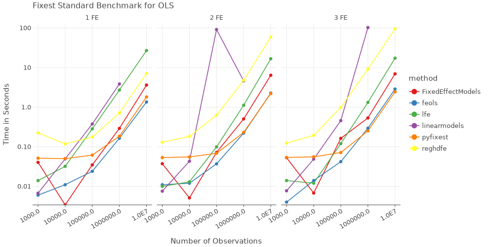

## PyFixest

[](https://pypi.org/project/pyfixest/)


[](https://codecov.io/gh/s3alfisc/pyfixest)

`PyFixest` is a Python implementation of the formidable [fixest](https://github.com/lrberge/fixest) package. The package aims to mimic `fixest` syntax and functionality as closely as Python allows. For a quick introduction, see the [tutorial](https://s3alfisc.github.io/pyfixest/tutorial/) or take a look at the regression chapter of [Arthur Turrell's](https://github.com/aeturrell) book on [Coding for Economists](https://aeturrell.github.io/coding-for-economists/econmt-regression.html#imports).

`PyFixest` supports

- OLS and IV Regression
- Poisson Regression
- Multiple Estimation Syntax
- Several Robust and Cluster Robust Variance-Covariance Types
- Wild Cluster Bootstrap Inference (via [wildboottest](https://github.com/s3alfisc/wildboottest))
- Difference-in-Difference Estimators:
  - The canonical Two-Way Fixed Effects Estimator
  - [Gardner's two-stage ("`Did2s`")](https://jrgcmu.github.io/2sdd_current.pdf) estimator
  - Basic Versions of the Local Projections estimator following [Dube et al (2023)](https://www.nber.org/papers/w31184)

## Installation

You can install the release version from `PyPi` by running

```py
pip install pyfixest
```
or the development version from github by running
```py
pip install git+https://github.com/s3alfisc/pyfixest.git
```

## News

`PyFixest` `0.13` adds support for the local projections "DID2s" estimator:


```python
import pandas as pd
import numpy as np
from pyfixest.did.lpdid import lpdid

df_het = pd.read_stata("pyfixest/did/data/lpdidtestdata1.dta")
df_het = df_het.astype(np.float64)

fit_lpdid = lpdid(
    df_het,
    yname="Y",
    idname="unit",
    tname="time",
    gname="event_date",
    att=True,
    pre_window=5,
    post_window=10,
)

fit_lpdid.tidy()
```


<div>
<style scoped>
    .dataframe tbody tr th:only-of-type {
        vertical-align: middle;
    }

    .dataframe tbody tr th {
        vertical-align: top;
    }

    .dataframe thead th {
        text-align: right;
    }
</style>
<table border="1" class="dataframe">
  <thead>
    <tr style="text-align: right;">
      <th></th>
      <th>Estimate</th>
      <th>Std. Error</th>
      <th>t value</th>
      <th>Pr(&gt;|t|)</th>
      <th>2.5 %</th>
      <th>97.5 %</th>
      <th>N</th>
    </tr>
  </thead>
  <tbody>
    <tr>
      <th>treat_diff</th>
      <td>31.794381</td>
      <td>0.755459</td>
      <td>42.086191</td>
      <td>0.0</td>
      <td>30.312812</td>
      <td>33.27595</td>
      <td>28709.0</td>
    </tr>
  </tbody>
</table>
</div>


```python
fit_lpdid = lpdid(
    df_het,
    yname="Y",
    idname="unit",
    tname="time",
    gname="event_date",
    att=False,
    pre_window=5,
    post_window=10,
)

fit_lpdid.iplot(figsize = [800, 350], xintercept = 5.5, yintercept = 0).show()
```


<svg xmlns="http://www.w3.org/2000/svg" xmlns:xlink="http://www.w3.org/1999/xlink" class="plt-container" width="800.0" height="350.0">
  <style type="text/css">
  .plt-container {
   font-family: Lucida Grande, sans-serif;
   user-select: none;
   -webkit-user-select: none;
   -moz-user-select: none;
   -ms-user-select: none;
}
text {
   text-rendering: optimizeLegibility;
}
#p9mx0pm .plot-title {
   fill: #474747;
   font-family: Lucida Grande, sans-serif;
   font-size: 16.0px;
   font-weight: normal;
   font-style: normal;
}
#p9mx0pm .plot-subtitle {
   fill: #474747;
   font-family: Lucida Grande, sans-serif;
   font-size: 15.0px;
   font-weight: normal;
   font-style: normal;
}
#p9mx0pm .plot-caption {
   fill: #474747;
   font-family: Lucida Grande, sans-serif;
   font-size: 13.0px;
   font-weight: normal;
   font-style: normal;
}
#p9mx0pm .legend-title {
   fill: #474747;
   font-family: Lucida Grande, sans-serif;
   font-size: 15.0px;
   font-weight: normal;
   font-style: normal;
}
#p9mx0pm .legend-item {
   fill: #474747;
   font-family: Lucida Grande, sans-serif;
   font-size: 13.0px;
   font-weight: normal;
   font-style: normal;
}
#p9mx0pm .axis-title-x {
   fill: #474747;
   font-family: Lucida Grande, sans-serif;
   font-size: 15.0px;
   font-weight: normal;
   font-style: normal;
}
#p9mx0pm .axis-text-x {
   fill: #474747;
   font-family: Lucida Grande, sans-serif;
   font-size: 13.0px;
   font-weight: normal;
   font-style: normal;
}
#dlAOMCI .axis-tooltip-text-x {
   fill: #ffffff;
   font-family: Lucida Grande, sans-serif;
   font-size: 13.0px;
   font-weight: normal;
   font-style: normal;
}
#p9mx0pm .axis-title-y {
   fill: #474747;
   font-family: Lucida Grande, sans-serif;
   font-size: 15.0px;
   font-weight: normal;
   font-style: normal;
}
#p9mx0pm .axis-text-y {
   fill: #474747;
   font-family: Lucida Grande, sans-serif;
   font-size: 13.0px;
   font-weight: normal;
   font-style: normal;
}
#dlAOMCI .axis-tooltip-text-y {
   fill: #ffffff;
   font-family: Lucida Grande, sans-serif;
   font-size: 13.0px;
   font-weight: normal;
   font-style: normal;
}
#p9mx0pm .facet-strip-text-x {
   fill: #474747;
   font-family: Lucida Grande, sans-serif;
   font-size: 13.0px;
   font-weight: normal;
   font-style: normal;
}
#p9mx0pm .facet-strip-text-y {
   fill: #474747;
   font-family: Lucida Grande, sans-serif;
   font-size: 13.0px;
   font-weight: normal;
   font-style: normal;
}
#dlAOMCI .tooltip-text {
   fill: #474747;
   font-family: Lucida Grande, sans-serif;
   font-size: 13.0px;
   font-weight: normal;
   font-style: normal;
}
#dlAOMCI .tooltip-title {
   fill: #474747;
   font-family: Lucida Grande, sans-serif;
   font-size: 13.0px;
   font-weight: bold;
   font-style: normal;
}
#dlAOMCI .tooltip-label {
   fill: #474747;
   font-family: Lucida Grande, sans-serif;
   font-size: 13.0px;
   font-weight: bold;
   font-style: normal;
}

  </style>
  <g id="p9mx0pm">
    <path fill-rule="evenodd" fill="rgb(255,255,255)" fill-opacity="1.0" d="M0.0 0.0 L0.0 350.0 L800.0 350.0 L800.0 0.0 Z">
    </path>
    <g transform="translate(23.0 34.0 ) ">
      <g transform="translate(21.961210910936405 0.0 ) ">
        <line x1="10.338472671948296" y1="270.0" x2="10.338472671948296" y2="-2.842170943040401E-14" stroke="rgb(233,233,233)" stroke-opacity="1.0" stroke-width="1.0" fill="none">
        </line>
        <line x1="194.13354239547354" y1="270.0" x2="194.13354239547354" y2="-2.842170943040401E-14" stroke="rgb(233,233,233)" stroke-opacity="1.0" stroke-width="1.0" fill="none">
        </line>
        <line x1="377.9286121189988" y1="270.0" x2="377.9286121189988" y2="-2.842170943040401E-14" stroke="rgb(233,233,233)" stroke-opacity="1.0" stroke-width="1.0" fill="none">
        </line>
        <line x1="561.723681842524" y1="270.0" x2="561.723681842524" y2="-2.842170943040401E-14" stroke="rgb(233,233,233)" stroke-opacity="1.0" stroke-width="1.0" fill="none">
        </line>
      </g>
      <g transform="translate(21.961210910936405 270.0 ) ">
        <g transform="translate(10.338472671948296 0.0 ) ">
          <line stroke-width="1.0" stroke="rgb(71,71,71)" stroke-opacity="1.0" x2="0.0" y2="4.0">
          </line>
          <g transform="translate(0.0 13.5 ) ">
            <text class="axis-text-x" text-anchor="middle" dy="0.35em">
              <tspan>time_to_treatment::-5</tspan>
            </text>
          </g>
        </g>
        <g transform="translate(194.13354239547354 0.0 ) ">
          <line stroke-width="1.0" stroke="rgb(71,71,71)" stroke-opacity="1.0" x2="0.0" y2="4.0">
          </line>
          <g transform="translate(0.0 13.5 ) ">
            <text class="axis-text-x" text-anchor="middle" dy="0.35em">
              <tspan>time_to_treatment::0</tspan>
            </text>
          </g>
        </g>
        <g transform="translate(377.9286121189988 0.0 ) ">
          <line stroke-width="1.0" stroke="rgb(71,71,71)" stroke-opacity="1.0" x2="0.0" y2="4.0">
          </line>
          <g transform="translate(0.0 13.5 ) ">
            <text class="axis-text-x" text-anchor="middle" dy="0.35em">
              <tspan>time_to_treatment::4</tspan>
            </text>
          </g>
        </g>
        <g transform="translate(561.723681842524 0.0 ) ">
          <line stroke-width="1.0" stroke="rgb(71,71,71)" stroke-opacity="1.0" x2="0.0" y2="4.0">
          </line>
          <g transform="translate(0.0 13.5 ) ">
            <text class="axis-text-x" text-anchor="middle" dy="0.35em">
              <tspan>time_to_treatment::8</tspan>
            </text>
          </g>
        </g>
        <line x1="0.0" y1="0.0" x2="663.9596893762349" y2="0.0" stroke-width="1.0" stroke="rgb(71,71,71)" stroke-opacity="1.0">
        </line>
      </g>
      <g transform="translate(21.961210910936405 0.0 ) ">
        <line x1="0.0" y1="251.6564348931656" x2="663.959689376235" y2="251.6564348931656" stroke="rgb(233,233,233)" stroke-opacity="1.0" stroke-width="1.0" fill="none">
        </line>
        <line x1="0.0" y1="219.72823520517906" x2="663.959689376235" y2="219.72823520517906" stroke="rgb(233,233,233)" stroke-opacity="1.0" stroke-width="1.0" fill="none">
        </line>
        <line x1="0.0" y1="187.80003551719255" x2="663.959689376235" y2="187.80003551719255" stroke="rgb(233,233,233)" stroke-opacity="1.0" stroke-width="1.0" fill="none">
        </line>
        <line x1="0.0" y1="155.87183582920602" x2="663.959689376235" y2="155.87183582920602" stroke="rgb(233,233,233)" stroke-opacity="1.0" stroke-width="1.0" fill="none">
        </line>
        <line x1="0.0" y1="123.94363614121949" x2="663.959689376235" y2="123.94363614121949" stroke="rgb(233,233,233)" stroke-opacity="1.0" stroke-width="1.0" fill="none">
        </line>
        <line x1="0.0" y1="92.01543645323295" x2="663.959689376235" y2="92.01543645323295" stroke="rgb(233,233,233)" stroke-opacity="1.0" stroke-width="1.0" fill="none">
        </line>
        <line x1="0.0" y1="60.087236765246416" x2="663.959689376235" y2="60.087236765246416" stroke="rgb(233,233,233)" stroke-opacity="1.0" stroke-width="1.0" fill="none">
        </line>
        <line x1="0.0" y1="28.15903707725988" x2="663.959689376235" y2="28.15903707725988" stroke="rgb(233,233,233)" stroke-opacity="1.0" stroke-width="1.0" fill="none">
        </line>
      </g>
      <g transform="translate(21.961210910936405 0.0 ) ">
        <g transform="translate(0.0 251.6564348931656 ) ">
          <g transform="translate(-3.0 0.0 ) ">
            <text class="axis-text-y" text-anchor="end" dy="0.35em">
              <tspan>0</tspan>
            </text>
          </g>
        </g>
        <g transform="translate(0.0 219.72823520517906 ) ">
          <g transform="translate(-3.0 0.0 ) ">
            <text class="axis-text-y" text-anchor="end" dy="0.35em">
              <tspan>10</tspan>
            </text>
          </g>
        </g>
        <g transform="translate(0.0 187.80003551719255 ) ">
          <g transform="translate(-3.0 0.0 ) ">
            <text class="axis-text-y" text-anchor="end" dy="0.35em">
              <tspan>20</tspan>
            </text>
          </g>
        </g>
        <g transform="translate(0.0 155.87183582920602 ) ">
          <g transform="translate(-3.0 0.0 ) ">
            <text class="axis-text-y" text-anchor="end" dy="0.35em">
              <tspan>30</tspan>
            </text>
          </g>
        </g>
        <g transform="translate(0.0 123.94363614121949 ) ">
          <g transform="translate(-3.0 0.0 ) ">
            <text class="axis-text-y" text-anchor="end" dy="0.35em">
              <tspan>40</tspan>
            </text>
          </g>
        </g>
        <g transform="translate(0.0 92.01543645323295 ) ">
          <g transform="translate(-3.0 0.0 ) ">
            <text class="axis-text-y" text-anchor="end" dy="0.35em">
              <tspan>50</tspan>
            </text>
          </g>
        </g>
        <g transform="translate(0.0 60.087236765246416 ) ">
          <g transform="translate(-3.0 0.0 ) ">
            <text class="axis-text-y" text-anchor="end" dy="0.35em">
              <tspan>60</tspan>
            </text>
          </g>
        </g>
        <g transform="translate(0.0 28.15903707725988 ) ">
          <g transform="translate(-3.0 0.0 ) ">
            <text class="axis-text-y" text-anchor="end" dy="0.35em">
              <tspan>70</tspan>
            </text>
          </g>
        </g>
      </g>
      <g transform="translate(21.961210910936405 0.0 ) " clip-path="url(#cXPw7DS)" clip-bounds-jfx="[rect (0.0, 0.0), (663.9596893762349, 270.0)]">
        <defs>
          <clipPath id="cXPw7DS">
            <rect x="0.0" y="0.0" width="663.9596893762349" height="270.0">
            </rect>
          </clipPath>
        </defs>
        <g>
          <g >
            <circle fill="#e41a1c" stroke="#e41a1c" stroke-opacity="0.0" stroke-width="0.0" cx="10.338472671948296" cy="251.79234026368394" r="3.3000000000000003" />
            <circle fill="#e41a1c" stroke="#e41a1c" stroke-opacity="0.0" stroke-width="0.0" cx="56.28724010282961" cy="249.61196282366888" r="3.3000000000000003" />
            <circle fill="#e41a1c" stroke="#e41a1c" stroke-opacity="0.0" stroke-width="0.0" cx="102.23600753371092" cy="248.20872804667" r="3.3000000000000003" />
            <circle fill="#e41a1c" stroke="#e41a1c" stroke-opacity="0.0" stroke-width="0.0" cx="148.18477496459224" cy="246.9992282853341" r="3.3000000000000003" />
            <circle fill="#e41a1c" stroke="#e41a1c" stroke-opacity="0.0" stroke-width="0.0" cx="194.13354239547354" cy="240.03408032460527" r="3.3000000000000003" />
            <circle fill="#e41a1c" stroke="#e41a1c" stroke-opacity="0.0" stroke-width="0.0" cx="240.08230982635484" cy="228.94756789380224" r="3.3000000000000003" />
            <circle fill="#e41a1c" stroke="#e41a1c" stroke-opacity="0.0" stroke-width="0.0" cx="286.0310772572362" cy="220.52704442366309" r="3.3000000000000003" />
            <circle fill="#e41a1c" stroke="#e41a1c" stroke-opacity="0.0" stroke-width="0.0" cx="331.97984468811745" cy="204.7752536449295" r="3.3000000000000003" />
            <circle fill="#e41a1c" stroke="#e41a1c" stroke-opacity="0.0" stroke-width="0.0" cx="377.9286121189988" cy="188.18789020393928" r="3.3000000000000003" />
            <circle fill="#e41a1c" stroke="#e41a1c" stroke-opacity="0.0" stroke-width="0.0" cx="423.8773795498801" cy="160.65985526089753" r="3.3000000000000003" />
            <circle fill="#e41a1c" stroke="#e41a1c" stroke-opacity="0.0" stroke-width="0.0" cx="469.8261469807614" cy="140.81958999332778" r="3.3000000000000003" />
            <circle fill="#e41a1c" stroke="#e41a1c" stroke-opacity="0.0" stroke-width="0.0" cx="515.7749144116427" cy="114.76403484944399" r="3.3000000000000003" />
            <circle fill="#e41a1c" stroke="#e41a1c" stroke-opacity="0.0" stroke-width="0.0" cx="561.723681842524" cy="81.7598220993863" r="3.3000000000000003" />
            <circle fill="#e41a1c" stroke="#e41a1c" stroke-opacity="0.0" stroke-width="0.0" cx="607.6724492734054" cy="51.67676678612426" r="3.3000000000000003" />
            <circle fill="#e41a1c" stroke="#e41a1c" stroke-opacity="0.0" stroke-width="0.0" cx="653.6212167042866" cy="19.743294946584342" r="3.3000000000000003" />
          </g>
        </g>
      </g>
      <g transform="translate(21.961210910936405 0.0 ) " clip-path="url(#c4BtR6H)" clip-bounds-jfx="[rect (0.0, 0.0), (663.9596893762349, 270.0)]">
        <defs>
          <clipPath id="c4BtR6H">
            <rect x="0.0" y="0.0" width="663.9596893762349" height="270.0">
            </rect>
          </clipPath>
        </defs>
        <g>
          <line x1="9.189753486176263" y1="257.72727272727275" x2="11.487191857720328" y2="257.72727272727275" stroke="rgb(228,26,28)" stroke-opacity="1.0" fill="rgb(17,142,216)" fill-opacity="1.0" stroke-width="1.6500000000000001">
          </line>
          <line x1="9.189753486176263" y1="245.85740780009516" x2="11.487191857720328" y2="245.85740780009516" stroke="rgb(228,26,28)" stroke-opacity="1.0" fill="rgb(17,142,216)" fill-opacity="1.0" stroke-width="1.6500000000000001">
          </line>
          <line x1="10.338472671948296" y1="257.72727272727275" x2="10.338472671948296" y2="245.85740780009516" stroke="rgb(228,26,28)" stroke-opacity="1.0" fill="rgb(17,142,216)" fill-opacity="1.0" stroke-width="1.6500000000000001">
          </line>
        </g>
        <g>
          <line x1="55.138520917057576" y1="255.61287891070515" x2="57.43595928860164" y2="255.61287891070515" stroke="rgb(228,26,28)" stroke-opacity="1.0" fill="rgb(17,142,216)" fill-opacity="1.0" stroke-width="1.6500000000000001">
          </line>
          <line x1="55.138520917057576" y1="243.6110467366326" x2="57.43595928860164" y2="243.6110467366326" stroke="rgb(228,26,28)" stroke-opacity="1.0" fill="rgb(17,142,216)" fill-opacity="1.0" stroke-width="1.6500000000000001">
          </line>
          <line x1="56.28724010282961" y1="255.61287891070515" x2="56.28724010282961" y2="243.6110467366326" stroke="rgb(228,26,28)" stroke-opacity="1.0" fill="rgb(17,142,216)" fill-opacity="1.0" stroke-width="1.6500000000000001">
          </line>
        </g>
        <g>
          <line x1="101.0872883479389" y1="253.82072285542762" x2="103.38472671948294" y2="253.82072285542762" stroke="rgb(228,26,28)" stroke-opacity="1.0" fill="rgb(17,142,216)" fill-opacity="1.0" stroke-width="1.6500000000000001">
          </line>
          <line x1="101.0872883479389" y1="242.59673323791236" x2="103.38472671948294" y2="242.59673323791236" stroke="rgb(228,26,28)" stroke-opacity="1.0" fill="rgb(17,142,216)" fill-opacity="1.0" stroke-width="1.6500000000000001">
          </line>
          <line x1="102.23600753371092" y1="253.82072285542762" x2="102.23600753371092" y2="242.59673323791236" stroke="rgb(228,26,28)" stroke-opacity="1.0" fill="rgb(17,142,216)" fill-opacity="1.0" stroke-width="1.6500000000000001">
          </line>
        </g>
        <g>
          <line x1="147.0360557788202" y1="252.17144626327098" x2="149.33349415036426" y2="252.17144626327098" stroke="rgb(228,26,28)" stroke-opacity="1.0" fill="rgb(17,142,216)" fill-opacity="1.0" stroke-width="1.6500000000000001">
          </line>
          <line x1="147.0360557788202" y1="241.82701030739725" x2="149.33349415036426" y2="241.82701030739725" stroke="rgb(228,26,28)" stroke-opacity="1.0" fill="rgb(17,142,216)" fill-opacity="1.0" stroke-width="1.6500000000000001">
          </line>
          <line x1="148.18477496459224" y1="252.17144626327098" x2="148.18477496459224" y2="241.82701030739725" stroke="rgb(228,26,28)" stroke-opacity="1.0" fill="rgb(17,142,216)" fill-opacity="1.0" stroke-width="1.6500000000000001">
          </line>
        </g>
        <g>
          <line x1="192.98482320970152" y1="245.00888577232664" x2="195.2822615812456" y2="245.00888577232664" stroke="rgb(228,26,28)" stroke-opacity="1.0" fill="rgb(17,142,216)" fill-opacity="1.0" stroke-width="1.6500000000000001">
          </line>
          <line x1="192.98482320970152" y1="235.0592748768839" x2="195.2822615812456" y2="235.0592748768839" stroke="rgb(228,26,28)" stroke-opacity="1.0" fill="rgb(17,142,216)" fill-opacity="1.0" stroke-width="1.6500000000000001">
          </line>
          <line x1="194.13354239547354" y1="245.00888577232664" x2="194.13354239547354" y2="235.0592748768839" stroke="rgb(228,26,28)" stroke-opacity="1.0" fill="rgb(17,142,216)" fill-opacity="1.0" stroke-width="1.6500000000000001">
          </line>
        </g>
        <g>
          <line x1="238.9335906405828" y1="234.63858217456684" x2="241.23102901212687" y2="234.63858217456684" stroke="rgb(228,26,28)" stroke-opacity="1.0" fill="rgb(17,142,216)" fill-opacity="1.0" stroke-width="1.6500000000000001">
          </line>
          <line x1="238.9335906405828" y1="223.25655361303762" x2="241.23102901212687" y2="223.25655361303762" stroke="rgb(228,26,28)" stroke-opacity="1.0" fill="rgb(17,142,216)" fill-opacity="1.0" stroke-width="1.6500000000000001">
          </line>
          <line x1="240.08230982635484" y1="234.63858217456684" x2="240.08230982635484" y2="223.25655361303762" stroke="rgb(228,26,28)" stroke-opacity="1.0" fill="rgb(17,142,216)" fill-opacity="1.0" stroke-width="1.6500000000000001">
          </line>
        </g>
        <g>
          <line x1="284.8823580714641" y1="226.51868143118165" x2="287.1797964430082" y2="226.51868143118165" stroke="rgb(228,26,28)" stroke-opacity="1.0" fill="rgb(17,142,216)" fill-opacity="1.0" stroke-width="1.6500000000000001">
          </line>
          <line x1="284.8823580714641" y1="214.53540741614452" x2="287.1797964430082" y2="214.53540741614452" stroke="rgb(228,26,28)" stroke-opacity="1.0" fill="rgb(17,142,216)" fill-opacity="1.0" stroke-width="1.6500000000000001">
          </line>
          <line x1="286.0310772572362" y1="226.51868143118165" x2="286.0310772572362" y2="214.53540741614452" stroke="rgb(228,26,28)" stroke-opacity="1.0" fill="rgb(17,142,216)" fill-opacity="1.0" stroke-width="1.6500000000000001">
          </line>
        </g>
        <g>
          <line x1="330.8311255023454" y1="210.8454421237312" x2="333.1285638738895" y2="210.8454421237312" stroke="rgb(228,26,28)" stroke-opacity="1.0" fill="rgb(17,142,216)" fill-opacity="1.0" stroke-width="1.6500000000000001">
          </line>
          <line x1="330.8311255023454" y1="198.7050651661278" x2="333.1285638738895" y2="198.7050651661278" stroke="rgb(228,26,28)" stroke-opacity="1.0" fill="rgb(17,142,216)" fill-opacity="1.0" stroke-width="1.6500000000000001">
          </line>
          <line x1="331.97984468811745" y1="210.8454421237312" x2="331.97984468811745" y2="198.7050651661278" stroke="rgb(228,26,28)" stroke-opacity="1.0" fill="rgb(17,142,216)" fill-opacity="1.0" stroke-width="1.6500000000000001">
          </line>
        </g>
        <g>
          <line x1="376.77989293322673" y1="194.52812225884816" x2="379.07733130477084" y2="194.52812225884816" stroke="rgb(228,26,28)" stroke-opacity="1.0" fill="rgb(17,142,216)" fill-opacity="1.0" stroke-width="1.6500000000000001">
          </line>
          <line x1="376.77989293322673" y1="181.8476581490304" x2="379.07733130477084" y2="181.8476581490304" stroke="rgb(228,26,28)" stroke-opacity="1.0" fill="rgb(17,142,216)" fill-opacity="1.0" stroke-width="1.6500000000000001">
          </line>
          <line x1="377.9286121189988" y1="194.52812225884816" x2="377.9286121189988" y2="181.8476581490304" stroke="rgb(228,26,28)" stroke-opacity="1.0" fill="rgb(17,142,216)" fill-opacity="1.0" stroke-width="1.6500000000000001">
          </line>
        </g>
        <g>
          <line x1="422.72866036410807" y1="167.00762961867963" x2="425.02609873565217" y2="167.00762961867963" stroke="rgb(228,26,28)" stroke-opacity="1.0" fill="rgb(17,142,216)" fill-opacity="1.0" stroke-width="1.6500000000000001">
          </line>
          <line x1="422.72866036410807" y1="154.3120809031154" x2="425.02609873565217" y2="154.3120809031154" stroke="rgb(228,26,28)" stroke-opacity="1.0" fill="rgb(17,142,216)" fill-opacity="1.0" stroke-width="1.6500000000000001">
          </line>
          <line x1="423.8773795498801" y1="167.00762961867963" x2="423.8773795498801" y2="154.3120809031154" stroke="rgb(228,26,28)" stroke-opacity="1.0" fill="rgb(17,142,216)" fill-opacity="1.0" stroke-width="1.6500000000000001">
          </line>
        </g>
        <g>
          <line x1="468.67742779498934" y1="147.21107557620186" x2="470.97486616653345" y2="147.21107557620186" stroke="rgb(228,26,28)" stroke-opacity="1.0" fill="rgb(17,142,216)" fill-opacity="1.0" stroke-width="1.6500000000000001">
          </line>
          <line x1="468.67742779498934" y1="134.42810441045373" x2="470.97486616653345" y2="134.42810441045373" stroke="rgb(228,26,28)" stroke-opacity="1.0" fill="rgb(17,142,216)" fill-opacity="1.0" stroke-width="1.6500000000000001">
          </line>
          <line x1="469.8261469807614" y1="147.21107557620186" x2="469.8261469807614" y2="134.42810441045373" stroke="rgb(228,26,28)" stroke-opacity="1.0" fill="rgb(17,142,216)" fill-opacity="1.0" stroke-width="1.6500000000000001">
          </line>
        </g>
        <g>
          <line x1="514.6261952258707" y1="121.23720419005184" x2="516.9236335974148" y2="121.23720419005184" stroke="rgb(228,26,28)" stroke-opacity="1.0" fill="rgb(17,142,216)" fill-opacity="1.0" stroke-width="1.6500000000000001">
          </line>
          <line x1="514.6261952258707" y1="108.2908655088361" x2="516.9236335974148" y2="108.2908655088361" stroke="rgb(228,26,28)" stroke-opacity="1.0" fill="rgb(17,142,216)" fill-opacity="1.0" stroke-width="1.6500000000000001">
          </line>
          <line x1="515.7749144116427" y1="121.23720419005184" x2="515.7749144116427" y2="108.2908655088361" stroke="rgb(228,26,28)" stroke-opacity="1.0" fill="rgb(17,142,216)" fill-opacity="1.0" stroke-width="1.6500000000000001">
          </line>
        </g>
        <g>
          <line x1="560.574962656752" y1="88.60733604072257" x2="562.872401028296" y2="88.60733604072257" stroke="rgb(228,26,28)" stroke-opacity="1.0" fill="rgb(17,142,216)" fill-opacity="1.0" stroke-width="1.6500000000000001">
          </line>
          <line x1="560.574962656752" y1="74.91230815805002" x2="562.872401028296" y2="74.91230815805002" stroke="rgb(228,26,28)" stroke-opacity="1.0" fill="rgb(17,142,216)" fill-opacity="1.0" stroke-width="1.6500000000000001">
          </line>
          <line x1="561.723681842524" y1="88.60733604072257" x2="561.723681842524" y2="74.91230815805002" stroke="rgb(228,26,28)" stroke-opacity="1.0" fill="rgb(17,142,216)" fill-opacity="1.0" stroke-width="1.6500000000000001">
          </line>
        </g>
        <g>
          <line x1="606.5237300876333" y1="58.61079852037133" x2="608.8211684591774" y2="58.61079852037133" stroke="rgb(228,26,28)" stroke-opacity="1.0" fill="rgb(17,142,216)" fill-opacity="1.0" stroke-width="1.6500000000000001">
          </line>
          <line x1="606.5237300876333" y1="44.74273505187716" x2="608.8211684591774" y2="44.74273505187716" stroke="rgb(228,26,28)" stroke-opacity="1.0" fill="rgb(17,142,216)" fill-opacity="1.0" stroke-width="1.6500000000000001">
          </line>
          <line x1="607.6724492734054" y1="58.61079852037133" x2="607.6724492734054" y2="44.74273505187716" stroke="rgb(228,26,28)" stroke-opacity="1.0" fill="rgb(17,142,216)" fill-opacity="1.0" stroke-width="1.6500000000000001">
          </line>
        </g>
        <g>
          <line x1="652.4724975185145" y1="27.21386262044146" x2="654.7699358900586" y2="27.21386262044146" stroke="rgb(228,26,28)" stroke-opacity="1.0" fill="rgb(17,142,216)" fill-opacity="1.0" stroke-width="1.6500000000000001">
          </line>
          <line x1="652.4724975185145" y1="12.272727272727224" x2="654.7699358900586" y2="12.272727272727224" stroke="rgb(228,26,28)" stroke-opacity="1.0" fill="rgb(17,142,216)" fill-opacity="1.0" stroke-width="1.6500000000000001">
          </line>
          <line x1="653.6212167042866" y1="27.21386262044146" x2="653.6212167042866" y2="12.272727272727224" stroke="rgb(228,26,28)" stroke-opacity="1.0" fill="rgb(17,142,216)" fill-opacity="1.0" stroke-width="1.6500000000000001">
          </line>
        </g>
      </g>
      <g transform="translate(21.961210910936405 0.0 ) " clip-path="url(#cScWQ63)" clip-bounds-jfx="[rect (0.0, 0.0), (663.9596893762349, 270.0)]">
        <defs>
          <clipPath id="cScWQ63">
            <rect x="0.0" y="0.0" width="663.9596893762349" height="270.0">
            </rect>
          </clipPath>
        </defs>
        <line x1="0.0" y1="251.6564348931656" x2="663.959689376235" y2="251.6564348931656" stroke="rgb(0,0,0)" stroke-opacity="1.0" fill="rgb(17,142,216)" fill-opacity="1.0" stroke-width="1.6500000000000001" stroke-dasharray="7.095000000000001,7.095000000000001">
        </line>
      </g>
      <g transform="translate(21.961210910936405 0.0 ) " clip-path="url(#cSx0YOo)" clip-bounds-jfx="[rect (0.0, 0.0), (663.9596893762349, 270.0)]">
        <defs>
          <clipPath id="cSx0YOo">
            <rect x="0.0" y="0.0" width="663.9596893762349" height="270.0">
            </rect>
          </clipPath>
        </defs>
        <line x1="263.05669354179554" y1="270.0" x2="263.05669354179554" y2="-2.842170943040401E-14" stroke="rgb(0,0,0)" stroke-opacity="1.0" fill="rgb(17,142,216)" fill-opacity="1.0" stroke-width="1.6500000000000001" stroke-dasharray="7.095000000000001,7.095000000000001">
        </line>
      </g>
    </g>
    <g transform="translate(44.9612109109364 15.2 ) ">
      <text class="plot-title" y="0.0">
        <tspan>LPDID Event Study Estimate</tspan>
      </text>
    </g>
    <g transform="translate(14.5 169.0 ) rotate(-90.0 ) ">
      <text class="axis-title-y" y="0.0" text-anchor="middle">
        <tspan>Estimate and 95% Confidence Interval</tspan>
      </text>
    </g>
    <g transform="translate(376.94105559905387 341.5 ) ">
      <text class="axis-title-x" y="0.0" text-anchor="middle">
        <tspan>Coefficient</tspan>
      </text>
    </g>
    <g transform="translate(718.9209002871713 136.25 ) ">
      <rect x="5.0" y="5.0" height="55.5" width="71.07909971282872" stroke="rgb(71,71,71)" stroke-opacity="1.0" stroke-width="0.0" fill="rgb(255,255,255)" fill-opacity="1.0">
      </rect>
      <g transform="translate(10.0 10.0 ) ">
        <g transform="translate(0.0 10.5 ) ">
          <text class="legend-title" y="0.0">
            <tspan>Model</tspan>
          </text>
        </g>
        <g transform="translate(0.0 22.5 ) ">
          <g transform="">
            <g>
              <rect x="0.0" y="0.0" height="23.0" width="23.0" stroke-width="0.0" fill="rgb(255,255,255)" fill-opacity="1.0">
              </rect>
              <g transform="translate(1.0 1.0 ) ">
                <g>
                  <g >
                    <circle fill="#e41a1c" stroke="#e41a1c" stroke-opacity="0.0" stroke-width="0.0" cx="10.5" cy="10.5" r="5.5" />
                  </g>
                </g>
                <g>
                  <line x1="6.146249999999999" y1="0.8250000000000001" x2="14.853750000000002" y2="0.8250000000000001" stroke="rgb(228,26,28)" stroke-opacity="1.0" fill="rgb(255,255,255)" fill-opacity="1.0" stroke-width="1.6500000000000001">
                  </line>
                  <line x1="6.146249999999999" y1="20.175" x2="14.853750000000002" y2="20.175" stroke="rgb(228,26,28)" stroke-opacity="1.0" fill="rgb(255,255,255)" fill-opacity="1.0" stroke-width="1.6500000000000001">
                  </line>
                  <line x1="10.5" y1="0.8250000000000001" x2="10.5" y2="20.175" stroke="rgb(228,26,28)" stroke-opacity="1.0" fill="rgb(255,255,255)" fill-opacity="1.0" stroke-width="1.6500000000000001">
                  </line>
                </g>
              </g>
              <rect x="0.0" y="0.0" height="23.0" width="23.0" stroke="rgb(255,255,255)" stroke-opacity="1.0" stroke-width="1.0" fill-opacity="0.0">
              </rect>
            </g>
            <g transform="translate(26.9903027277341 16.05 ) ">
              <text class="legend-item" y="0.0">
                <tspan>lpdid</tspan>
              </text>
            </g>
          </g>
        </g>
      </g>
    </g>
    <path fill="rgb(0,0,0)" fill-opacity="0.0" stroke="rgb(71,71,71)" stroke-opacity="1.0" stroke-width="0.0" d="M0.0 0.0 L0.0 350.0 L800.0 350.0 L800.0 0.0 Z">
    </path>
  </g>
  <g id="dlAOMCI">
  </g>
</svg>


## Benchmarks

All benchmarks follow the [fixest benchmarks](https://github.com/lrberge/fixest/tree/master/_BENCHMARK). All non-pyfixest timings are taken from the `fixest` benchmarks.




## Quickstart

You can estimate a linear regression models just as you would in `fixest` - via `feols()`:


```python
from pyfixest.estimation import feols, fepois
from pyfixest.utils import get_data
from pyfixest.summarize import etable

data = get_data()
feols("Y ~ X1 | f1 + f2", data=data).tidy()
```


<div>
<style scoped>
    .dataframe tbody tr th:only-of-type {
        vertical-align: middle;
    }

    .dataframe tbody tr th {
        vertical-align: top;
    }

    .dataframe thead th {
        text-align: right;
    }
</style>
<table border="1" class="dataframe">
  <thead>
    <tr style="text-align: right;">
      <th></th>
      <th>Estimate</th>
      <th>Std. Error</th>
      <th>t value</th>
      <th>Pr(&gt;|t|)</th>
      <th>2.5 %</th>
      <th>97.5 %</th>
    </tr>
    <tr>
      <th>Coefficient</th>
      <th></th>
      <th></th>
      <th></th>
      <th></th>
      <th></th>
      <th></th>
    </tr>
  </thead>
  <tbody>
    <tr>
      <th>X1</th>
      <td>-0.919255</td>
      <td>0.065394</td>
      <td>-14.05723</td>
      <td>1.776357e-14</td>
      <td>-1.053</td>
      <td>-0.78551</td>
    </tr>
  </tbody>
</table>
</div>


You can estimate multiple models at once by using [multiple estimation syntax](https://aeturrell.github.io/coding-for-economists/econmt-regression.html#multiple-regression-models):


```python
# OLS Estimation: estimate multiple models at once
fit = feols("Y~X1 | csw0(f1, f2)", data = data, vcov = {'CRV1':'group_id'})
# Print the results
etable([fit.fetch_model(i) for i in range(3)])
```

    Model:  Y~X1
    Model:  Y~X1|f1
    Model:  Y~X1|f1+f2
                              est1               est2               est3
    ------------  ----------------  -----------------  -----------------
    depvar                       Y                  Y                  Y
    --------------------------------------------------------------------
    Intercept     0.919*** (0.121)
    X1             -1.0*** (0.117)  -0.949*** (0.087)  -0.919*** (0.069)
    --------------------------------------------------------------------
    f1                           -                  x                  x
    f2                           -                  -                  x
    --------------------------------------------------------------------
    R2                       0.123              0.437              0.609
    S.E. type         by: group_id       by: group_id       by: group_id
    Observations               998                997                997
    --------------------------------------------------------------------
    Significance levels: * p < 0.05, ** p < 0.01, *** p < 0.001


Standard Errors can be adjusted after estimation, "on-the-fly":


```python
fit1 = fit.fetch_model(0)
fit1.vcov("hetero").tidy()
```

    Model:  Y~X1


<div>
<style scoped>
    .dataframe tbody tr th:only-of-type {
        vertical-align: middle;
    }

    .dataframe tbody tr th {
        vertical-align: top;
    }

    .dataframe thead th {
        text-align: right;
    }
</style>
<table border="1" class="dataframe">
  <thead>
    <tr style="text-align: right;">
      <th></th>
      <th>Estimate</th>
      <th>Std. Error</th>
      <th>t value</th>
      <th>Pr(&gt;|t|)</th>
      <th>2.5 %</th>
      <th>97.5 %</th>
    </tr>
    <tr>
      <th>Coefficient</th>
      <th></th>
      <th></th>
      <th></th>
      <th></th>
      <th></th>
      <th></th>
    </tr>
  </thead>
  <tbody>
    <tr>
      <th>Intercept</th>
      <td>0.918518</td>
      <td>0.111707</td>
      <td>8.222580</td>
      <td>6.661338e-16</td>
      <td>0.699310</td>
      <td>1.137725</td>
    </tr>
    <tr>
      <th>X1</th>
      <td>-1.000086</td>
      <td>0.082420</td>
      <td>-12.134086</td>
      <td>0.000000e+00</td>
      <td>-1.161822</td>
      <td>-0.838350</td>
    </tr>
  </tbody>
</table>
</div>


You can estimate Poisson Regressions via the `fepois()` function:


```python
poisson_data = get_data(model = "Fepois")
fepois("Y ~ X1 + X2 | f1 + f2", data = poisson_data).tidy()
```


<div>
<style scoped>
    .dataframe tbody tr th:only-of-type {
        vertical-align: middle;
    }

    .dataframe tbody tr th {
        vertical-align: top;
    }

    .dataframe thead th {
        text-align: right;
    }
</style>
<table border="1" class="dataframe">
  <thead>
    <tr style="text-align: right;">
      <th></th>
      <th>Estimate</th>
      <th>Std. Error</th>
      <th>t value</th>
      <th>Pr(&gt;|t|)</th>
      <th>2.5 %</th>
      <th>97.5 %</th>
    </tr>
    <tr>
      <th>Coefficient</th>
      <th></th>
      <th></th>
      <th></th>
      <th></th>
      <th></th>
      <th></th>
    </tr>
  </thead>
  <tbody>
    <tr>
      <th>X1</th>
      <td>-0.008268</td>
      <td>0.034600</td>
      <td>-0.238967</td>
      <td>0.811131</td>
      <td>-0.076083</td>
      <td>0.059547</td>
    </tr>
    <tr>
      <th>X2</th>
      <td>-0.015107</td>
      <td>0.010269</td>
      <td>-1.471148</td>
      <td>0.141251</td>
      <td>-0.035234</td>
      <td>0.005020</td>
    </tr>
  </tbody>
</table>
</div>


Last, `PyFixest` also supports IV estimation via three part formula syntax:


```python

fit_iv = feols("Y ~ 1 | f1 | X1 ~ Z1", data = data)
fit_iv.summary()
```

    ###

    Estimation:  IV
    Dep. var.: Y, Fixed effects: f1
    Inference:  CRV1
    Observations:  997

    | Coefficient   |   Estimate |   Std. Error |   t value |   Pr(>|t|) |   2.5 % |   97.5 % |
    |:--------------|-----------:|-------------:|----------:|-----------:|--------:|---------:|
    | X1            |     -1.025 |        0.115 |    -8.930 |      0.000 |  -1.259 |   -0.790 |
    ---

