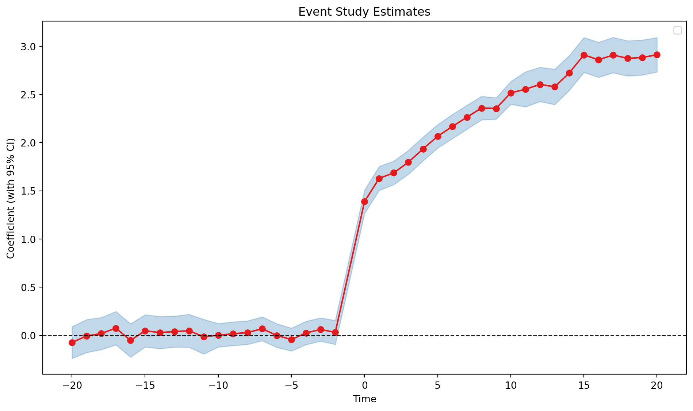

# did.estimation.event_study

``` python
did.estimation.event_study(
    data,
    yname,
    idname,
    tname,
    gname,
    xfml=None,
    cluster=None,
    estimator='twfe',
    att=True,
)
```

Estimate Event Study Model.

This function allows for the estimation of treatment effects using different estimators. Currently, it supports “twfe” for the two-way fixed effects estimator and “did2s” for Gardner’s two-step DID2S estimator. Other estimators are in development.

## Parameters

| Name | Type | Description | Default |
|----|----|----|----|
| data | DataFrame | The DataFrame containing all variables. | *required* |
| yname | str | The name of the dependent variable. | *required* |
| idname | str | The name of the id variable. | *required* |
| tname | str | Variable name for calendar period. | *required* |
| gname | str | Unit-specific time of initial treatment. | *required* |
| cluster | str \| None | The name of the cluster variable. If None, defaults to idname. | `None` |
| xfml | str | The formula for the covariates. | `None` |
| estimator | str | The estimator to use. Options are “did2s”, “twfe”, and “saturated”. | `'twfe'` |
| att | bool | If True, estimates the average treatment effect on the treated (ATT). If False, estimates the canonical event study design with all leads and lags. Default is True. | `True` |

## Returns

| Name | Type | Description |
|----|----|----|
|  | object | A fitted model object of class [Feols](../reference/estimation.models.feols_.Feols.llms.md). |

## Examples

``` python
import pandas as pd
import pyfixest as pf

url = "https://raw.githubusercontent.com/py-econometrics/pyfixest/master/pyfixest/did/data/df_het.csv"
df_het = pd.read_csv(url)

fit_twfe = pf.event_study(
    df_het,
    yname="dep_var",
    idname="unit",
    tname="year",
    gname="g",
    estimator="twfe",
    att=True,
)

fit_twfe.tidy()

# run saturated event study
fit_twfe_saturated = pf.event_study(
    df_het,
    yname="dep_var",
    idname="unit",
    tname="year",
    gname="g",
    estimator="saturated",
)

fit_twfe_saturated.aggregate()
fit_twfe_saturated.iplot_aggregate()
```


