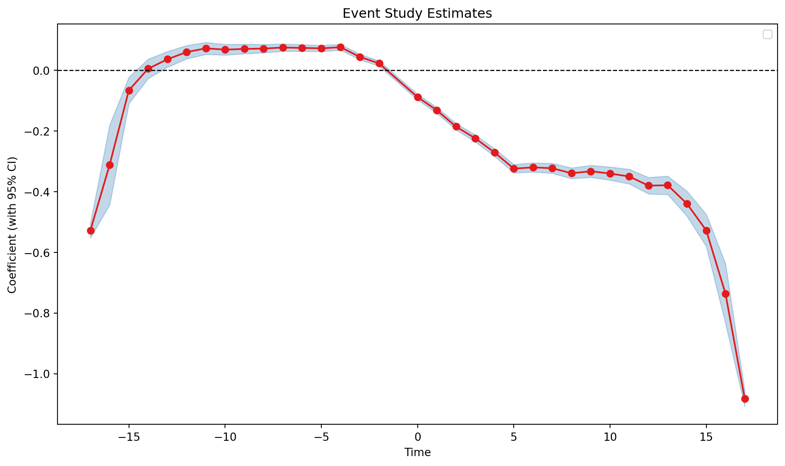

# SaturatedEventStudy

``` python
SaturatedEventStudy(
    data,
    yname,
    idname,
    tname,
    gname,
    att=True,
    cluster=None,
    xfml=None,
    display_warning=True,
)
```

Saturated event study with cohort-specific effect curves.

## Attributes

| Name | Type | Description |
|----|----|----|
| data | pd.DataFrame | Dataframe containing the data. |
| yname | str | Name of the outcome variable. |
| idname | str | Name of the unit identifier variable. |
| tname | str | Name of the time variable. |
| gname | str | Name of the treatment variable. |
| cluster | str | The name of the cluster variable. |
| xfml | str | Additional covariates to include in the model. |
| att | bool | Whether to use the average treatment effect. |
| display_warning | bool | Whether to display (some) warning messages. |

## Notes

Fits a fully saturated event study that interacts every treatment cohort with every relative period. Each cohort has its own set of event time effects, which avoids the comparisons between already-treated units that bias static two-way fixed effects under heterogeneous treatment effects (Sun and Abraham 2021, [Journal of Econometrics](https://doi.org/10.1016/j.jeconom.2020.09.006)).

## Examples

Returned by [event_study()](../reference/did.estimation.event_study.llms.md) with `estimator="saturated"`. `aggregate()` aggregates the cohort-specific effects by event time.

``` python
import pyfixest as pf

data = pf.get_motherhood_event_study_data()

fit = pf.event_study(
    data,
    yname="log_earnings",
    idname="unit",
    tname="year",
    gname="g",
    estimator="saturated",
)
fit.aggregate().head()
```

|        | Estimate  | Std. Error | t value    | Pr(\>\|t\|) | 2.5%      | 97.5%     |
|--------|-----------|------------|------------|-------------|-----------|-----------|
| period |           |            |            |             |           |           |
| -17.0  | -0.528314 | 0.012096   | -43.677375 | 0.0         | -0.552022 | -0.504607 |
| -16.0  | -0.311872 | 0.067012   | -4.653967  | 0.000003    | -0.443213 | -0.180531 |
| -15.0  | -0.066293 | 0.022019   | -3.010666  | 0.002607    | -0.109449 | -0.023136 |
| -14.0  | 0.004688  | 0.016255   | 0.288419   | 0.773026    | -0.027172 | 0.036548  |
| -13.0  | 0.035952  | 0.013157   | 2.732575   | 0.006284    | 0.010165  | 0.06174   |

`iplot_aggregate()` plots the aggregated effects.

``` python
fit.iplot_aggregate()
```



## Methods

| Name | Description |
|----|----|
| [SaturatedEventStudy.aggregate](#pyfixest.did.saturated_twfe.SaturatedEventStudy.aggregate) | Aggregate the fully interacted event study estimates by relative time, cohort, and time. |
| [SaturatedEventStudy.estimate](#pyfixest.did.saturated_twfe.SaturatedEventStudy.estimate) | Estimate the model. |
| [SaturatedEventStudy.iplot](#pyfixest.did.saturated_twfe.SaturatedEventStudy.iplot) | Plot DID estimates. |
| [SaturatedEventStudy.iplot_aggregate](#pyfixest.did.saturated_twfe.SaturatedEventStudy.iplot_aggregate) | Plot the aggregated estimates. |
| [SaturatedEventStudy.summary](#pyfixest.did.saturated_twfe.SaturatedEventStudy.summary) | Get summary table. |
| [SaturatedEventStudy.test_treatment_heterogeneity](#pyfixest.did.saturated_twfe.SaturatedEventStudy.test_treatment_heterogeneity) | Test for treatment heterogeneity in the event study design. |
| [SaturatedEventStudy.tidy](#pyfixest.did.saturated_twfe.SaturatedEventStudy.tidy) | Tidy result dataframe. |
| [SaturatedEventStudy.vcov](#pyfixest.did.saturated_twfe.SaturatedEventStudy.vcov) | Get the covariance matrix. |

### SaturatedEventStudy.aggregate

``` python
aggregate(agg='period', weighting='shares')
```

Aggregate the fully interacted event study estimates by relative time, cohort, and time.

#### Parameters

| Name | Type | Description | Default |
|----|----|----|----|
| agg | str | The type of aggregation to perform. Can be either “att” or “cohort” or “period”. Default is “att”. If “att”, computes the average treatment effect on the treated. If “cohort”, computes the average treatment effect by cohort. If “period”, computes the average treatment effect by period. | `'period'` |
| weighting | str | The type of weighting to use. Can be either ‘shares’ or ‘variance’. | `'shares'` |

#### Returns

| Name | Type      | Description                                   |
|------|-----------|-----------------------------------------------|
|      | pd.Series | A Series containing the aggregated estimates. |

### SaturatedEventStudy.estimate

``` python
estimate()
```

Estimate the model.

#### Returns

| Name | Type  | Description                    |
|------|-------|--------------------------------|
|      | Feols | The fitted Feols model object. |

### SaturatedEventStudy.iplot

``` python
iplot()
```

Plot DID estimates.

### SaturatedEventStudy.iplot_aggregate

``` python
iplot_aggregate(agg='period', weighting='shares')
```

Plot the aggregated estimates.

#### Parameters

| Name | Type | Description | Default |
|----|----|----|----|
| agg | str | The type of aggregation to perform. Can be either “att” or “cohort” or “period”. Default is “att”. If “att”, computes the average treatment effect on the treated. If “cohort”, computes the average treatment effect by cohort. If “period”, computes the average treatment effect by period. | `'period'` |
| weighting | str | The type of weighting to use. Can be either ‘shares’ or ‘variance’. | `'shares'` |

#### Returns

| Name | Type | Description |
|------|------|-------------|
|      | None |             |

### SaturatedEventStudy.summary

``` python
summary()
```

Get summary table.

### SaturatedEventStudy.test_treatment_heterogeneity

``` python
test_treatment_heterogeneity()
```

Test for treatment heterogeneity in the event study design.

#### Parameters

| Name | Type | Description | Default |
|----|----|----|----|
| by | str | The type of test to perform. Can be either “cohort” or “time”. Default is “cohort”. If “cohort”, tests for treatment heterogeneity across cohorts as in Lal (2025). See https://arxiv.org/abs/2503.05125 for details. | *required* |

### SaturatedEventStudy.tidy

``` python
tidy()
```

Tidy result dataframe.

### SaturatedEventStudy.vcov

``` python
vcov()
```

Get the covariance matrix.

#### Returns

| Name | Type         | Description                                   |
|------|--------------|-----------------------------------------------|
|      | pd.DataFrame | A DataFrame containing the covariance matrix. |
