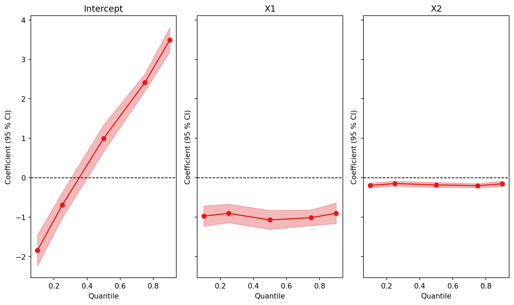

# qplot

``` python
qplot(models, rename_models=None, figsize=None, ncol=None, nrow=None)
```

Plot regression quantiles.

## Parameters

| Name | Type | Description | Default |
|----|----|----|----|
| models | Feols, Fepois, Feiv, FixestMulti, or list | A fitted model object, or a list of Feols, Fepois, and Feiv models. | *required* |
| figsize | tuple or None | The size of the figure. If None, the default size is (10, 6). | `None` |
| rename_models | dict | A dictionary to rename the models. The keys are the original model names and the values the new names. | `None` |
| ncol | int | Number of columns of subplots. Default is None. Note: cannot be set jointly with nrow argument. | `None` |
| nrow | int | Number of rows of subplots. Default is None. Note: cannot be set jointly with ncol argument. | `None` |

## Returns

| Name | Type   | Description           |
|------|--------|-----------------------|
|      | object | A matplotplit figure. |

## Examples

Plots the coefficients of a quantile regression across quantiles, the counterpart of `coefplot()` for `quantreg()`.

``` python
import pyfixest as pf

data = pf.get_data()
fit = pf.quantreg("Y ~ X1 + X2", data, quantile=[0.1, 0.25, 0.5, 0.75, 0.9])

pf.qplot(fit)
```

    (<Figure size 960x576 with 3 Axes>,
     array([<Axes: title={'center': 'Intercept'}, xlabel='Quantile', ylabel='Coefficient (95 % CI)'>,
            <Axes: title={'center': 'X1'}, xlabel='Quantile', ylabel='Coefficient (95 % CI)'>,
            <Axes: title={'center': 'X2'}, xlabel='Quantile', ylabel='Coefficient (95 % CI)'>],
           dtype=object))



See the [quantile regression tutorial](../tutorials/quantile-regression.llms.md) for details.
