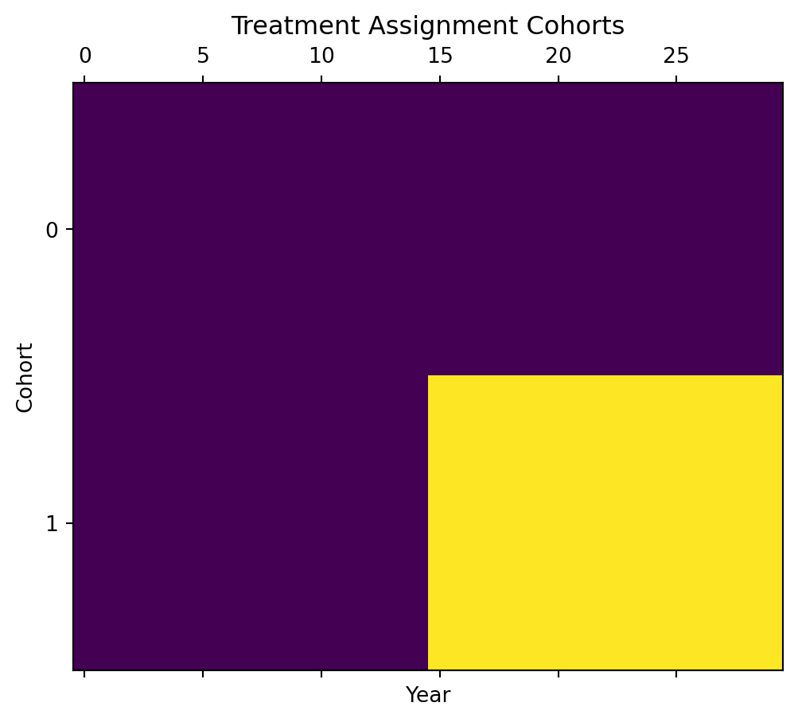
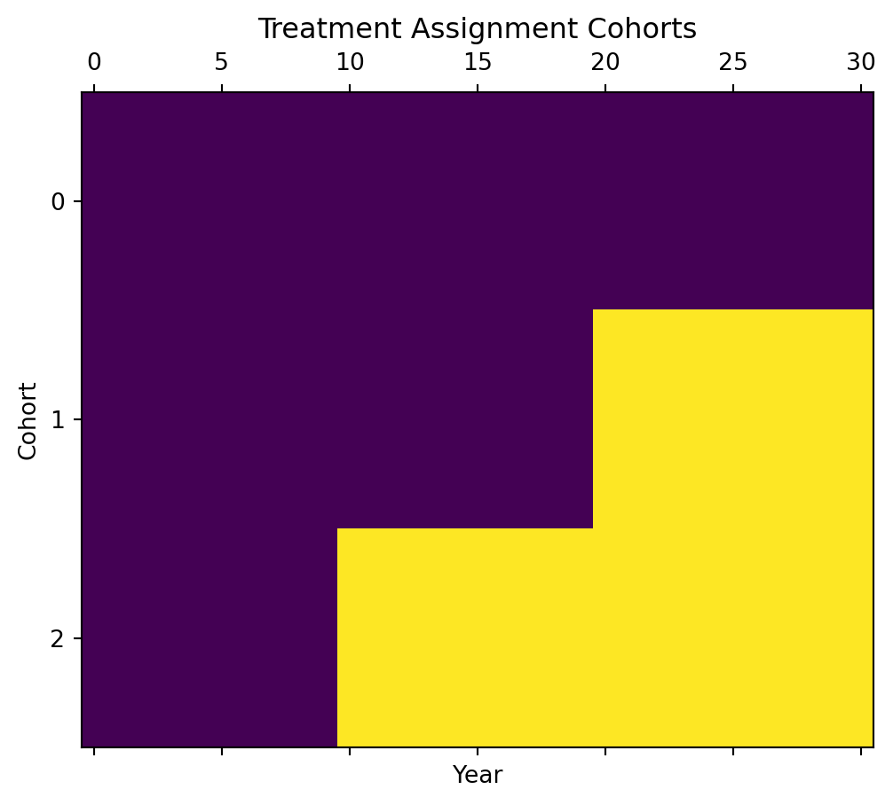
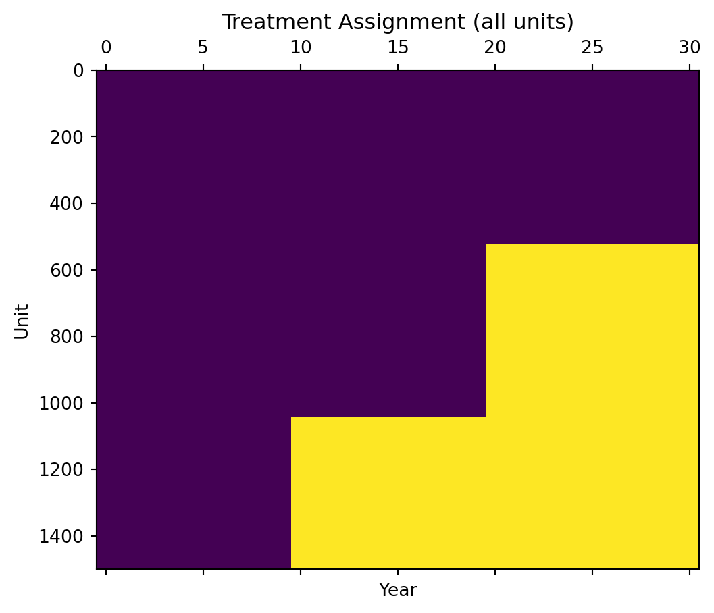
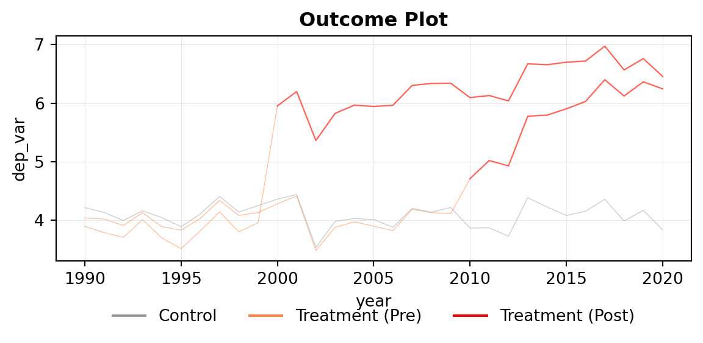
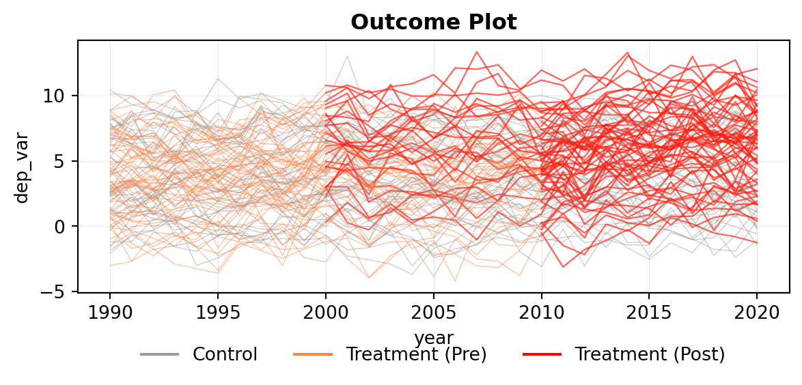
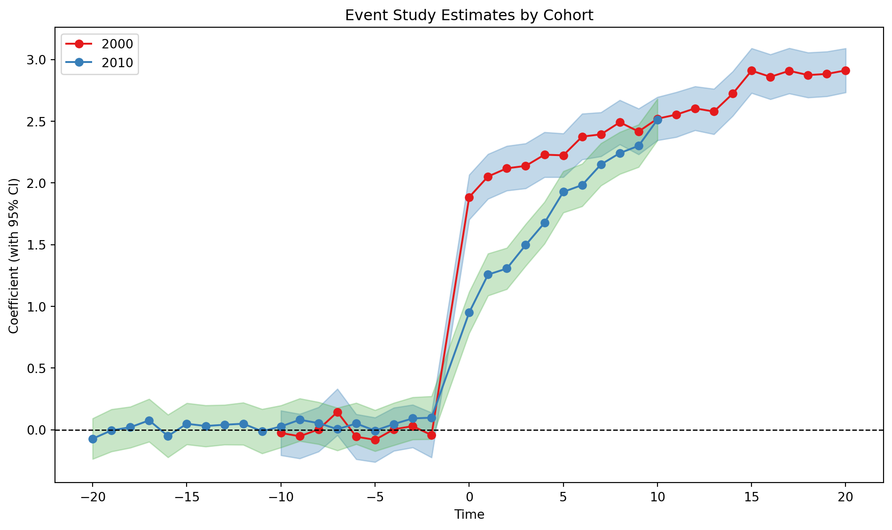
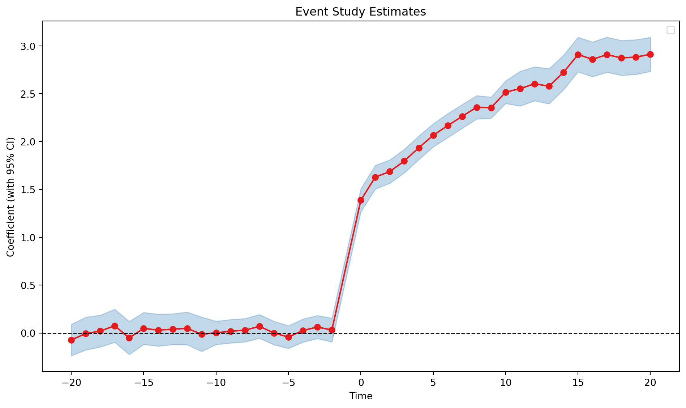

# Difference-in-Differences Estimation

Causal Inference

TWFE, Gardner’s two-stage DID2S, local projections, and event study designs with heterogeneous treatment effects.

`PyFixest` supports event study designs via the canonical two-way fixed effects design, the 2-Step imputation estimator, and local projections.

See also [NBER SI methods lectures on Linear Panel Event Studies](https://www.nber.org/conferences/si-2023-methods-lectures-linear-panel-event-studies).

## Setup

``` python
from importlib import resources

import pandas as pd

import pyfixest as pf
from pyfixest.report.utils import rename_event_study_coefs
from pyfixest.utils.dgps import get_sharkfin

%load_ext watermark
%watermark --iversions
%load_ext autoreload
%autoreload 2
```

    pandas  : 2.3.3
    pyfixest: 0.40.1

``` python
# one-shot adoption data - parallel trends is true
df_one_cohort = get_sharkfin()
df_one_cohort.head()
```

|     | unit | year | treat | Y         | ever_treated |
|-----|------|------|-------|-----------|--------------|
| 0   | 0    | 0    | 0     | 1.629307  | 0            |
| 1   | 0    | 1    | 0     | 0.825902  | 0            |
| 2   | 0    | 2    | 0     | 0.208988  | 0            |
| 3   | 0    | 3    | 0     | -0.244739 | 0            |
| 4   | 0    | 4    | 0     | 0.804665  | 0            |

``` python
# multi-cohort adoption data
df_multi_cohort = pd.read_csv(
    resources.files("pyfixest.did.data").joinpath("df_het.csv")
)
df_multi_cohort.head()
```

|  | unit | state | group | unit_fe | g | year | year_fe | treat | rel_year | rel_year_binned | error | te | te_dynamic | dep_var |
|----|----|----|----|----|----|----|----|----|----|----|----|----|----|----|
| 0 | 1 | 33 | Group 2 | 7.043016 | 2010 | 1990 | 0.066159 | False | -20.0 | -6 | -0.086466 | 0 | 0.0 | 7.022709 |
| 1 | 1 | 33 | Group 2 | 7.043016 | 2010 | 1991 | -0.030980 | False | -19.0 | -6 | 0.766593 | 0 | 0.0 | 7.778628 |
| 2 | 1 | 33 | Group 2 | 7.043016 | 2010 | 1992 | -0.119607 | False | -18.0 | -6 | 1.512968 | 0 | 0.0 | 8.436377 |
| 3 | 1 | 33 | Group 2 | 7.043016 | 2010 | 1993 | 0.126321 | False | -17.0 | -6 | 0.021870 | 0 | 0.0 | 7.191207 |
| 4 | 1 | 33 | Group 2 | 7.043016 | 2010 | 1994 | -0.106921 | False | -16.0 | -6 | -0.017603 | 0 | 0.0 | 6.918492 |

## Examining Treatment Timing

Before any DiD estimation, we need to examine the treatment timing, since it is crucial to our choice of estimator.

``` python
pf.panelview(
    df_one_cohort,
    unit="unit",
    time="year",
    treat="treat",
    collapse_to_cohort=True,
    sort_by_timing=True,
    ylab="Cohort",
    xlab="Year",
    title="Treatment Assignment Cohorts",
    figsize=(6, 5),
)
```



``` python
pf.panelview(
    df_multi_cohort,
    unit="unit",
    time="year",
    treat="treat",
    collapse_to_cohort=True,
    sort_by_timing=True,
    ylab="Cohort",
    xlab="Year",
    title="Treatment Assignment Cohorts",
    figsize=(6, 5),
)
```



We immediately see that we have staggered adoption of treatment in the second case, which implies that a naive application of 2WFE might yield biased estimates under substantial effect heterogeneity.

We can also plot treatment assignment in a disaggregated fashion, which gives us a sense of cohort sizes.

``` python
pf.panelview(
    df_multi_cohort,
    unit="unit",
    time="year",
    treat="treat",
    sort_by_timing=True,
    ylab="Unit",
    xlab="Year",
    title="Treatment Assignment (all units)",
    figsize=(6, 5),
)
```



## Inspecting the Outcome Variable

`pf.panelview()` further allows us to inspect the “outcome” variable over time:

``` python
pf.panelview(
    df_multi_cohort,
    outcome="dep_var",
    unit="unit",
    time="year",
    treat="treat",
    collapse_to_cohort=True,
    title="Outcome Plot",
    legend=True,
    figsize=(7, 2.5),
)
```



We immediately see that the first cohort is switched into treatment in 2000, while the second cohort is switched into treatment by 2010. Before each cohort is switched into treatment, the trends are parallel.

We can additionally inspect individual units by dropping the collapse_to_cohort argument. Because we have a large sample, we might want to inspect only a subset of units.

``` python
pf.panelview(
    df_multi_cohort,
    outcome="dep_var",
    unit="unit",
    time="year",
    treat="treat",
    subsamp=100,
    title = "Outcome Plot",
    legend=True,
    figsize=(7, 2.5),
)
```



## One-shot adoption: Static and Dynamic Specifications

After taking a first look at the data, let’s turn to estimation. We return to the `df_one_cohort` data set (without staggered treatment rollout).

``` python
fit_static_twfe = pf.feols(
    "Y ~ treat | unit + year",
    df_one_cohort,
    vcov={"CRV1": "unit"},
)
fit_static_twfe.summary()
```

    ###

    Estimation:  OLS
    Dep. var.: Y, Fixed effects: unit + year
    Inference:  CRV1
    Observations:  30000

    | Coefficient   |   Estimate |   Std. Error |   t value |   Pr(>|t|) |   2.5% |   97.5% |
    |:--------------|-----------:|-------------:|----------:|-----------:|-------:|--------:|
    | treat         |      0.206 |        0.052 |     3.927 |      0.000 |  0.103 |   0.308 |
    ---
    RMSE: 0.701 R2: 0.905 R2 Within: 0.003 

Since this is a single-cohort dataset, this estimate is consistent for the ATT under parallel trends. We can estimate heterogeneous effects by time by interacting time with the treated group:

``` python
fit_dynamic_twfe = pf.feols(
    "Y ~ i(year, ever_treated,  ref = 14) | unit + year",
    df_one_cohort,
    vcov={"CRV1": "unit"},
)
```

``` python
fit_dynamic_twfe.iplot(
    coord_flip=False,
    title="Event Study",
    figsize=[1200, 400],
    yintercept=0,
    xintercept=13.5,
    labels=rename_event_study_coefs(fit_dynamic_twfe._coefnames),
)
```

Event study plots like this are very informative, as they allow us to visually inspect the parallel trends assumption and also the dynamic effects of the treatment.

Based on a cursory glance, one would conclude that parallel trends does not hold because one of the pre-treatment coefficient has a confidence interval that does not include zero. However, we know that parallel trends is true because the treatment is randomly assigned in the underlying DGP.

## Pointwise vs Simultaneous Inference in Event Studies

This is an example of a false positive in testing for pre-trends produced by *pointwise* inference (where each element of the coefficient vector is tested separately).

As an alternative, we can use simultaneous confidence bands of the form \\\[a, b\] = (\[a_k, b_k\])\_{k=1}^K\\ such that

\\ P(\beta \in \[a, b\]) = P(\beta_k \in \[a_k, b_k\] \forall k) \rightarrow 1 - \alpha \\

These bands can be constructed by using a carefully chosen critical value \\c\\ that [accounts for the covariance between coefficients using the multiplier bootstrap](https://www.annualreviews.org/docserver/fulltext/statistics/10/1/annurev-statistics-040120-022239.pdf?expires=1724543273&id=id&accname=guest&checksum=0D11ADF816FFFA0AE21BD7EDC6DB1801#page=14). In pointwise inference, the critical value is \\c = z\_{1 - \alpha/2} = 1.96\\ for \\\alpha = 0.05\\; the corresponding critical value for simultaneous inference is typically larger. These are also known as `sup-t` bands in the literature (see lec 3 of the NBER SI methods lectures linked above).

This is implemented in the `confint(joint=True)` method in the `feols` class. If we pass the `joint='both'` argument to `iplot`, we get the simultaneous confidence bands (for all event study coefficients) in addition to the pointwise confidence intervals. Note that simultaneous inference for all event study coefficients may be overly conservative, especially when the number of coefficients is large; one may instead choose to perform joint inference for [all pre-treatment coefficients and all post-treatment coefficients separately](https://gist.github.com/apoorvalal/8a7687d3620577fd5214f1d43fc740b3).

``` python
fit_dynamic_twfe.iplot(
    coord_flip=False,
    title="Event Study",
    figsize=[1200, 400],
    yintercept=0,
    xintercept=13.5,
    joint="both",
    labels=rename_event_study_coefs(fit_dynamic_twfe._coefnames),
)
```

The joint confidence bands are wider than the pointwise confidence intervals, and they include zero for all pre-treatment coefficients. This is consistent with the parallel trends assumption.

## Event Study under Staggered Adoption via `feols()`, `event_study()`, `did2s()`, `lpdid()`

We now return to the data set with staggered treatment rollout, `df_multi_cohort`.

### Two-Way Fixed Effects

As a baseline model, we can estimate a simple two-way fixed effects DiD regression via `feols()`:

``` python
fit_twfe = pf.feols(
    "dep_var ~ i(rel_year, ref=-1.0) | state + year",
    df_multi_cohort,
    vcov={"CRV1": "state"},
)
```

You can also estimate a TWFE model via the `event_study()` function, which aims to provide a common interface to multiple difference-in-differences implementations:

``` python
fit_twfe_event = pf.event_study(
    data=df_multi_cohort,
    yname="dep_var",
    idname="unit",
    tname="year",
    gname="g",
    estimator="twfe",
)
```

### Fully-Interacted / Saturated Event Study (Sun-Abraham)

In a similar spirit, you can fit a fully-interacted difference-in-differences model by selecting the `estimator = "saturated"`:

``` python
fit_saturated = pf.event_study(
    data=df_multi_cohort,
    yname="dep_var",
    idname="unit",
    tname="year",
    gname="g",
    estimator="saturated",
)

fit_saturated.iplot()
```



We can obtain treatment effects by period via the `aggregate()` method

``` python
fit_saturated.aggregate(weighting = "shares")
```

|        | Estimate  | Std. Error | t value   | Pr(\>\|t\|) | 2.5%      | 97.5%    |
|--------|-----------|------------|-----------|-------------|-----------|----------|
| period |           |            |           |             |           |          |
| -20.0  | -0.073055 | 0.083868   | -0.871071 | 0.383715    | -0.237434 | 0.091324 |
| -19.0  | -0.005748 | 0.087254   | -0.065871 | 0.94748     | -0.176763 | 0.165268 |
| -18.0  | 0.019863  | 0.084817   | 0.234181  | 0.814844    | -0.146376 | 0.186101 |
| -17.0  | 0.075561  | 0.08836    | 0.85515   | 0.392468    | -0.097622 | 0.248744 |
| -16.0  | -0.051278 | 0.088165   | -0.581611 | 0.560829    | -0.224077 | 0.121522 |
| -15.0  | 0.047891  | 0.085371   | 0.560977  | 0.574813    | -0.119433 | 0.215215 |
| -14.0  | 0.030061  | 0.085232   | 0.352697  | 0.724316    | -0.13699  | 0.197112 |
| -13.0  | 0.03987   | 0.082118   | 0.485517  | 0.62731     | -0.121079 | 0.200818 |
| -12.0  | 0.048458  | 0.087172   | 0.555888  | 0.578287    | -0.122396 | 0.219312 |
| -11.0  | -0.01282  | 0.091618   | -0.13993  | 0.888715    | -0.192388 | 0.166748 |
| -10.0  | 0.001529  | 0.06211    | 0.02461   | 0.980366    | -0.120205 | 0.123262 |
| -9.0   | 0.017902  | 0.062642   | 0.285777  | 0.775049    | -0.104874 | 0.140677 |
| -8.0   | 0.02942   | 0.062148   | 0.473384  | 0.635939    | -0.092389 | 0.151229 |
| -7.0   | 0.06927   | 0.06336    | 1.093268  | 0.274276    | -0.054914 | 0.193453 |
| -6.0   | -0.000168 | 0.06252    | -0.002687 | 0.997856    | -0.122705 | 0.122369 |
| -5.0   | -0.042447 | 0.060507   | -0.701529 | 0.482973    | -0.161039 | 0.076144 |
| -4.0   | 0.025822  | 0.061739   | 0.418243  | 0.67577     | -0.095185 | 0.146828 |
| -3.0   | 0.062146  | 0.061508   | 1.010385  | 0.312311    | -0.058406 | 0.182699 |
| -2.0   | 0.031255  | 0.06339    | 0.493059  | 0.621971    | -0.092988 | 0.155498 |
| 0.0    | 1.38732   | 0.061787   | 22.453107 | 0.0         | 1.266219  | 1.508421 |
| 1.0    | 1.628963  | 0.063322   | 25.724928 | 0.0         | 1.504854  | 1.753073 |
| 2.0    | 1.686253  | 0.062372   | 27.035432 | 0.0         | 1.564007  | 1.8085   |
| 3.0    | 1.796582  | 0.063137   | 28.455425 | 0.0         | 1.672837  | 1.920328 |
| 4.0    | 1.934649  | 0.063037   | 30.690833 | 0.0         | 1.8111    | 2.058199 |
| 5.0    | 2.065588  | 0.061803   | 33.422231 | 0.0         | 1.944456  | 2.186719 |
| 6.0    | 2.166252  | 0.064074   | 33.808421 | 0.0         | 2.040668  | 2.291835 |
| 7.0    | 2.263413  | 0.06352    | 35.632879 | 0.0         | 2.138916  | 2.387911 |
| 8.0    | 2.358293  | 0.06232    | 37.841747 | 0.0         | 2.236149  | 2.480438 |
| 9.0    | 2.354538  | 0.056481   | 41.687038 | 0.0         | 2.243837  | 2.465239 |
| 10.0   | 2.515993  | 0.060297   | 41.72651  | 0.0         | 2.397813  | 2.634174 |
| 11.0   | 2.552978  | 0.092825   | 27.503048 | 0.0         | 2.371044  | 2.734912 |
| 12.0   | 2.603939  | 0.090658   | 28.722574 | 0.0         | 2.426252  | 2.781625 |
| 13.0   | 2.578044  | 0.093739   | 27.502403 | 0.0         | 2.394319  | 2.761769 |
| 14.0   | 2.722969  | 0.092043   | 29.583642 | 0.0         | 2.542568  | 2.90337  |
| 15.0   | 2.909275  | 0.092438   | 31.472726 | 0.0         | 2.7281    | 3.09045  |
| 16.0   | 2.859325  | 0.092643   | 30.864025 | 0.0         | 2.677749  | 3.040901 |
| 17.0   | 2.907943  | 0.093763   | 31.013703 | 0.0         | 2.724171  | 3.091716 |
| 18.0   | 2.873678  | 0.093009   | 30.896721 | 0.0         | 2.691384  | 3.055973 |
| 19.0   | 2.882807  | 0.09253    | 31.155532 | 0.0         | 2.701453  | 3.064162 |
| 20.0   | 2.911501  | 0.091093   | 31.961938 | 0.0         | 2.732962  | 3.09004  |

and plot the effects

``` python
fit_saturated.iplot_aggregate(weighting = "shares")
```



### When can we get away with using the two-way fixed effects regression?

We will motivate this section by lazily quoting the abstract of [Lal (2025)](https://arxiv.org/abs/2503.05125):

> The use of the two-way fixed effects regression in empirical social science was historically motivated by folk wisdom that it uncovers the Average Treatment effect on the Treated (ATT) as in the canonical two-period two-group case. This belief has come under scrutiny recently due to recent results in applied econometrics showing that it fails to uncover meaningful averages of heterogeneous treatment effects in the presence of effect heterogeneity over time and across adoption cohorts, and several heterogeneity-robust alternatives have been proposed. However, these estimators often have higher variance and are therefore under-powered for many applications, which poses a bias-variance tradeoff that is challenging for researchers to navigate. In this paper, we propose simple tests of linear restrictions that can be used to test for differences in dynamic treatment effects over cohorts, which allows us to test for when the two-way fixed effects regression is likely to yield biased estimates of the ATT.

You can employ the proposed test after running a saturated event study by calling the `test_treatment_heterogeneity()` method:

``` python
fit_saturated.test_treatment_heterogeneity()
```

    statistic    3256.497337
    pvalue          0.000000
    dtype: float64

In this case, we might be willing to rely on the simple TWFE model to produce unbiased estimates. If we’re not, two “new” difference-in-differences estimators are implemented (beyond the already-presented saturated Sun-Abraham approach) that produce unbiased estimates under staggered assignment and heterogeneous treatment effects: Gardner’s 2-Step Estimator and the Local Projections estimator from Dube et al.

### Gardner’s 2-Step Estimator

To do the same via Gardners 2-stage estimator, we employ the the `pf.did2s()` function:

``` python
fit_did2s = pf.did2s(
    df_multi_cohort,
    yname="dep_var",
    first_stage="~ 0 | unit + year",
    second_stage="~i(rel_year,ref=-1.0)",
    treatment="treat",
    cluster="state",
)
```

### Local Projections (Dube et al)

Last, we can estimate the ATT for each time period via local projections by using the `lpdid()` function:

``` python
fit_lpdid = pf.lpdid(
    data=df_multi_cohort,
    yname="dep_var",
    gname="g",
    tname="year",
    idname="unit",
    vcov={"CRV1": "state"},
    pre_window=-20,
    post_window=20,
    att=False,
)
```

Let’s look at some results:

``` python
figsize = [1200, 400]
```

``` python
fit_twfe.iplot(
    coord_flip=False,
    title="TWFE-Estimator",
    figsize=figsize,
    xintercept=18.5,
    yintercept=0,
    labels=rename_event_study_coefs(fit_twfe._coefnames),  # rename coefficients
).show()
```

``` python
fit_lpdid.iplot(
    coord_flip=False,
    title="Local-Projections-Estimator",
    figsize=figsize,
    yintercept=0,
    xintercept=18.5,
).show()
```

What if we are not interested in the ATT per treatment period, but in a pooled effects?

``` python
fit_twfe = pf.feols(
    "dep_var ~ i(treat) | unit + year",
    df_multi_cohort,
    vcov={"CRV1": "state"},
)

fit_did2s = pf.did2s(
    df_multi_cohort,
    yname="dep_var",
    first_stage="~ 0 | unit + year",
    second_stage="~i(treat)",
    treatment="treat",
    cluster="state",
)

fit_lpdid = pf.lpdid(
    data=df_multi_cohort,
    yname="dep_var",
    gname="g",
    tname="year",
    idname="unit",
    vcov={"CRV1": "state"},
    pre_window=-20,
    post_window=20,
    att=True,
)
pd.concat(
    [
        fit_twfe.tidy().assign(estimator="TWFE"),
        fit_did2s.tidy().assign(estimator="DID2s"),
        fit_lpdid.tidy().assign(estimator="LPDID").drop("N", axis=1),
    ],
    axis=0,
)
```

|  | Estimate | Std. Error | t value | Pr(\>\|t\|) | 2.5% | 97.5% | estimator |
|----|----|----|----|----|----|----|----|
| treat::True | 1.982540 | 0.019338 | 102.521988 | 0.0 | 1.943426 | 2.021655 | TWFE |
| treat::True | 2.230482 | 0.024709 | 90.271446 | 0.0 | 2.182052 | 2.278911 | DID2s |
| treat_diff | 2.506746 | 0.071420 | 35.098900 | 0.0 | 2.362287 | 2.651206 | LPDID |
